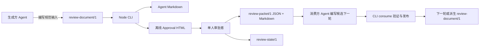
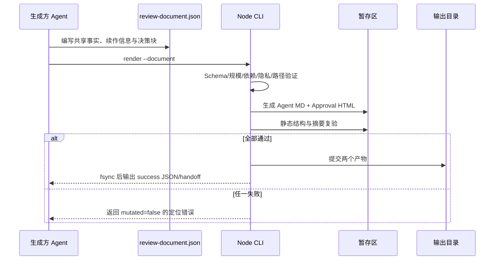
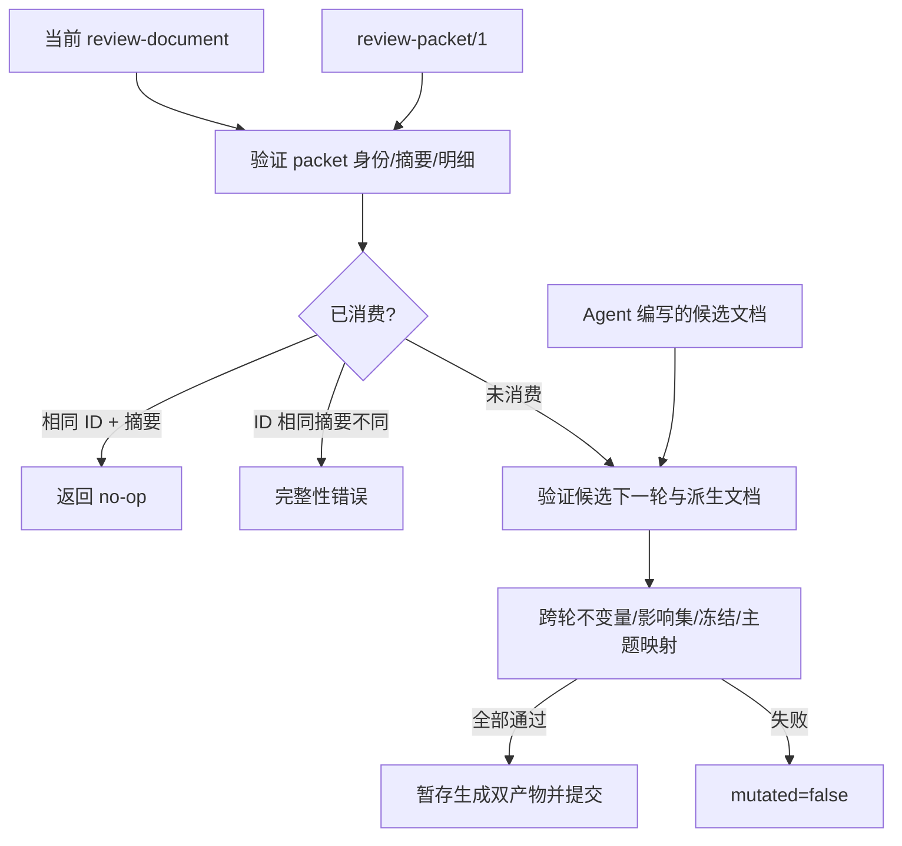

# `deliver-dual-audience-report` 技术设计

> - 文档状态：已确认，实施基线
> - 设计版本：0.2-implementation-baseline
> - 目标发布：v0.2.0
> - 更新日期：2026-08-17（文档整合：需求基线摘要、跟踪状态与现状说明对齐）；2026-08-18（DES-017 订正为“随仓库跟踪”，与已跟踪现状及发布门断言一致；其余 §4–§15 工程决定未变更）；2026-08-19（补录 DES-019 审批台视觉契约并新增 §11.8，同步 spec 2026-08-19 修订；不改变运行行为）
> - 需求基线：[spec.md](spec.md)
> - 需求基线 SHA-256：`2459bf72298f12dc6d5938b682737516ba87145de30568847ec286da8279124b`（2026-08-19 视觉契约修订后重算；2026-08-17 整合值为 `6f54504182d88388f6bfd71e487a2cdf741cac9c490a858f6591c3c7af9cdcc1`）
> - 基线解释：需求文件已于 2026-08-17 的文档整合中正式标记为“已确认，需求基线”，与本设计自 2026-08-12 起采用的口径一致；此前记录的摘要 `677f56b36ff881058fa9054786a095a15780efe105f9fbbe992abc34a45cfbb5` 对应仅有状态元数据差异的同一份需求条款。
> - 追踪状态：本文自 2026-08-17 起随仓库跟踪；`docs/调研/` 保持本地忽略，不进入仓库
> - 施工单：[task.md](task.md) · 运行事实源：[claude-code-handoff.md](claude-code-handoff.md) · 目录索引：[README.md](README.md)

## 目录

1. [文档职责与决策优先级](#1-文档职责与决策优先级)
2. [设计目标、原则与非目标](#2-设计目标原则与非目标)
3. [现状与迁移边界](#3-现状与迁移边界)
4. [架构决策摘要](#4-架构决策摘要)
5. [系统上下文与目标架构](#5-系统上下文与目标架构)
6. [模块划分与分发拓扑](#6-模块划分与分发拓扑)
7. [公共协议与接口](#7-公共协议与接口)
8. [标识、版本与摘要规则](#8-标识版本与摘要规则)
9. [状态模型与不变量](#9-状态模型与不变量)
10. [关键数据流与状态流](#10-关键数据流与状态流)
11. [审批工作台实现设计](#11-审批工作台实现设计)
12. [安全、隐私与文件系统边界](#12-安全隐私与文件系统边界)
13. [性能、扩展性与可靠性](#13-性能扩展性与可靠性)
14. [验证架构与验收映射](#14-验证架构与验收映射)
15. [构建、迁移、发布与回滚](#15-构建迁移发布与回滚)
16. [风险与 trade-off](#16-风险与-trade-off)
17. [需求追溯矩阵](#17-需求追溯矩阵)
18. [设计确认条件](#18-设计确认条件)

## 1. 文档职责与决策优先级

本文回答“如何实现 [spec.md](spec.md) 规定的行为，以及为什么采用这些工程选择”。本文可以规定架构、模块、数据结构、算法、CLI、存储适配、DOM 安全策略、测试工具和发布方式，但不得扩大需求范围。

实现时按以下优先级处理冲突：

1. 已确认的 `docs/spec.md`；
2. 经用户确认后的本文；
3. `docs/task.md` 的实施顺序和写入边界；
4. 当前 Skill 代码与历史原型。

历史实现只能作为迁移证据，不能覆盖新版需求。若实施中发现必须增加新的产品行为，先停止相应任务并更新需求契约；不得在代码或任务清单中静默扩展。

## 2. 设计目标、原则与非目标

### 2.1 设计目标

目标系统必须做到：

- 以一个规范化文档合同确定性生成 Agent Markdown 与审批 HTML；
- 在单文件离线 HTML 内完成浏览、表态、恢复和回执导出；
- 用同一套协议不变量验证浏览器状态、回执和跨轮修订；
- 将 Agent 的语义判断与可确定验证分开；
- 对旧报告合同、坏状态、身份冲突、路径逃逸和内容注入失败关闭；
- 让安装后的 Skill 直接调用已分发的 Node CLI，无需在目标项目执行依赖安装；
- 保持 Skill 主说明精简，把详细协议放入按需读取的 references。

### 2.2 设计原则

- **单一规范输入**：`review-document.json` 是两个默认产物的规范输入，避免手工维护三份事实。
- **不可变基础 + 状态覆盖**：审批文档在浏览器中不可变，用户行为只写入独立状态层。
- **边界先验证**：文件、协议、导入、消费和发布都先验证再产生可观察修改。
- **派生值不落真值**：进度、统计和执行资格从事实与状态重新计算，不信任输入汇总。
- **运行时零外联**：审批 HTML 不发网络请求，不加载远程资源。
- **安全表达优先**：用结构化内容节点换取确定性渲染和清晰的 XSS 边界。
- **明确破坏升级**：新版不伪装兼容旧静态报告合同。
- **有限规模优化**：最多 15 个块，不采用虚拟列表或复杂客户端框架。

### 2.3 非目标

本文不设计 Info_ORG 目录、索引、归档和文件流转治理，也不设计多人协作、跨轮 diff、深色模式、Todoist、审批队列、Agent 预填决定或自动执行已批准事项。

## 3. 现状与迁移边界

### 3.1 当前实现

当前 Skill 是 Python 标准库实现：

- `init_delivery.py` 创建 `dual-audience-report-contract-v1`、Agent Markdown 骨架和静态 `_HUMAN.html`；
- `validate_delivery.py` 检查旧合同、双文件、摘要标记、基础 HTML 和常见隐私泄漏；
- `record_usage.py` 追加内容无关的本地使用记录；
- 人类模板是静态叙事报告，不包含审批状态机；
- 测试以 Python `unittest` 为主，没有真实浏览器覆盖。

以下是 v0.2 实施启动前（2026-08-12）的基线观测，只用于说明迁移起点，不代表 v0.2 候选的当前测试状态：当时 Skill 结构验证通过，单元测试为 6 项通过、1 项失败；失败来自公开树隐私测试遍历被 `.gitignore` 忽略的调研 HTML，并把普通 Microsoft 支持 URL 中的 UUID 误判为 Session ID。该失败是既有测试边界错误，不是新版产品行为失败，已由 QA-001 的公开树扫描边界修复关闭。v0.2 候选已用 Node 24 测试体系整体取代该 Python 测试面，当前测试与候选状态以 [claude-code-handoff.md](claude-code-handoff.md) 为准。

### 3.2 可保留语义

新版继续保留：

- Skill 名称 `deliver-dual-audience-report`；
- 一个共享事实集合驱动两个受众产物；
- Agent Markdown 的精确续作职责；
- 证据层级、新鲜度、隐私最小化、输出边界和双产物完成条件；
- 内容无关、非阻断的使用记录；
- open Agent Skills 的目录形态和跨宿主可移植目标。

### 3.3 明确退休

以下内容不进入新版现行路径：

- `dual-audience-report-contract-v1`；
- `report-contract.json` 文件语义；
- `_HUMAN.html` 静态叙事产物；
- claim/decision SHA 注释标记作为跨产物主要一致性机制；
- 旧 Python 初始化、验证和使用记录入口；
- `dual-audience-delivery-receipt-v1`；
- artifact waiver 和“单产物也可成功”的旧兼容面。

旧报告合同缺少决策块、分诊、依赖、冻结和审批状态，不能可靠自动迁移。新版 CLI 识别到旧 `schema_version` 时返回专用不兼容错误，并指向 v0.1 回滚产物或重新初始化流程。

## 4. 架构决策摘要

| ID | 决策 | 采用方案 | 不采用方案与原因 | 主要影响 |
|---|---|---|---|---|
| DES-001 | 工程栈 | [Node 24 LTS](https://nodejs.org/en/about/previous-releases)、npm lockfile、严格 TypeScript | 不继续 Python 主路径；否则浏览器与 CLI 规则需跨语言维护 | 产品生成、验证和前端统一为 TS |
| DES-002 | 分发方式 | esbuild 生成单文件 ESM CLI，随 Skill 分发 | 不要求使用者在目标目录 `npm install` | 开发有依赖，运行只需 Node |
| DES-003 | 规范输入 | 新文件 `review-document.json`，协议 `review-document/1` | 不复用 `report-contract.json`，避免旧工具静默误读 | 破坏性但语义清晰 |
| DES-004 | Schema 权威 | JSON Schema 为公共事实源，TS 类型由其派生，Ajv 校验 | 不同时手写 Schema 与类型 | 降低协议漂移 |
| DES-005 | 回执权威 | JSON 是唯一机器权威，Markdown 由 JSON 生成并内嵌 JSON | 不让 Markdown 与 JSON 双向等价 | 幂等、解析和一致性更可靠 |
| DES-006 | 内容模型 | 受限结构化内容节点 | 不接受任意 HTML/SVG；通用 sanitizer 攻击面过大 | 表达范围受控，安全可验证 |
| DES-007 | 浏览器架构 | 原生 DOM/CSS、纯 reducer、派生 selector | 不引入 React/Vue | 单文件更小，运行时更可审计 |
| DES-008 | 状态分层 | 不可变 ReviewDocument + 可变 ReviewState | 不直接修改内嵌文档 | 导入、撤销和跨轮校验更清晰 |
| DES-009 | 摘要算法 | RFC 8785/JCS 规范化 + SHA-256 | 不使用属性顺序相关 JSON 或非加密短哈希 | Node/浏览器结果稳定 |
| DES-010 | 自动恢复 | 封装 `localStorage`，失败降级为内存 + state 导入导出 | 不采用 IndexedDB；状态小且无需异步数据库 | 实现简单，但必须处理 file 模式差异 |
| DES-011 | 下游重审 | Agent 明确影响集和理由；不确定时重开传递闭包 | 不只重开直接下游，也不无条件重开全部下游 | 平衡漏审风险与重复负担 |
| DES-012 | 文件提交 | 同文件系统 stage + 私有事务 manifest + 旧文件备份恢复；成功 JSON 最后输出 | 不原地逐文件覆盖，也不把文件存在当作成功 | 正常失败可回滚；崩溃残留可恢复 |
| DES-013 | 公开 CLI | 新 `review-delivery.mjs`，使用 init/render/validate/consume/record-usage | 不保留旧脚本名换内核 | 降低新旧语义混淆 |
| DES-014 | 发布 | v0.2.0 硬切换，v0.1 tag/zip 回滚 | 不做双轨 shim | 维护面小，迁移需明确 |
| DES-015 | 浏览器矩阵 | Chromium、WebKit 完整覆盖，Firefox smoke | 不只测 Chromium | 覆盖主要 macOS 使用环境 |
| DES-016 | 语言 | UI 内置 `zh-CN` 与 `en`；内容语言使用 BCP-47 | 不在 v0.2 引入任意 locale 包 | 满足首发需要，保留扩展点 |
| DES-017 | 文档治理 | spec/design/task 随仓库跟踪，以 SHA-256 绑定（2026-08-17 修订，原为“保持本地忽略”） | 只由用户维护 `.gitignore`；实施任务不得修改 | 摘要仍须人工回填；跟踪状态由 CI 的 `scan:legacy-surface` 断言 |
| DES-018 | 语义写作边界 | Agent 编写候选文档；CLI 只生成、验证和提交 | 不让 CLI 猜测 EDIT/HOLD 的内容 | 防止自动修改扩大授权 |
| DES-019 | 审批台视觉契约 | 审批 HTML 采用用户 2026-08-18 批准的审批工作台原型视觉系统与方案 A 阅读顺序；规范性 token 清单与布局常量固定在 §11.8 | 不把视觉留作实现自由裁量，也不把 `docs/调研/` 的业务正文复制进跟踪文件 | 防止审批面再次漂移；由 spec §7.2 条款与三浏览器断言双重守护 |

上述决策均已由已接受计划或计划阶段用户选择锁定；本文没有需要实施者再选择的架构分支。

DES-017 于 2026-08-17 按用户决定修订：规划文档由“本地忽略”改为随仓库跟踪，`docs/调研/` 反过来加入 `.gitignore` 保持私有。该修订只改变规划记录的存放位置，不改变任何产品行为、接口或其他 DES 决定；SHA-256 绑定与人工回填义务保持不变。跟踪状态现在还是一个可执行约束：`tools/scan-legacy-surface.mjs` 把这三份文件登记为规划记录边界，并在它们不再被 Git 跟踪时失败关闭，因此“未跟踪”已成为发布门会拒绝的状态。修订前的原文为“spec/design/task 保持本地忽略，以 SHA-256 绑定 / 不进入 CI，需人工维护摘要”。

DES-019 于 2026-08-19 补录：W11 期间用户否决了首版审批 HTML 的视觉呈现，指令改用其已批准并实际使用的审批工作台原型视觉系统，并在两种阅读顺序中选定方案 A（UI-005 已按此实施并通过三浏览器断言）。补录把这次用户决定从任务卡备注升格为工程决定，同时把规范性 token 清单固定在 §11.8，与 spec §7.2 的新增条款（2026-08-19 修订）互为行为层/实现层对照。补录不改变任何运行行为——实现与断言在补录前已经落地，本条只消除“视觉契约无契约记录”的治理缺口。

## 5. 系统上下文与目标架构

### 5.1 系统上下文



### 5.2 五层架构

```text
Skill 编排层
  └─ 触发、工作流、按需引用、交付要求

CLI / 生成层
  ├─ init / render / validate / consume / record-usage
  ├─ Agent Markdown generator
  ├─ Approval HTML assembler
  └─ path boundary / filesystem transaction / success result

协议核心层
  ├─ JSON Schema / derived TypeScript types
  ├─ normalize / canonicalize / digest
  ├─ dependency graph / eligibility
  ├─ packet-state migration
  └─ transition invariant / error model

浏览器工作台层
  ├─ immutable document
  ├─ reducer + selectors
  ├─ safe structured-content renderer
  ├─ persistence / import / export
  └─ keyboard / focus / locale

验证发布层
  ├─ schema / unit / fixture
  ├─ Playwright / axe / E2E
  ├─ Skill compatibility
  └─ deterministic bundle / ZIP
```

协议核心在 Node CLI 与工作台 runtime 之间共享源码。构建生成两个 bundle：一个是可执行 CLI，另一个是被内联进审批 HTML 的浏览器 runtime。两者使用相同 Schema 夹具、规范化和摘要算法。

### 5.3 生成快照边界

Agent Markdown 与 Approval HTML 的一致性定义为“由同一份通过验证的 `review-document/1`、同一生成器版本和同一次 render 事务生成”。审批者在 HTML 中记录的决定属于后续 ReviewState，不回写已生成的 Agent Markdown；只有消费 packet 并生成下一轮时，两个默认产物才一起刷新。系统不承诺两个静态文件之间存在实时同步。

生成快照使用封闭的静态产物标记。Agent Markdown 的前七行必须依次且各恰好出现一次，标记后紧接一个空行，再进入既有确定性正文；值不得含换行或 HTML 注释结束串：

```text
<!-- dar-artifact: review-agent-markdown/1 -->
<!-- dar-generator-version: <semver> -->
<!-- dar-delivery-id: <RDL-ID> -->
<!-- dar-document-id: <RD-ID> -->
<!-- dar-content-version: <positive integer> -->
<!-- dar-round: <positive integer> -->
<!-- dar-review-digest: <sha256 digest> -->
```

标记后正文的 H1 固定为 `<document.title> — Agent Continuation`；随后 H2 必须依次且各恰好一次为 `Document identity`、`Objective and boundaries`、`Source hierarchy`、`Current state`、`Shared evidence`、`Decision blocks`、`Approval history and lineage`、`Next actions`、`Validation evidence`、`Glossary`。`Objective and boundaries` 下的 H3 固定为 `Objective`、`In scope`、`Excluded`；`Shared evidence` 下依次为 `Facts`、`Existing decisions`、`Constraints`、`Risks`、`Open questions and evidence gaps`、`Source conflicts`；`Approval history and lineage` 下依次为 `Current frozen and active sets`、`Consumed packets, topics, impacts, and feedback resolutions`。这些标题与 `agent-context.template.md` 是同一冻结语法；生成器将结构化内容确定性渲染为 Markdown，不接受额外同级标题或缺失/重排。VAL 只把标记和固定章节结构当作机器可验证的静态合同，不把自由文本本身当成新的机器事实源。Approval HTML 以固定的 `<meta name="dar-artifact" content="review-approval-html/1">` 作为产物判别标记；它不增加模板数据 token，既有五个身份 meta、唯一 Base64 文档 template、内联 runtime/style 与 CSP 继续定义同快照身份。两个产物的原始 UTF-8 字节分别用 `sha256Bytes` 计算摘要。机器门能证明标记、嵌入合同、固定结构和同一声明快照一致；自由文本语义一致性仍必须通过人工语义审阅和 reader-isolation，不能由标记替代。

`<document.title>` 在上述 H1 中是语义占位，其字节表示精确定义为 VAL 公开纯函数 `encodeAgentMarkdownHeadingText(document.title)` 的结果；GEN 与 Agent parser 必须共用，不得各写一份。编码器按 Unicode scalar value 扫描：拒绝未配对 surrogate；ASCII 标点 `!` 至 `/`、`:` 至 `@`、`[` 至 `` ` ``、`{` 至 `~` 以 CommonMark 反斜杠转义（包括反斜杠本身）；C0/C1 控制、Unicode `Cf`/`Zl`/`Zp` 以及标题首尾的 ASCII 空格用大写十六进制 `\uXXXX` 或 `\u{XXXXX}` 表示。其他 scalar 和内部 ASCII 空格原样保留。原始反斜杠始终先被转义，因此该单行表示无歧义、可逆且不能注入新标题/HTML；换行不得被 trim 或折叠为普通空格。

`--replace-generated` 的身份门由 VAL 公开 `createGeneratedReplacementByteVerifiers` 唯一实现。调用方一次传入 current document、唯一受支持 generatorVersion、冻结 Approval template 和同次只读取得的旧 Agent/Approval 字节。VAL 先无 current-snapshot 绑定地解析 Approval，验证嵌入 `/1` 文档、meta/template/CSP/offline/privacy 并以嵌入文档重建精确 HTML；再把旧 Agent 绑定到该嵌入文档。两份旧产物必须同一旧快照、同一受支持 generatorVersion，且其 `delivery.id`/`document.id` 分别等于 current；旧 contentVersion/round/reviewDigest 明确允许与 current 不同。成功结果返回 `agent`/`approval` 两个 CLI `ByteVerifier` 结构的 callback，分别只对预检时安全复制的精确旧字节返回 `{ok:true}`；换位、Proxy/异常、任何字节漂移都返回 `{ok:false}`。这使 paired preflight 证明旧产物身份，transaction-time callback 同时关闭 TOCTOU；GEN 不解析旧 HTML/Markdown，CLI I/O 不理解产物语义。

本发布中上述“唯一受支持 generatorVersion”的精确值为 `0.2.0`；VAL 必须自身拒绝其他即使语法合法的 semver，不得只依赖 GEN 调用方传对值。

## 6. 模块划分与分发拓扑

### 6.1 开发源码

仓库级开发源码按职责拆分：

```text
src/
├── protocol/       # schemas 加载、类型、规范化、摘要、packet Markdown、依赖、迁移、不变量
├── generators/     # Agent Markdown 与 Approval HTML 确定性生成
├── workbench/      # reducer、selectors、DOM renderer、storage、export、i18n
└── cli/            # 命令路由、参数、I/O、路径边界、文件事务和使用记录

tests/
├── fixtures/       # document/packet/state 正反例与跨轮 golden corpus
├── unit/           # 协议、reducer、摘要、图算法、迁移
├── browser/        # Playwright + axe
└── e2e/            # CLI、双产物、消费、发布与回滚检查
```

公共 Schema 文件位于 Skill 的 `references/`，既是对外协议文档，也是 TypeScript 类型和 Ajv validator 的输入。开发源码不得复制一份含义相同但独立维护的 Schema。

浏览器 validator 在构建期由 Ajv standalone code generation 生成并随 runtime 打包；运行时不得编译 Schema，也不得出现 `eval` 或 `new Function`。Node CLI 可复用同一 standalone validator，从而让 file:// CSP 与协议判断一致。

standalone validator 的唯一生成入口为 `tools/generate-schema-validators.mjs`。默认 Node/可 tree-shake 生成物是 `src/protocol/schema.generated.ts`；W4 的同一入口另生成仅供 browser build substitution 使用的 `src/protocol/schema.browser.generated.ts`，二者都不是第二套协议或运行时编译器。`tools/check-generated.mjs` 同时检查既有派生类型和两份 validator 的字节漂移；`schema.ts` 只封装默认生成物，不在运行时导入 Ajv。后续 Node、浏览器、CLI 与测试只能通过 protocol facade 调用，不能自行生成、直接导入或维护第三份 validator。

JCS、SHA-256、Unicode portable path key 与 packet Markdown serializer/parser 都属于协议层唯一实现。SHA-256 固定使用 `@noble/hashes/sha2.js` 的同步纯 JavaScript `sha256`，Node 与浏览器不得另写 crypto/WebCrypto 分支；portable path key 固定使用 `unicode-case-folding` 的完整默认 case fold。`packet-markdown.ts` 同时拥有 JSON/Markdown serializer 和四反引号 CommonMark 容器 parser，由工作台导出和 CLI 验证共同调用；validate 模块只解析 Agent Markdown 与 Approval HTML 的静态交付结构，不能复制 packet parser。

CTR-002 冻结 `src/protocol/index.ts` 作为 core facade。其职责分配固定为：`schema.ts` 调用三个 standalone validator；`canonical.ts` 生成不修改输入的规范副本；`digest.ts` 生成 blockContent、documentContent、review、packetSemantic、state、feedback 六类摘要、packet ID 与原始字节摘要；`portable-path.ts` 生成与文件系统无关的 Unicode portable path key；`packet-markdown.ts` 生成唯一 JSON/Markdown 表示并解析四反引号完整载荷；`graph.ts` 只提供 DAG 与传递上下游闭包；`migration.ts` 处理 prototype-v1、TRIM/EXPAND 和显式身份确认；`identity.ts` 校验文档/packet/state 绑定、七维高水位、机械内容版本、previousReviewDigest 和追加前缀；`invariants.ts` 汇总单文件及上下文语义校验；`errors.ts` 定义封闭错误码。公共结果统一为 `{ok:true,value}` 或 `{ok:false,mutated:false,errors}`；错误包含稳定的 `code`、JSON `path`、可空 `blockId`、`message` 和 `hint`，并按 path、code 稳定排序。CTR-002 不实现 PASS/EDIT/HOLD/TOPIC 的跨轮消费、执行资格、影响裁决、冻结提交或定稿；RND-001 在不修改 core facade 的前提下，另以 `src/protocol/transition/index.ts` 冻结 transition facade。transition 只调用 core facade，CON-001 只调用 transition facade。

W4 开工前的边界审计允许一次窄范围 protocol 勘误，但不改变公共 wire：`validateReviewDocument` 必须在遍历全部 InlineNode 时拒绝不安全 href。内部 fragment 只接受 `^#[A-Za-z][A-Za-z0-9_.:-]*$`；外部链接必须是可由 URL parser 解析的绝对 `http:` 或 `https:` URL，且 username/password 都为空。空值、相对 URL、协议相对 URL、`javascript:`、`data:`、`file:`、`blob:` 和带凭据 URL 均以现有 `SCHEMA_FORMAT` 在精确 `.../href` 路径失败。浏览器 renderer 继续保留同一防御，但 VAL/GEN 不复制该规则。

UI-003 还需要完整 packet/state 校验；生成 validator 因此新增一个仅供 browser build 选择的 `schema.browser.generated.ts`，同时保留 Node/default 使用的 `schema.generated.ts` 两组 topology。browser 生成器从三份冻结公共 Schema 构造私有 build-only shared-def graph：只抽取经规范 JSON 深等证明完全相同的 definition；任一拟共享 definition 不同立即阻断生成。它以同一锁定 Ajv `strict:true,allErrors:true,inlineRefs:1,messages:false`、full `ajv-formats` 和三份原始 root 一次生成 document/packet/state 三入口，不改 public Schema、wire、ProtocolResult 或 core semantics。`tools/build-workbench.mjs` 的精确 esbuild plugin 只把 `schema.generated` 叶替换为该 combined browser 生成物；工作台仍从 `src/protocol/index.ts` 调用完整 `validateReviewDocument/Packet/State`，不得直接导入生成文件。runtime 仍无 Ajv/eval/new Function，Node 默认 document-only probe 仍须 ≤235520 且可 tree-shake portable table；新增 browser combined probe 必须显式保活三入口，并连同真实工作台 shell 通过最终 `358400` 字节门。`check-generated` 同时逐字核对两份生成物和两个 probe，防止 private shared graph、build substitution 或体积漂移。不得削弱字段/语义验证、改 wire 或把校验推迟到 CLI。

供工作台使用的 core facade 名称和签名固定为：`validateReviewDocument(input: unknown): ProtocolResult<ReviewDocumentV1>` 一次完成 standalone Schema、单文档语义不变量和非修改式规范化；`computeReviewDigest(document: ReviewDocumentV1): ProtocolResult<Sha256Digest>` 生成完整审阅摘要。`index.ts` 同时导出 `ContentNode`、`InlineNode`、`ProtocolError`、`ProtocolResult`、`ReviewDocumentV1` 和 `Sha256Digest` 类型。UI 只能从该 facade 导入，不能直接引用生成 validator、派生类型文件或内部 digest 模块。

供 CLI 复用而不复制算法的两个纯入口固定为：`sha256Bytes(input: Uint8Array): Sha256Digest` 对传入字节原样摘要，不做文本解码；`portablePathKey(relativePath: string): ProtocolResult<PortablePathKey>` 只接受非空、以 `/` 分段的安全相对路径，拒绝 NUL、反斜杠、绝对路径、空段、`.`、`..` 与盘符/UNC 形态，再对每段执行 NFC → `unicode-case-folding.caseFold` → NFC 并以 `/` 连接。`PortablePathKey` 是不透明字符串类型；非法输入返回专用 `PORTABLE_PATH_INVALID`，path 固定为 `/relativePath`。`portable-path.ts` 必须是可 tree-shake 的独立叶模块；`index.ts` 只 re-export，工作台未引用时不得把 Unicode folding 表带入浏览器 bundle。

默认 `schema.generated.ts` 的生成拓扑固定为两个 `/* @__PURE__ */` factory：document 单根一组，packet/state 共用重复定义一组；未引用的组必须可被 esbuild 移除。W4 browser companion 只按 §6.1 上述 combined 规则生成，不改变默认拓扑。Ajv 固定 `strict:true`、`allErrors:true`、`inlineRefs:1`、`messages:false`；关闭的只是未被 core 暴露的 Ajv 英文 message，keyword、instancePath、params、全部错误判定以及 core 自有稳定 message/hint 均保留。锁定版 `ajv-formats` fullFormats、Ajv ucs2/equal helper 由生成工具在构建期通过 esbuild 精确内联，不能用近似的自写 URL/时间判断；runtime 仍无 Ajv require/import、编译器、eval 或 `new Function`。测试逐例对比构建期 Ajv 与两份 standalone 结果。体积探针由 CTR-owned `tools/check-generated.mjs` 创建内存入口，显式执行 `globalThis.__DAR_PROTOCOL_PROBE__=[validateReviewDocument,computeReviewDigest]` 防止 DCE，再以 esbuild `bundle:true, platform:"browser", format:"iife", minify:true, target:"es2023", write:false, sourcemap:false, metafile:true` 构建；输出不得超过 `235520` UTF-8 bytes。esbuild 可以因 `index.ts` re-export 而在 `metafile.inputs` 解析 `portable-path.ts` 与 `unicode-case-folding`，但它们在每个 `metafile.outputs[*].inputs` 中必须不存在或 `bytesInOutput=0`，最终输出文本也不得包含其固定 sentinel。该子门为完整 `358400` 工作台保留至少 120 KiB，不替代最终 UI 体积门。

### 6.2 Skill 分发内容

安装后的 Skill 只包含运行所需或 Agent 必须按需读取的资源：

```text
skills/deliver-dual-audience-report/
├── SKILL.md
├── agents/openai.yaml
├── scripts/review-delivery.mjs
├── assets/
│   ├── agent-context.template.md
│   └── review-workbench.template.html
└── references/
    ├── review-document.schema.json
    ├── review-packet.schema.json
    ├── review-state.schema.json
    ├── review-protocols.md
    ├── audience-contracts.md
    └── evidence-and-privacy.md
```

开发依赖、TypeScript 源码和测试不进入 Skill ZIP。`SKILL.md` 只保留触发、阶段顺序、命令入口、失败关闭与何时读取哪个 reference；字段级协议放入 references，模板放入 assets，确定性行为放入 CLI。

### 6.3 模块依赖方向

允许的依赖方向为：

```text
schemas/types <- protocol core <- transition facade <- consume
                         \----<- generators/workbench <- cli composition
```

- `protocol` 不导入 DOM、文件系统或 CLI。
- `transition` 只导入 protocol core；consume 调用 `validateTransition` 完成跨轮校验，workbench 调用 `deriveExecutionEligibility` 派生执行资格；其他 CLI 与 UI 模块不得复制这些规则。
- `workbench` 不导入 Node API。
- `generators` 接收已验证的规范对象，不自行放宽验证。
- `cli` 负责 I/O 和事务，不复制业务不变量。
- tests 可以从任一公开模块导入，但生产模块不得依赖 tests。

### 6.4 触发与路由边界

触发由 Skill 的 frontmatter description、`agents/openai.yaml` 默认提示和工作流说明共同表达，不由 CLI 猜测用户意图。

路由顺序固定为：

1. 是否存在明确审批/评审目标；
2. 是否为单人主要审批者；
3. 初始方案是否天然包含至少 4 个可独立裁决事项；
4. 是否确实需要 Agent Markdown 与 Approval HTML；
5. 是否属于自由阅读、单报告、聊天回答、纯代码或多人协作反例。

不满足触发条件时，Agent 返回“不适用”并选用更轻方式，不创建合同，也不记为验证失败。只有任务已经合法触发、开始建立 `review-document/1` 后出现坏字段、超限、坏依赖或身份冲突，才进入失败关闭路径。不得为了触发而人为拆段凑到 4 块。

## 7. 公共协议与接口

### 7.1 通用 JSON 规则

三个公共协议统一采用：

- UTF-8 JSON；
- JSON Schema Draft 2020-12；三个根 Schema 的 `$id` 分别为 `urn:deliver-dual-audience-report:schema:review-document:1`、`urn:deliver-dual-audience-report:schema:review-packet:1`、`urn:deliver-dual-audience-report:schema:review-state:1`，仅作稳定协议标识，不触发网络获取；
- 字段名使用 `camelCase`；
- 顶层必须有精确 `format`；
- 默认拒绝未知字段；只在 Schema 明确标为扩展槽的位置允许扩展；
- 数组按下述封闭矩阵处理，不能依赖对象属性插入顺序或调用者偶然排序：
  - 保留叙事顺序并把顺序视为语义：`continuation.scope/exclusions/currentState/nextActions/validationEvidence/evidenceGaps`、constraints/risks/openQuestions/conflicts、blocks、全部 ContentNode 子数组和 flow nodes/edges；
  - 规范化为稳定 ID/rank 顺序：sourceHierarchy 按 rank 再 source ID，facts/decisions/glossary 按 ID，SharedItem.sourceRefs、block dependencies/claimRefs、packet/state 的 frozenCarried/reopened/decisions/sideNotes/topics 按稳定 ID，approval history 按 block ID 再 round，lineage 的 topicMappings 按 topicId、impactAssessments 按 changedAtRound 再 upstreamBlockId、feedbackResolutions 按 sourcePacketId/feedbackId/feedbackDigest；
  - lineage.consumedPackets 保留并验证跨轮追加顺序，旧前缀必须逐项不变；
  - `splitGroup` 批量输入和 handoff parts 按 part；集合型字符串数组先拒绝重复再按 Unicode code point 顺序排序；
  - 未在矩阵中声明的新数组属于协议变更，validator 必须拒绝，不能自行猜测排序；
- 时间使用含时区的 ISO 8601；
- 空字符串不能代替缺失值；
- 汇总值、摘要和 ID 不得覆盖明细冲突。

未来不兼容变化使用新的协议主版本，例如 `review-packet/2`。`/1` 的封闭对象不得增加字段；任何字段新增都发布新的协议版本。这样与 `additionalProperties: false` 和未知字段失败关闭保持一致。

### 7.2 `review-document/1`

单文档默认规范文件名为 `review-document.json`；同一 splitGroup 为满足单根事务必须放在同一输出根，分别使用 `<baseName>.review-document.json`。文件格式而非文件名是协议身份。它是生成输入和跨轮验证事实源，也是交付辅助合同，但不是最终回复必须链接的第三个默认受众产物；默认最终回复仍只链接 Agent Markdown 与 Approval HTML。

顶层结构：

```ts
interface ReviewDocumentV1 {
  format: "review-document/1"
  delivery: Delivery
  document: DocumentIdentity
  continuation: AgentContinuation
  evidence: EvidenceSnapshot
  blocks: DecisionBlock[]
  glossary: GlossaryEntry[]
  approvals: ApprovalSnapshot
  lineage: Lineage
}
```

#### `delivery`

| 字段 | 规则 |
|---|---|
| `id` | `RDL-` + 20 位大写十六进制；初始化时使用加密安全随机值生成 |
| `baseName` | 仅字母、数字、连字符和下划线，不含点和路径分隔符 |
| `repositoryStatus` | `local-only`、`tracked-approved` 或 `public-approved`；init 默认且在无当次授权时只允许 `local-only` |
| `outputs.agent` | 相对路径；默认 `<baseName>_AGENT.md` |
| `outputs.approval` | 相对路径；默认 `<baseName>_APPROVAL.html` |
| `splitGroup?` | 超限方案经人工拆分时使用；包含 `RSG-` + 20 位大写十六进制的随机 `groupId`、从 1 开始的 `part`、`total` 和非空 `reason` |

合同所在目录是输出边界根。输出字段不得为绝对路径，不得包含 `..`，解析真实路径后不得逃逸根目录。repositoryStatus 只是预期发布分类，不是用户授权凭据；任何写命令都不能仅凭合同中的 `*-approved` 值写入受跟踪或公开位置。

splitGroup 的每个 part 必须有独立 delivery/document ID、4–15 个块、T2 不超过 7，且所有依赖位于本 part 内。同组 part/total 必须连续且完整；批量 render/validate 在任何 part 失败时不提交该组任何新产物。

所有批量写入先为合同文件、Agent Markdown 和 Approval HTML 计算 portable path key：相对路径分隔符统一为 `/`；每段依次执行 Unicode NFC、`unicode-case-folding.caseFold`、再次 NFC 后再连接。一个事务内所有 key 必须两两唯一，baseName 的同法 key 也必须唯一；这会提前拒绝 `Foo`/`foo`、`Straße`/`STRASSE`、组合字符等在大小写不敏感或规范化文件系统上的碰撞。render batch 使用各输入合同的现有安全文件名，只写各自两个产物；consume 将 candidate 与每份 derived 的规范合同分别落为 `<baseName>.review-document.json`，并生成各自声明的两个产物。合同名、baseName 或任一输出 key 冲突时在创建暂存目录前失败。

`review-document/1` 不保存“已验证”声明，避免输入自称通过或 render 为写验证结果而覆盖 Agent 正在维护的规范合同。render 和 validate 每次都从当前合同重算 documentContentDigest、reviewDigest 与两个产物摘要；验证结果只存在于 CLI stdout 成功结果中。render 只读合同本身，任何失败都不回写输入。

#### `document`

| 字段 | 规则 |
|---|---|
| `id` | `RD-` + 20 位大写十六进制；同一方案全部轮次稳定 |
| `title` | 非空标题 |
| `language` | BCP-47 内容语言；Schema 先拒绝空值、空分段和非语言标签字符，协议核心再用 `Intl.getCanonicalLocales` 做结构有效性校验；保留调用方原始大小写，不把规范化结果静默写回合同 |
| `uiLocale` | v0.2 只接受 `zh-CN` 或 `en` |
| `contentVersion` | 从 1 开始的正整数 |
| `asOf` | 含时区 ISO 8601 |
| `round` | 从 1 开始的正整数 |
| `status` | `draft`、`in-review` 或 `finalized` |
| `summary` | 全文一句话摘要 |

状态机固定为：init 只创建 `draft`；Agent 完成全部必填内容并把状态显式改为 `in-review`；render 只接受合法的 `in-review` 或满足全冻结不变量的 `finalized`，对 draft 一律返回业务阻塞，不自动提升状态。consume 的 current 不能是 draft；`in-review` 可转为下一轮 `in-review` 或 `finalized`；`finalized` 只有 packet 明确 reopened 时才能进入新轮，可在重新审批未完成时转为 `in-review`，或在全部重新 PASS 后保持 `finalized` 并追加批准历史。所有 consume 成功转换 round 恰好加 1。

#### `continuation`

该对象提供生成 Agent Markdown 所需的专属信息：

- `objective`；
- `scope[]` 与 `exclusions[]`；
- `currentState[]`，使用同一安全内容节点；
- `nextActions[]`，每项固定为 `{id, action, owner?, verification}`；`id` 使用 `ACT-001…`，同一文档当前集合内唯一，并在同一动作跨轮延续时保持稳定；其余三个文本字段中 `action`、`verification` 必填且非空，`owner` 可选；
- `validationEvidence[]`；
- `evidenceGaps[]`。

Agent Markdown 由该对象、evidence、blocks、approvals 和 lineage 确定性生成。需要命令、伪代码或表格时使用结构化内容节点，不在生成后的 Markdown 中手工追加无法回流的事实。

生成器在 Agent Markdown 开头固定加入“本文是基于所列来源的证据综合，不是新的事实源；续作前按来源层级复核易变事实”的声明，并在 Approval HTML 的证据区域给出等义提示。两份产物都必须显示 document.asOf；不能因内容由合同生成而把产物自身当作来源引用。

#### `evidence`

```ts
interface EvidenceSnapshot {
  sourceHierarchy: SourceRef[]
  facts: SharedItem[]
  decisions: SharedItem[]
  constraints: string[]
  risks: string[]
  openQuestions: string[]
  conflicts: EvidenceConflict[]
}

interface SourceRef {
  id: string
  rank: number
  label: string
  reference: string
  freshness: StaticFreshness | TimeSensitiveFreshness
}

interface SharedItem {
  id: string
  content: ContentNode[]
  confidence: "high" | "medium" | "low" | "unknown"
  sourceRefs: string[]
}

interface EvidenceConflict {
  itemRefs: string[]
  description: string
  severity: "blocking" | "nonblocking"
  status: "resolved" | "unresolved"
  resolution?: string
}
```

- `SourceRef.id` 使用 `SRC-001…`，在文档生命周期内稳定且不得复用；`rank` 是从 1 开始的正整数，sourceHierarchy 按 rank 升序排列。freshness 是封闭联合：静态来源为 `{kind:"static", checkedAt}`；易变来源为 `{kind:"time-sensitive", checkedAt, expiresAt}`，时间均含时区。
- facts 中的 SharedItem ID 使用 `C-001…`，decisions 中使用 `D-001…`，在当前文档生命周期内不得复用；两个数组中的 ID 和全部 SourceRef ID 分别唯一。
- 每个 SharedItem 的 `content` 非空，`sourceRefs` 至少一个、数组内唯一且每项必须引用 sourceHierarchy 中现存的 `SourceRef.id`；`confidence` 必须是封闭枚举值。重复 ID、空/重复 sourceRefs 或悬空引用均以可定位协议错误失败关闭，不生成产物、不导入状态，也不消费回执。
- conflict 固定使用上述字段名；`itemRefs` 非空、数组内唯一，且每项必须引用当前 evidence 中存在的 `SRC-*`、`C-*` 或 `D-*` ID；`description` 非空。`resolution` 是可选的非空解决说明，不得以它覆盖 `status` 的机器含义。
- 未解决的 blocking conflict 使 render 返回业务阻塞；CLI 不自行判断来源真假。
- Agent 在 render 前刷新所有被核心 fact/decision 引用的易变来源，并让 `checkedAt <= document.asOf < expiresAt`；validator 机械检查时间、引用与次序。过期或缺 freshness 的核心来源使 render 阻塞。无法刷新时，Agent 必须移除未经支持的核心断言并把限制写入 evidenceGaps/openQuestions，而不能只更新 asOf 伪装新鲜。

#### `blocks`

```ts
interface DecisionBlock {
  id: string
  tier: "T2" | "T1" | "T0"
  title: string
  summary: string
  body: ContentNode[]
  whyTier?: string
  ask?: string
  dependencies: string[]
  claimRefs: string[]
  decisionRefs: string[]
  changed?: { round: number; summary: string }
}
```

- ID 使用 `B001…`，单调分配且永不复用。
- T2 必须同时提供 `whyTier` 和 `ask`。
- 分诊由 Agent 作语义判断，CLI 只验证结构。只要事项不可逆、承诺显著资源、对外可见、偏离先例、Agent 置信度不足或触及用户明确利害中的任一项，就必须标为 T2；用户需要知道背景/理由/风险但不需作选择时标为 T1；仅常规、有可靠先例且可回滚时才可标为 T0。不能仅按文字长度或章节位置分诊。用户对 T0/T1 给出 EDIT/HOLD 后，下一轮 Agent 必须根据反馈重新执行同一判定，不能机械沿用旧 tier。
- title 上限为 32 个显示列，summary 上限为 80 个显示列；统一使用共享的 Unicode string-width 实现，中文全角字符通常计 2 列，从而分别对应约 16/40 个中文字符。Node 与浏览器使用同一组中英文、组合字符和 emoji 夹具。
- `changed` 只描述本轮展示变化，不计入块语义摘要。首轮原始块不带 `changed`；跨轮 validator 逐块比较稳定 ID 与语义摘要：候选轮中新增或发生任何语义变化的活动块必须带非空 `changed`，其 round 必须等于候选轮次；未变化块、冻结块和未触及块不得带本轮 `changed`。定稿时必须全部移除。
- 依赖必须在当前文档内存在、不能自依赖或成环。
- 总块数为 4–15；T2 为 0–7。CLI 不自动拆分超限内容，只返回可定位阻塞，由 Agent 按独立身份和依赖闭合边界重新建文档。

#### `glossary`

每个术语条目包含 `id: G-001…`、term 和 definition。ID 在文档生命周期内稳定且不复用；termRef 必须引用现存 glossary ID。术语定义必须足以离线理解，不能只放外链。

#### `approvals`

```ts
interface ApprovalSnapshot {
  history: Array<{
    blockId: string
    approvedRound: number
    approvedContentDigest: string
  }>
  currentFrozen: string[]
}
```

批准历史与当前冻结状态分离：

- history 以 blockId、approvedRound 排序，同一组合唯一；每次 PASS 都追加当轮批准记录，重新打开不删除历史记录；
- currentFrozen 是当前冻结的块 ID 集合。每个 ID 必须存在至少一条历史记录，且该块最新批准记录的摘要必须等于当前 blockContentDigest；
- 不在 currentFrozen 的块是活动块。曾有 history 但不在 currentFrozen 的块表示已经重新打开或仍待重新审批，历史批准轮次和摘要继续保留，但不具备当前批准状态；
- 冻结块内容变化、最新批准摘要不符、无历史却冻结、重复历史记录或未来批准轮次都会使文档无效；
- 重新打开后再次 PASS 时，追加新的 history 记录并重新加入 currentFrozen。Agent Markdown 必须同时区分当前冻结/活动状态与相关历史批准记录。

#### `lineage`

```ts
interface Lineage {
  previousReviewDigest: string | null
  idHighWater: IdHighWater
  consumedPackets: Array<{ packetId: string; semanticDigest: string }>
  topicMappings: Array<{
    topicId: string
    derivedDocumentId: string
    derivedDeliveryId: string
  }>
  impactAssessments: Array<{
    upstreamBlockId: string
    changedAtRound: number
    affectedDownstreamIds: string[]
    reason: string
    usedConservativeClosure: boolean
  }>
  feedbackResolutions: Array<{
    sourcePacketId: string
    feedbackId: string
    feedbackDigest: string
    disposition: "context-only" | "converted-to-block"
    targetBlockId?: string
    reason: string
  }>
}
```

lineage 只记录逻辑关系与跨轮 ID 高水位，不规定文件归档位置。首轮 previousReviewDigest 必须为 null；之后每个 candidate 必须精确引用 current.reviewDigest，并在 consumedPackets 追加当前 packetId/semanticDigest。重复 packet 和 topic 映射通过该对象实现幂等验证。

每条 side note 有稳定 `NOTE-001…` ID；非空 overall 在 packet 内使用保留 ID `OVERALL`。feedbackDigest 是 kind、feedbackId、可选 blockId 与规范化文本的 JCS SHA-256。消费方 Agent 必须为当前 packet 的每条 side note 和非空 overall 写且只写一个 feedbackResolution，并精确绑定 sourcePacketId、feedbackId、feedbackDigest：纯上下文标为 `context-only` 并说明理由；形成能力或内容变化时标为 `converted-to-block` 并引用本轮新增/重开的 targetBlockId。新一轮的 OVERALL 因 sourcePacketId/feedbackDigest 不同，不能复用旧 resolution。

feedbackResolutions 是按 sourcePacketId、feedbackId、feedbackDigest 排序的跨轮 append-only 账本。candidate 必须逐字节保留 current 的全部旧 tuple，只能追加当前 packet 的 resolution；旧 tuple 不得删除、覆盖或重排为不同规范值。targetBlockId 与 disposition 在首次加入时相对 candidate 验证，此后由已验证 lineage 沿用。当前 packet 缺 resolution、出现重复 tuple、摘要/packet 不匹配、目标块无效或理由为空时，任何 candidate 都无效；因为旧账本不可删改，finalized 可以证明全部历史 consumed packet 中曾出现并已消费的反馈 tuple 均各有且只有一个合法 resolution。

### 7.3 结构化内容节点

`body` 和 `continuation.currentState` 不接受原始 HTML、Markdown HTML、任意 SVG 或事件属性。

允许的块级节点：

| type | 关键字段 | 用途与限制 |
|---|---|---|
| `paragraph` | `content: InlineNode[]` | 普通段落 |
| `list` | `ordered: boolean`、`items: InlineNode[][]` | 单层列表，不递归嵌套 |
| `table` | `headers: InlineNode[][]`、`rows: InlineNode[][][]` | 每行列数必须等于表头列数 |
| `code` | `language?`、`text` | 只作为文本展示，不执行 |
| `callout` | `tone`、`title?`、`content` | tone 为 info/warning/decision；`content` 是非空的 paragraph/list/code 数组，不允许递归 callout/steps/flow |
| `steps` | `items: Array<{title, content}>` | items 非空；每项 title 非空，content 是非空的 paragraph/list/code 数组，不允许递归结构节点 |
| `flow` | `title`、`description`、`nodes: Array<{id,label}>`、`edges: Array<{from,to,label?}>` | title/description/nodes 必填且非空；节点 `id` 是该 flow 内唯一的 `^[A-Za-z][A-Za-z0-9_-]{0,31}$` 本地标识，label 非空；from/to 必须引用同一 flow 的节点，边 label 可选且非空；renderer 生成受控 SVG，并从节点标签与边关系确定性生成同页可展开的文字清单 |

允许的行内节点是封闭判别联合：

- `text`、`strong`、`emphasis`、`inlineCode` 均为 `{type, text}`，text 必须非空；
- `link` 为 `{type:"link", text, href}`，text 与 href 必须非空；
- `termRef` 为 `{type:"termRef", glossaryId, text?}`，glossaryId 必须引用现存 `G-*`，可选 text 非空且只覆盖显示文字，不覆盖术语定义。

文本型节点直接携带 text，不允许无限嵌套 marks。Schema 负责判别联合、必填字段与基础形状；表格列数、flow 引用、termRef 引用和 BCP-47 结构等跨字段规则由协议核心失败关闭。flow 的文字清单与 SVG 表达同一节点和有向边；缺标签、description 或等价文字关系时拒绝，不能只给视觉图。link 只允许 `https:`、`http:` 和当前文件内 `#anchor`；外部链接由 renderer 加 `rel="noopener noreferrer"` 和明确的“延伸阅读”标识。`javascript:`、`data:`、`file:`、`blob:`、协议相对 URL 和带凭据 URL 一律拒绝。

### 7.4 `review-packet/1`

```ts
interface ReviewPacketV1 {
  format: "review-packet/1"
  packetId: string
  semanticDigest: string
  doc: {
    id: string
    title: string
    contentVersion: number
    round: number
    reviewDigest: string
  }
  reviewedAt: string
  idHighWater: IdHighWater
  progress: { decided: number; total: number; partial: boolean }
  frozenCarried: string[]
  reopened: string[]
  decisions: Decision[]
  sideNotes: SideNote[]
  topics: Topic[]
  overall?: string
  stats: { PASS: number; EDIT: number; TOPIC: number; HOLD: number }
}
```

Decision：

- `blockId`；
- `action: PASS | EDIT | TOPIC | HOLD`；
- EDIT/HOLD 必填 `note`；
- 可选 `quote`；
- TOPIC 必填 `topicId`，且必须与 topics 中一个同源块条目一一对应。

`quote` 只要求非空并足以在当前块中定位，不设置协议字符上限；工作台可以折叠其视觉呈现，但导出、导入和回执消费必须保留完整原文，不能截断机器载荷。

SideNote：

- `id` 使用 `NOTE-001…`，在来源文档内稳定且不复用；
- `blockId` 必须引用现存块；
- `note` 必须非空；
- 同一块允许多条 side note，编辑或删除按 note ID 定位。

Topic：

- `id` 使用 `TOP-001…`，在来源文档内稳定且不复用；
- `title` 必填；
- `note` 可选；
- 块级主题必须有 `sourceBlockId`；全局主题不得有来源块。

`IdHighWater` 固定包含 block、source、fact、decision、glossary、note、topic 七个非负整数；source 对应 `SRC-*`。文档 lineage 保存跨轮累计值；工作台状态从 lineage 初始化 note/topic，Agent 或初始化流程分配 source/block/fact/decision/glossary 时也只递增相应值。packet/state 必须携带当前完整高水位；消费方 Agent 在候选 lineage 中填写 current、packet 与候选已分配 ID 的逐项最大值，transition/consume 只验证这个机械结果并拒绝不一致，不静默改写候选。任何新 ID 的数字后缀不得小于或等于上一轮相应高水位；删除条目不降低高水位，因此重载、撤销或跨轮后都不能复用旧 ID。

规范化时 decisions、sideNotes、topics、frozenCarried 和 reopened 按稳定 ID 排序。`progress`、`stats` 与 `partial` 全部从明细重算；输入值不一致即拒绝。冻结沿用集合与 reopened 集合互斥；reopened 块可以同时出现在 decisions 中。idHighWater 低于任何现存/历史 ID，或相对来源文档回退时同样拒绝。

`packetId` 为 `RP-` 加 semanticDigest 的前 20 位大写十六进制。semanticDigest 不包含 `reviewedAt`，因此相同决定的重复导出自然得到同一 ID；时间仍保留作审阅记录。

独立 `.json` packet 与 Markdown fence 内载荷都使用同一份 JCS 单行 UTF-8 字节并以一个 LF 结束；两者逐字节相同。可读 Markdown 章节由该对象另行确定性渲染。

### 7.5 `review-state/1`

```ts
interface ReviewStateV1 {
  format: "review-state/1"
  doc: {
    id: string
    contentVersion: number
    round: number
    reviewDigest: string
  }
  savedAt: string
  stateDigest: string
  idHighWater: IdHighWater
  decisions: Decision[]
  sideNotes: SideNote[]
  topics: Topic[]
  overall?: string
  reopened: string[]
}
```

state 不保存 progress、stats、frozenCarried 或 execution eligibility。stateDigest 不包含 `savedAt`，只描述语义状态及 ID 高水位。状态导入永远不构成修订或执行授权。

### 7.6 Markdown 回执

Markdown 由同一个规范化 packet 对象生成，结构固定为：

1. 文档身份、时间、进度和 partial 标志；
2. 给下一轮 Agent 的动作规则；
3. 按 EDIT/HOLD/TOPIC/PASS 分组的决定；
4. 全局主题、随手记、冻结沿用、重新打开和总评；
5. 文末唯一的四反引号 JSON fenced code block。

机器载荷固定使用如下边界；不得改用 HTML `<script>`、Base64 容器或第二种编码：

`````markdown
````json review-packet/1
{"format":"review-packet/1"}
````
`````

serializer 将规范 packet 编码为 UTF-8 JSON；字符串中的换行和控制字符必须使用 JSON 转义，因此用户内容不会形成独立的 fence 结束行。消费方 parser 必须按 CommonMark fence 规则恰好找到一个 info string 为 `json review-packet/1` 的四反引号块，只把其中 JSON 当作机器权威，并重新校验 packetId/semanticDigest。载荷缺失、重复、截断、边界错误或 JSON 与可读章节的决定摘要不一致都失败关闭。

Markdown serializer 必须转义可读章节标题、列表和引用中的 Markdown 控制字符，并把用户文本当作数据。fence 外章节供人和 Agent 快速阅读，但不能覆盖 JSON。直接粘贴验收夹具必须覆盖含三/四反引号、HTML 结束标签、换行、双向文本和 emoji 的意见，证明在支持普通 Markdown 代码块的 Agent 输入链路中完整保留唯一载荷。

### 7.7 Node CLI

统一入口：

```bash
node <skill>/scripts/review-delivery.mjs <command> [...options]
```

#### `init`

```text
init
  --output-dir <dir>
  --base-name <name>
  --title <title>
  --language <bcp47>
  --ui-locale <zh-CN|en>
  --as-of <iso8601-with-timezone>
  [--contract-name <review-document.json|baseName.review-document.json>]
  [--repository-status <local-only|tracked-approved|public-approved>]
  [--confirm-output-scope <tracked|public>]
```

- 创建安全输出目录和 draft；contract-name 默认 `review-document.json`，自定义时必须是无路径分隔符的安全文件名并以 `.review-document.json` 结尾；
- 生成 delivery/document ID；
- 不生成空审批 HTML，也不宣称双产物完成；
- 目标存在时拒绝，不提供覆盖参数；
- repository-status 默认 local-only。tracked-approved 必须同时给 `--confirm-output-scope tracked`，public-approved 必须给 `--confirm-output-scope public`；否则在创建目录/合同前失败。

init 的输出必须已经通过单文档 Schema/语义校验，但不能伪造尚未提供的事实、决定或审批。其固定 draft 骨架因此使用四个独立的 `T0` 填写槽 `B001…B004`：每块 title、summary 与唯一 paragraph body 都明确写明这是待 Agent 替换的 draft decision slot，`dependencies`、`claimRefs`、`decisionRefs` 为空；`evidence.sourceHierarchy/facts/decisions/constraints/risks/openQuestions/conflicts`、`glossary`、approval history/currentFrozen 与全部 lineage ledger 为空，`idHighWater.block=4` 且其余维度为 0。continuation 只描述“填充并验证四个可审批决定块后显式改为 in-review”的当前任务，不能声称已有证据或决定。document 固定 `contentVersion=1`、`round=1`、`status="draft"`，`previousReviewDigest=null`。这份骨架只用于安全初始化；draft 业务门和未替换 draft-slot 文本都会阻止 render，调用方必须完整替换、补齐证据并显式切换状态，CLI 不自动提升。

#### `render`

```text
render --document <review-document.json> [--document <part.review-document.json> ...] [--replace-generated] [--confirm-output-scope <tracked|public>]
```

- 完整验证文档、规模、依赖、证据阻塞、冻结摘要和路径；
- 在暂存区确定性生成 Agent Markdown 与 Approval HTML；
- 两者都验证后提交；合同输入保持只读，不写验证快照，也不复制出第二份规范权威；
- 传入 splitGroup 时必须一次提交该组全部 part；缺 part、重复 part、total 不一致或任一 part 无效时整组不提交；
- 默认拒绝覆盖；`--replace-generated` 只接受具有同 delivery/document 身份和生成器标记的既有产物；
- 任一合同声明 tracked/public 时，必须在当次命令传入与最高公开级别匹配的 confirm-output-scope，不能沿用 init 或合同内旧授权。

#### `validate`

```text
validate delivery --document <path>
validate batch    --document <part1.review-document.json> --document <part2.review-document.json> [...]
validate packet   --document <path> --input <packet.json|packet.md> [--legacy-profile prototype-v1 --confirm-document-id <id> --confirm-content-version <n> --confirm-round <n>]
validate state    --document <path> --input <state.json> [--legacy-profile prototype-v1 --confirm-document-id <id> --confirm-content-version <n> --confirm-round <n>]
validate transition --current <path> --packet <path> --candidate <path> [--derived <topicId=path> ...]
```

- 默认只读；
- transition 模式验证下一轮、未触及块、冻结摘要、影响集、主题映射、定稿和内容版本；
- 不在失败时修正输入文件。

validate 的成功 stdout 外形是封闭联合；所有分支都有 `status:"ok"`、`phase:"validate"`、精确 `mode` 与 `mutated:false`，不得附带未列出的输入正文：

```ts
interface UncertaintySummary {
  count: number
  safeSummaries: string[]
}

interface ArtifactHandoff {
  relativePath: string
  byteDigest: Sha256Digest
}

interface DeliveryHandoff {
  kind: "delivery"
  generatorVersion: string
  deliveryId: string
  documentId: string
  contentVersion: number
  round: number
  asOf: string
  documentContentDigest: Sha256Digest
  reviewDigest: Sha256Digest
  artifacts: { agent: ArtifactHandoff; approval: ArtifactHandoff }
  uncertainties: {
    evidenceGaps: UncertaintySummary
    unresolvedNonblockingConflicts: UncertaintySummary
    risks: UncertaintySummary
    openQuestions: UncertaintySummary
  }
}

type ValidateSuccess =
  | { status:"ok"; phase:"validate"; mode:"delivery"; mutated:false; handoff:DeliveryHandoff }
  | { status:"ok"; phase:"validate"; mode:"batch"; mutated:false; handoff:BatchHandoff }
  | { status:"ok"; phase:"validate"; mode:"packet"; mutated:false; summary:{ format:"review-packet/1"; documentId:string; contentVersion:number; round:number; reviewDigest:Sha256Digest; packetId:string; semanticDigest:Sha256Digest }; normalized?:ReviewPacketV1 }
  | { status:"ok"; phase:"validate"; mode:"state"; mutated:false; summary:{ format:"review-state/1"; documentId:string; contentVersion:number; round:number; reviewDigest:Sha256Digest; stateDigest:Sha256Digest }; normalized?:ReviewStateV1 }
  | { status:"ok"; phase:"validate"; mode:"transition"; mutated:false; summary:{ status:"apply"|"noop"; packetId:string; semanticDigest:Sha256Digest; derivedTopicIds:string[] } }
```

`normalized` 只允许出现在调用方显式传入 `--legacy-profile prototype-v1` 且迁移成功的 packet/state 分支；普通 `/1` 验证不得回显完整输入。transition 的 `derivedTopicIds` 按 Unicode code point 排序，noop 时为空；stdout 不回显 candidate 或 derived 正文。

`BatchHandoff` 不是省略字段的开放对象，精确形状固定为：

```ts
interface DeliveryPartHandoff {
  part: number
  title: string
  summary: string
  generatorVersion: string
  deliveryId: string
  documentId: string
  contentVersion: number
  round: number
  asOf: string
  documentContentDigest: Sha256Digest
  reviewDigest: Sha256Digest
  artifacts: { agent: ArtifactHandoff; approval: ArtifactHandoff }
  uncertainties: DeliveryHandoff["uncertainties"]
}

interface BatchHandoff {
  kind: "batch"
  groupId: string
  total: number
  reason: string
  parts: DeliveryPartHandoff[]
}
```

parts 按 part 升序；groupId、total、reason 必须与每份合同一致，part 必须从 1 连续到 total，document/delivery ID 各自唯一，所有合同与产物位于同一已解析输入根，且全部相对路径通过 portable target 去重。`ArtifactHandoff.relativePath` 总是相对该已解析输入根，不得为绝对路径、URL 或猜测路径。

packet/state 使用 legacy 参数时，validate 仍不写文件，但成功 JSON 的 `normalized` 字段返回完整规范化 `/1` 对象，供调用者显式保存；缺失身份时三个 confirm 参数必须同时给出且与当前合同一致。浏览器历史导入同样只在显式身份确认和全量校验成功后替换内存，并可立即导出规范化 `review-state/1` 或 `review-packet/1`。

delivery/batch 成功结果必须返回一个即时计算、但不另立公共协议的 `handoff` 对象：已验证的 Agent/Approval 相对路径、document ID、contentVersion、round 和 asOf。`handoff.uncertainties` 固定包含 `evidenceGaps`、`unresolvedNonblockingConflicts`、`risks`、`openQuestions` 四类；每类都有精确 count 和完整 safeSummaries。safeSummaries 从已通过隐私校验的对应条目（conflict 使用 description）确定性复制，不包含来源 locator、路径或其他额外上下文，也不得把一类并入另一类。render 前未解决 blocking conflict 已阻塞，因此不进入成功 handoff。

batch handoff 还按 part 排序返回 groupId、part/total、拆分 reason、每份 title/summary、各自四类 uncertainties 和双产物路径。Skill 最终交付步骤只使用这份成功结果生成真实文件链接，并同时说明事实截止时间与剩余不确定性；四类中任一 count 非零时，最终回复必须明确披露该类别及其摘要，不能只写笼统“存在不确定性”。splitGroup 必须在链接前说明为什么拆分、每份覆盖的判断边界和共有几份，不能把多份初始内容描述成修订轮次。不得缓存或猜测路径。CLI 能证明文件、身份和输出边界，不能证明聊天回复确实包含链接或完整披露，因此 fresh-agent/E2E 必须捕获最终回复，验证全部链接可访问且与 handoff 精确相等，并逐类检查任一非空 uncertainties 均出现。失败结果不得产生 handoff。

VAL-001 独占 `src/cli/validate/**` 中的静态产物 parser、交付业务门、staged artifact verifier 和 handoff builder；GEN-001 生成字节但必须调用这些只读接口，不得复制 marker/CSP/privacy/handoff 判断；CON-001 复用 GEN、VAL、transition 与 CLI I/O；ASM-001 只组装命令路由和序列化。因而 GEN 可在 UI-003 后并行开发，但只有 VAL facade 合入后才能完成/合入。交付业务门固定为：draft 阻塞；存在 `severity:"blocking",status:"unresolved"` 的 conflict 阻塞；finalized 必须全部块 currentFrozen 且全部 changed 缺失；in-review 不得已经全部冻结。该门不放入 protocol 单文档 validator，以保留 draft 合同本身可验证的边界。

VAL 的公共 `src/cli/validate.ts` / `src/cli/validate/index.ts` facade 还固定 re-export `decodeStrictUtf8(bytes,path)`、`parseStrictJson(text,path)` 与 `validatePrivateData(value,path?)`。GEN 的 render 依次用前两者读取合同，init 用隐私门检查 draft；三者都返回既有 `ValidationResult`，不得在 GEN 内复制 UTF-8、重复 JSON key 或隐私规则，也不得导入 VAL 内部 `text.ts`/`privacy.ts`。这些导出不改变 VAL 命令 envelope 或错误映射。

CON 开工前，VAL facade 再窄范围公开以下组合接口；这不是通用错误 builder，也不授权导出 `validationError`、`validationErrors`、`fromProtocolError`、`failureEnvelope`、`stableErrors` 或 raw legacy boolean detector：

```ts
function rejectLegacyStaticContract(input: unknown): ValidationResult<true>

type ValidationFailureRequest =
  | { kind: "validation-code"; code: ValErrorCode; path: string }
  | { kind: "protocol-errors"; errors: readonly ProtocolError[] }

function createValidationFailureResult(
  input: ValidationFailureRequest,
): ValidationResult<never>

type ValidationExitInput =
  | { ok: true }
  | { ok: false; errors: readonly ValidationError[] }

function exitCodeForValidationResult(input: ValidationExitInput): number

interface ExactGeneratedArtifactByteVerifierInput {
  document: ReviewDocumentV1
  generatorVersion: string
  templateBytes: Uint8Array
  agentBytes: Uint8Array
  approvalBytes: Uint8Array
}

function createExactGeneratedArtifactByteVerifiers(
  input: ExactGeneratedArtifactByteVerifierInput,
): ValidationResult<{
  agent: GeneratedArtifactByteVerifier
  approval: GeneratedArtifactByteVerifier
}>
```

`rejectLegacyStaticContract` 对顶层 `schema_version` 或 `format` 精确等于 `dual-audience-report-contract-v1` 的输入返回固定 `LEGACY_CONTRACT_INCOMPATIBLE /format`，安全非旧输入返回 true；Proxy、revoked Proxy、getter、cycle 或异常原型必须失败关闭、零 getter 执行且不抛异常，不能把敌意输入当作“非旧”。`createValidationFailureResult` 的 `validation-code` 只从 VAL 固定表重建 message/hint；`protocol-errors` 忽略 caller message/hint，以 core 的 code/path/blockId 重新构造，并继续隐藏 `SCHEMA_ADDITIONAL_PROPERTIES` 的未知属性名；畸形或敌意 request 固定为安全的 `INTERNAL_ERROR` 空 path。`exitCodeForValidationResult` 对 success 返回 0，对失败按 §7.8 的最高严重度返回 2/3/4/5/70；空、畸形或敌意 errors 返回 70。CLI I/O 仍按完整 `CliIoResult` 调 `exitCodeForCliIoResult`，不得先降格为 VAL error 而丢失 recovery flags。

`createExactGeneratedArtifactByteVerifiers` 在读取字段前一次安全复制完整 envelope、document、template 与双产物 bytes，只接受本发布 `generatorVersion:"0.2.0"`，并对同一快照成对复用既有 Agent/Approval 静态、身份、隐私、CSP 验证；成功 callback 只接受预检时复制的精确 bytes。原数组随后修改、单字节漂移、Agent/Approval 换位、另一份即使语义有效但不同的快照和 hostile bytes 都返回 `{ok:false}`，callback 永不抛异常。该接口不调用 GEN，也不复用跨轮 replacement 的 old/current 身份规则；现有 semantic staged verifier、replacement verifier 与 render 行为不变。

Approval 原始 HTML 的正文锚点由浏览器 runtime 构建。VAL 静态门只证明内嵌规范合同引用完整、固定模板/runtime/style/CSP 未漂移以及原始 shell 中字面 fragment 可解析；运行后 DOM 的全部内部锚点由真实 browser gate 证明，不能由正则扫描原始 HTML 冒充。

#### `consume`

```text
consume
  --current <review-document.json>
  --packet <packet.json|packet.md>
  --candidate <next-review-document.json>
  [--derived <topicId=review-document.json> ...]
  [--legacy-profile prototype-v1 --confirm-document-id <id> --confirm-content-version <n> --confirm-round <n>]
  [--confirm-output-scope <tracked|public>]
  --output-dir <fresh-dir>
```

消费前，Agent 已完成 EDIT 语义修订、HOLD 回答、影响评估和派生方案编写。命令：

1. 按显式 profile 规范化历史动作（如适用）并验证 packet；
2. 检查是否已消费；
3. 验证 candidate 和所有 derived 文档；
4. 验证跨轮不变量；
5. 在暂存区生成各文档双产物；
6. 全部通过后完成事务提交与 fsync，最后输出 success JSON/handoff。

命令不执行外部计划。相同 packetId + semanticDigest 已被消费时返回 `status: "noop"` 和退出码 0；相同 packetId 对应不同摘要时返回完整性错误。

consume 不新建第五套 parser 或验证器。它只组合公开 facade：输入文件只由 CLI I/O 的只读 root/target/read 接口读取；UTF-8、严格 JSON 与隐私只调用 VAL；canonical packet JSON、Markdown bound/unbound、显式 prototype-v1 migration 与 transition 只调用 protocol/RND；合同/Agent/Approval 字节只调用 GEN，产物 verifier 与 handoff 只调用 VAL；最终多文件写入只调用 CLI I/O transaction。该“组合调用”不授权 CON 修改或复制这些层的算法。

顺序固定为：完整验证且隐私检查 current；同一次读取 packet bytes，安全解码后按输入种类做 independent canonical validation（Markdown 先 unbound，JSON 不绑定 current；显式 legacy 才按下述 unbound facade 迁移）；立即以 `validateTransition({current,packet})` 查询 ledger。相同摘要命中时直接返回 noop，不读取/验证 candidate 或 derived，不解析 output root，也不要求写入授权。replay conflict 或其他非 `/candidate` 错误立即失败。只有未命中且 transition 明确要求 candidate 时，Markdown 才用同一已读字符串追加 current-bound 校验，然后读取并隐私检查 candidate/derived，再以完整输入调用 transition。不得为 bound 校验、no-op 或 apply 二次读取 packet。

显式 legacy consume 只调用 core facade 新增的 packet-only unbound migration；validate packet/state 与 UI 继续使用原 current-bound migration，观测语义不变，且不新增 unbound state：

```ts
interface PrototypePacketUnboundMigrationOptions {
  profile: "prototype-v1"
  confirmation?: LegacyIdentityConfirmation
}

function migratePrototypePacketUnbound(
  input: unknown,
  options: PrototypePacketUnboundMigrationOptions,
): ProtocolResult<ReviewPacketV1>
```

该 facade 不接受 `document`，多传时以 `SCHEMA_ADDITIONAL_PROPERTIES /options/document` 失败。它安全复制并封闭校验 options/input，保留 bytes 中的 `doc.title` 与 `doc.reviewDigest`；`doc.id/contentVersion/round` 完整时原样使用，缺任一时只能由同一显式 confirmation 补齐，缺 confirmation 返回 `IDENTITY_CONFIRMATION_REQUIRED /doc`，已有字段与 confirmation 不一致返回对应 `IDENTITY_MISMATCH /doc/{field}`。为确保相同 legacy bytes 跨轮产生同一 packetId/semanticDigest，输入还必须自身携带 `doc.title`、`doc.reviewDigest`、`progress.total` 与 `frozenCarried`；这些字段不能从 current 猜测，缺失以各自 `SCHEMA_REQUIRED` 失败。facade 复用现有 TRIM/EXPAND、未知动作、derived container、Schema、digest 和 packet invariant 逻辑，`reopened` 可缺省为空，并只重算 `progress.decided/partial`、四动作 `stats`、format、semanticDigest 与 packetId。错误阶段固定为 options → input/root/format → identity/confirmation → actions → derived containers → array types → unbound context completeness → Schema → invariant/digest。

CON 对同一次 legacy bytes 只调用该 facade 一次，随后立即调用 `validateTransition({current,packet})`：ledger hit 直接 noop；miss 时由 transition 自己完成 current binding，CON 不得再调用 bound migrator。这样首次 apply 与下一轮对同一 self-sufficient legacy receipt 的重放得到同一规范 packet；完全缺失 title/reviewDigest/total/frozen context 的历史 receipt 不能仅靠三项身份确认安全补全，调用方应先用现有 bound `validate packet --legacy-profile prototype-v1` 的 `normalized` 输出保存为 `/1` 再 consume。

apply plan 成功后，CON 对 plan 中规范 candidate 和按 topicId Unicode code point 排序的 derived 逐份调用 GEN；所有 public artifact generator 必须和 render 一样拒绝 draft 生命周期以及仍含 initialization draft-slot marker 的文档。每份规范合同字节、Agent、Approval 分别使用 GEN/VAL 返回或验证的 exact-byte staged verifier。进入任何 output mutation 前，所有 `<baseName>.review-document.json`、baseName、Agent path、Approval path 必须一起通过单一 portable target set；全部语义、split/identity、授权、target parent 与生成检查也必须完成。随后只调用 `commitFreshFileTransaction`，在一个 writer claim 内完成 recover → fresh-root 复核 → 整体提交；CON 不得先解析可写 output root、扫描目录或直接组合 recovery/普通 transaction。candidate/derived 不是 splitGroup，不得伪装成 `BatchHandoff`。

consume 成功 stdout 使用以下封闭形状；`derived` 按 topicId 排序，`contract.relativePath` 固定为该文档 `<baseName>.review-document.json`，digest 为实际提交的原始字节摘要：

```ts
interface ConsumeContractHandoff {
  relativePath: string
  byteDigest: Sha256Digest
}

interface ConsumeDeliveryHandoff {
  contract: ConsumeContractHandoff
  delivery: DeliveryHandoff
}

interface ConsumeApplyHandoff {
  kind: "consume"
  packetId: string
  semanticDigest: Sha256Digest
  candidate: ConsumeDeliveryHandoff
  derived: Array<{
    topicId: string
    contract: ConsumeContractHandoff
    delivery: DeliveryHandoff
  }>
}

type ConsumeSuccess =
  | {
      status: "ok"
      phase: "consume"
      mode: "noop"
      mutated: false
      summary: { packetId: string; semanticDigest: Sha256Digest }
    }
  | {
      status: "ok"
      phase: "consume"
      mode: "apply"
      mutated: true
      handoff: ConsumeApplyHandoff
    }
```

noop/apply 都只在完整成功后退出 0。失败 envelope 固定为 `{status:"failed",phase:"consume",mutated,recoveryRequired,errors}`，不得含 summary/handoff；事务未开始或完整回滚时 mutated=false，只有 CLI I/O 报告不确定恢复状态时沿用其 flags。apply 的 confirm-output-scope 取 candidate/全部 derived 中最严格 repositoryStatus（public 优先于 tracked）；noop 不需要该授权，因为不写文件。

最终 `src/cli/main.ts` 的顶层 dispatch 只组装各命令 runner，不借用任何业务 phase 表示路由或安装资产故障。assembly-only 失败固定为 `{status:"failed",phase:"cli",mutated:false,recoveryRequired:false,errors:[error]}`，其中 `blockId:null` 且 errors 精确一项。缺失或未知顶层命令固定为 `code:"ARGUMENT_INVALID"`、`path:"/arguments/command"`、message `The CLI command is missing or unsupported.`、hint `Use --help and choose init, render, validate, consume, or record-usage.`，退出 2 且不回显未知命令。bundle-relative Approval template 解析或读取失败固定为 `code:"INTERNAL_ERROR"`、`path:"/runtime/approvalTemplateBytes"`、message `The installed approval template could not be loaded.`、hint `Reinstall the complete v0.2 Skill directory and retry.`；其他 main 未分类异常固定为同 code、空 path、message `The CLI stopped because of an unexpected internal error.`、hint `Retry from verified inputs; if the failure repeats, reinstall or inspect the local Skill.`。两种内部失败均退出 70，不得包含真实资产 URL/路径、异常文本、类型或堆栈。main 在自身文件中拥有这三组冻结常量/单项 builder，不导入或扩展 VAL 私有错误 factory。

精确单参数 `--help` 是唯一顶层纯文本成功面，退出 0、stderr 为空；不得新增 `help` 或 `-h` 第六入口。帮助文本只列 init、render、validate、consume、record-usage，五名各恰好一次，并指向 `SKILL.md` 与 `references/review-protocols.md`；它不得读取 Approval template 或其他业务输入。除 help 外，每次调用 stdout 恰有一行 JSON 加 LF、stderr 为空。main 剥去顶层命令后调用对应 public runner，业务 runner 的既有 envelope/code/exit 原样透传，不重命名或再包装；record-usage 的 `recorded`/`not-recorded` 仍按既有非阻断命令合同退出 0。

分发 bundle 对 Approval template 只有一个资产装配点：以 `new URL("../assets/review-workbench.template.html", import.meta.url)` 相对已安装 `scripts/review-delivery.mjs` 解析并读取原始 bytes，禁止依赖 cwd、源码目录或测试 helper。render 以及 validate 的 delivery/batch 分支注入该 bytes；validate 的 packet/state/transition、init、record-usage 不读模板。consume runtime 接受惰性 `loadApprovalTemplateBytes(): Promise<Uint8Array>`，只在独立 packet 验证且 replay miss、完整 transition、授权与 portable target preflight 均通过并即将生成 apply 产物后调用一次；noop 不读取或要求模板资产。这个 assembly-owned loader 的同步 throw 或 Promise rejection 是 `runConsumeCommand` 唯一被刻意保留的 rejected-Promise surface，CON 不得把它捕获或改写为 `phase:"consume"`；ASM 在 await runner 的边界忽略异常内容并固定映射为上方 `phase:"cli"`、`INTERNAL_ERROR`、`/runtime/approvalTemplateBytes`、exit 70。loader 成功返回但 bytes 被 VAL/GEN 判为漂移或无效时，仍是正常 consume Result 失败。除此以外 CON 的参数、输入、协议、生成、事务与未知内部异常全部闭合为既定 business Result，业务 runner 的正常 envelope/code/exit 由 main 原样透传。

`--confirm-output-scope` 只证明调用者在本次写命令作出了显式确认，不自动获得用户授权。Skill 工作流必须在 init/render/consume 创建文件之前检查目标位置：local-only 不需额外发布确认；受跟踪位置向用户明确说明范围并获得当次确认后才传 tracked；可能公开的位置必须说明泄露风险并获得当次确认后才传 public。没有当前对话中的明确用户确认时，Agent 不得传该参数；CLI 缺少匹配参数时在任何写入前失败。

#### transition core facade（§7.7.1）

RND-001 冻结以下纯接口；它不读写文件，也不生成产物：

```ts
interface DerivedReviewInput {
  topicId: string
  document: ReviewDocumentV1
}

interface TransitionApplyPlan {
  status: "apply"
  packetId: string
  semanticDigest: Sha256Digest
  candidate: ReviewDocumentV1
  derived: readonly DerivedReviewInput[] // topicId 按 Unicode code point 排序
  eligibleBlockIds: readonly string[]
  suspendedBlockIds: readonly string[]
}

interface TransitionNoopPlan {
  status: "noop"
  packetId: string
  semanticDigest: Sha256Digest
}

type TransitionPlan = TransitionApplyPlan | TransitionNoopPlan

validateTransition(input: {
  current: unknown
  packet: unknown
  candidate?: unknown
  derived?: readonly { topicId: string; document: unknown }[]
}): ProtocolResult<TransitionPlan>

deriveExecutionEligibility(input: {
  document: ReviewDocumentV1
  decisions?: readonly ReviewDecision[]
  reopened?: readonly string[]
}): ProtocolResult<{
  eligibleBlockIds: readonly string[]
  suspendedBlockIds: readonly string[]
}>
```

`ReviewDecision` 是 packet/state 四动作决定的只读公共联合类型，由 core facade 从生成类型导出；UI-002 与 RND-001 共用 `deriveExecutionEligibility`，不得复制传递依赖规则。UI-002 因此在 CTR-002 与 UI-001 后可以先实现其他 reducer/交互，但在 RND-001 facade 合入前不得宣称 execution eligibility、全量测试或任务 done。

重复消费的判定顺序固定：先用 `validateReviewDocument(current)` 完整验证并规范化 current，再独立验证 packet 的 Schema、内部语义摘要与 packetId，但暂不做 packet-current 身份绑定；随后只在已验证 current 的 `consumedPackets` 中按 packetId 查询。相同 packetId + semanticDigest 立即返回 `noop`，不读取也不验证 stale/missing candidate 或 derived；相同 packetId + 不同摘要返回 `PACKET_REPLAY_CONFLICT`；未命中才校验 packet 与 current 身份及全部 candidate/derived。不得在完整验证 current 前信任其 ledger。

非 no-op 时 transition 返回规范化的候选/派生文档，不修改输入。candidate 必须已由 Agent 填好逐维最大 `idHighWater`、round/contentVersion、lineage 和所有机械字段；transition 只验证，不替 Agent 静默写回。跨已发布轮次不得删除既有决策块，也不得改变既有块之间的相对叙事顺序；EDIT 中的“删除”是删除或替换块内被否定的内容，同时保留稳定 block ID、非空可审批块、依赖锚点与批准历史。新增块可插入任意叙事位置但必须有新 ID 和当轮 `changed`。

每个语义发生变化且具有传递下游的上游都必须恰有一条当轮 impactAssessment；`affectedDownstreamIds` 可以为空，但只在 `usedConservativeClosure=false` 且 reason 非空时表示 Agent 明确判断无下游受影响。无法排除影响时必须使用完整闭包。只有被声明受影响且当前仍冻结的下游才称为 reopened；已活动下游保持活动，但仍须位于 suspendedBlockIds。`converted-to-block` 只能指 candidate 中当轮新增的块，或 currentFrozen 中被本 packet 显式 reopened 的块，不能指既有未冻结活动块。candidate 若 finalized，当前 packet 的全部 feedbackResolution 只能是 `context-only`；任何 converted-to-block 都会产生需审批活动块，因而与 finalized 冲突。

transition 复用 `ProtocolResult` 外形，但其专用 code 在 core `ProtocolErrorCode` 中预注册并由 transition 调用 `protocolError`：`PACKET_REPLAY_CONFLICT`、`TRANSITION_ROUND_INVALID`、`TRANSITION_BLOCK_REMOVED`、`TRANSITION_BLOCK_REORDERED`、`UNTOUCHED_BLOCK_CHANGED`、`FROZEN_BLOCK_CHANGED`、`DECISION_APPLICATION_INVALID`、`IMPACT_ASSESSMENT_INVALID`、`FEEDBACK_RESOLUTION_INVALID`、`DERIVED_TOPIC_INVALID`、`EXECUTION_ELIGIBILITY_MISMATCH`、`FINALIZATION_INVALID`。identity/digest/schema/append-only/high-water 错误继续复用既有 core code；不得用一个泛化 `DERIVED_VALUE_MISMATCH` 隐藏上述不同恢复动作。

#### `record-usage`

```text
record-usage append --input <content-free-metrics.json>
record-usage summarize --min-samples 3 --max-samples 5
```

保留 eligible、triggered、correct、validation、result、corrections、interruptions 等内容无关字段。真实使用试点另允许记录以下聚合字段：本地 HMAC caseId、sampleSequence、T0/T1 已决定数、T0/T1 主动审阅毫秒数、整份主动审阅毫秒数、源方案返工轮次、是否完成闭环，以及用户相对旧流程的五级负担评分（`-2` 明显更低至 `2` 明显更高）。

“主动审阅”只累计页面可见且距最近一次键盘/指针交互不超过 60 秒的时间；后台、空闲和 Agent 生成时间不计。源方案返工轮次只统计初稿后、定稿前因 EDIT/HOLD 或源方案内容变化产生的成功修订轮，幂等 no-op 和独立 TOPIC 派生文档不计。append 先执行字段 allowlist 与范围验证，再并发安全追加；summarize 只向 stdout 返回 §13.4 的样本数、聚合量、逐案例阈值布尔值和“通过/未达标/尚未验证”，不回显 caseId。记录不得包含正文、标题、文档 ID 明文、路径、文件名、项目名、命令、输出、会话标识或凭据；caseId 不能跨本机反推业务身份。记录失败返回 `status: "not-recorded"`，不推翻已通过交付。

### 7.8 CLI 结果与错误

成功和失败都向 stdout 输出 JSON。默认不输出堆栈或输入正文；`--debug` 只允许在本地显式启用，仍需净化路径和敏感内容。

```json
{
  "status": "failed",
  "phase": "validate",
  "mutated": false,
  "recoveryRequired": false,
  "errors": [
    {
      "code": "IDENTITY_MISMATCH",
      "path": "/document/contentVersion",
      "blockId": null,
      "message": "Document content version does not match the review packet.",
      "hint": "Use the packet exported from this exact document version and round."
    }
  ]
}
```

退出码：

| 退出码 | 类别 | 例子 |
|---:|---|---|
| 0 | 成功或幂等 no-op | 验证通过、重复消费相同 packet |
| 2 | 调用或 I/O | 参数错误、文件不可读、UTF-8 错误 |
| 3 | 协议、身份、完整性或安全 | 未知格式、坏依赖、身份不匹配、路径逃逸、注入节点 |
| 4 | 业务阻塞 | 未解决来源冲突、超限且未拆分、旧状态身份无法唯一建立 |
| 5 | 交付验收失败 | 缺产物、内容漂移、浏览器或链接检查失败 |
| 70 | 非预期内部错误 | 未分类异常或需恢复的中断；不得假定文件未变化 |

错误 code 使用稳定大写枚举；message 可本地化但 code 和 JSON path 不变。正常失败与已成功回滚的写失败必须是 `mutated:false`；只有进程崩溃后无法安全完成恢复时才允许 `mutated:true, recoveryRequired:true`，此时退出码 70 且后续写命令保持阻塞。

VAL 自有错误不扩展冻结的 `ProtocolErrorCode`，而使用下列封闭枚举与退出类别：exit 2 为 `ARGUMENT_INVALID`、`INPUT_UTF8_INVALID`；exit 3 为 `INPUT_JSON_INVALID`、`LEGACY_CONTRACT_INCOMPATIBLE`、`ARTIFACT_FORMAT_INVALID`、`ARTIFACT_IDENTITY_MISMATCH`、`PRIVACY_VIOLATION`、`EXTERNAL_RESOURCE_FORBIDDEN`、`CSP_INVALID`；exit 4 为 `DOCUMENT_NOT_REVIEWABLE`、`BLOCKING_CONFLICT`；exit 5 为 `ARTIFACT_MISSING`、`ARTIFACT_DRIFT`、`PLACEHOLDER_REMAINS`、`INTERNAL_LINK_INVALID`、`SPLIT_GROUP_INVALID`；exit 70 为 `INTERNAL_ERROR`。protocol 与 CLI I/O facade 返回的既有 code 原样透传：read facade 的 `PATH_INVALID`/`IO_OPERATION_FAILED` 映射 exit 2，`SYMLINK_REJECTED`/`PATH_ESCAPE`/`CROSS_DEVICE_TRANSACTION` 映射 exit 3；其他 protocol/I/O code 按上方通用退出表映射。VAL 不改名或复制其判断。`INTERNAL_ERROR` 只允许由 validate 命令最外层捕获尚未被任何 Result facade 分类的未知异常时产生；它固定使用安全通用 message/hint、空 path、`mutated:false`、`recoveryRequired:false`，不得回显异常类型、文本或堆栈，也不得把该异常伪装为 `IO_OPERATION_FAILED`。全部 VAL 错误仍固定为 `{code,path,blockId:null,message,hint}`，只使用安全 JSON Pointer/相对位置，按 path、code 稳定排序；异常文本、输入正文和真实绝对路径不得进入 stdout。任何 validate failure 都严格使用上方失败 envelope，不得同时出现 `handoff`、`normalized` 或 `summary`。

错误来源优先级同样封闭：CLI 通过 PRQ-IO 读取声明的产物路径时，missing、非普通文件或其他被 read facade 合并的 unsafe target 必须原样返回 `PATH_INVALID`/exit 2；VAL 不得通过第二次 `stat`、异常文本或文件系统旁路把它重命名为 `ARTIFACT_MISSING`。`ARTIFACT_MISSING` 只用于已经进入纯内存 artifact facade、调用方未提供必需的 Agent 或 Approval artifact slot 的 acceptance 失败。两层测试分别锁定该行为，既保留 read facade 的不泄露边界，也让组合方漏传必需产物得到稳定 exit 5。

## 8. 标识、版本与摘要规则

### 8.1 稳定标识

- delivery/document ID 由 Node `crypto.randomBytes` 生成 80 位随机值，以大写十六进制表示；不含标题、路径或用户信息。
- 来源、块、事实、共享决定、术语、随手记和主题使用文档内单调编号；lineage 与 state/packet 的 IdHighWater 使删除、重载和跨轮都不回收编号。
- 派生主题获得新的 document/delivery ID，但 lineage 保留 topicId 映射。
- 拆分超限文档时，每份文档有独立身份；不能共享同一 document ID 伪装为轮次。

### 8.2 内容版本与轮次

`contentVersion` 和 `round` 独立。init 的未发布 draft 固定从 contentVersion 1 开始；首次 render 前的填充不构成已发布版本迁移。两个已发布轮次之间采用机械规则：documentContentDigest 改变，当且仅当 contentVersion 恰好加 1；摘要不变，当且仅当 contentVersion 保持不变。title、language、uiLocale、asOf、summary、continuation、evidence、任一块语义、块集合和 glossary 的任何变化都由摘要覆盖，不使用不完整字段白名单判断。

- 单纯 PASS、冻结、重新打开、消费记录、展示用 changed 增删不改变 documentContentDigest 或 contentVersion；
- 每次成功消费有效 packet，round 恰好加 1；
- 全通过定稿也加 round，但内容版本保持不变；
- TOPIC 只派生新方案且原文不变时，原方案 contentVersion 不变；
- HOLD 答复写入判断内容或 EDIT 改文时，contentVersion 加 1。

纯审批状态变化不得通过改写 continuation 来伪装成内容变化。Agent Markdown 中的轮次、冻结、执行资格和“等待审批/已定稿”等生命周期说明由 document.status、approvals、lineage 和派生 selector 生成；只有目标、范围、事实性 currentState、方案 nextActions 或验证证据本身发生语义变化时，才修改 continuation 并递增 contentVersion。

### 8.3 规范化摘要

规范化采用 RFC 8785/JCS 语义：UTF-8、对象键排序、数组按协议规则排序、数值使用 JSON 规范表示。实现使用同一共享函数，不允许 Node 和浏览器分别手写。

共享摘要函数先按 §7.1 的数组矩阵构造规范值，再用 `json-canonicalize` 生成 JCS UTF-8 字节，最后同步调用 `@noble/hashes/sha2.js` 的 `sha256`。浏览器 action/reducer 因此能在同一事务内计算 digest 并同步持久化，不依赖尚未完成的异步 WebCrypto Promise。

摘要类型：

| 摘要 | 包含 | 排除 | 用途 |
|---|---|---|---|
| `blockContentDigest` | tier、title、summary、body、whyTier、ask、deps、fact/decision refs | changed、批准历史 | 冻结正文保护 |
| `documentContentDigest` | title/language/uiLocale/asOf/summary、continuation、evidence、各块语义（排除 changed）、glossary | document status、round、approvals、lineage、delivery/输出路径 | 内容版本验证 |
| `reviewDigest` | document ID/contentVersion/round/status、documentContentDigest、approvals、完整 lineage | delivery/输出路径、生成时间 | packet/state 身份绑定 |
| `packetSemanticDigest` | doc 身份、idHighWater、decisions、notes、topics、overall、reopened、frozenCarried | packetId、semanticDigest 自身、reviewedAt、展示顺序 | 幂等消费 |
| `stateDigest` | doc 身份、idHighWater 及当前审阅覆盖层 | stateDigest 自身、savedAt | dirty/export 状态 |
| `feedbackDigest` | feedback kind、feedbackId、可选 blockId、规范化文本 | sourcePacketId、resolution、展示顺序 | feedbackResolution 与原始反馈精确绑定 |

摘要字符串使用 `sha256:<64 位小写十六进制>`。短 ID 只用于标识；完整摘要用于完整性比较。

## 9. 状态模型与不变量

### 9.1 浏览器内状态

```ts
interface MutableReviewState {
  idHighWater: IdHighWater
  decisionsByBlock: Map<BlockId, Decision>
  sideNotesById: Map<NoteId, SideNote>
  topicsById: Map<TopicId, Topic>
  overall: string
  reopened: Set<BlockId>
}
```

UI 瞬时状态（filter、search、focusedBlock、openEditor、bulkConfirmation）与 ReviewState 分开，不进入 packet/state，除非它影响用户决定。

所有业务修改通过纯 reducer action：

- `SET_DECISION`；
- `UNSET_DECISION`；
- `SET_SIDE_NOTE` / `DELETE_SIDE_NOTE`；
- `ADD_TOPIC` / `UPDATE_TOPIC` / `DELETE_TOPIC`；
- `SET_OVERALL`；
- `REOPEN_BLOCK`；
- `BULK_PASS`；
- `IMPORT_STATE`；
- `CLEAR_REVIEW`。

reducer 先验证 action 前置条件，返回新状态；失败不部分更新。

`SET_DECISION` 对 TOPIC 采用单次 reducer 转换：从非 TOPIC 进入 TOPIC 时同时创建唯一配对 topic；TOPIC 覆盖为 PASS/EDIT/HOLD 或执行 UNSET_DECISION 时同时删除旧配对；TOPIC→TOPIC 保持同一 topicId 时原子更新配对内容，改用新 topicId 时在同一转换中删除旧配对并创建新配对。删除块级 topic 同样删除对应 TOPIC 决定；全局 topic 不关联决定。任一 ID、必填字段或一一对应检查失败时，决定和 topic 都保持原状。

### 9.2 派生选择器

每次状态改变后以 `O(blocks + dependencies)` 计算：

- 活动/冻结块；
- decided/total/partial；
- 四动作 stats；
- 待处理导航；
- bulk eligible 集；
- frozenCarried；
- TOPIC 一一映射；
- 每块传递依赖闭包；
- execution eligibility；
- 是否满足 finalized 条件。

最多 15 块，完整重新计算比维护增量缓存更可靠。

浏览器中的有效冻结集合为 `approvals.currentFrozen - state.reopened`；活动集合为其补集。immutable document 的 currentFrozen 不被浏览器改写，reopened 只是覆盖层；packet 的 frozenCarried 等于有效冻结集合，candidate 消费后才把重新打开块从下一轮 approvals.currentFrozen 移除或在新 PASS 时连同新历史记录重新加入。

### 9.3 核心不变量

1. 每个活动块最多一个当前决定，后写覆盖，撤销回 PENDING。
2. currentFrozen 中的块不能决定，除非先加入 reopened。
3. reopened 未决定块从浏览器有效冻结集合排除，但 immutable approvals.currentFrozen 与 approvals.history 原样保留；它暂停执行资格并进入活动分母，下一轮 candidate 才提交新的 currentFrozen。
4. bulk 只作用于仍待处理的 T0/T1 活动块，并需二次确认。
5. T2 永远不进 bulk。
6. EDIT/HOLD 必须有非空 note；TOPIC 必须有 topicId 和唯一 topic。
7. 部分回执中的待处理块保持原样，不能默认 PASS。
8. 上游待处理、reopened 未决定、EDIT、HOLD 或 TOPIC 时，全部直接和间接下游暂停执行资格。
9. execution eligibility 是派生状态，不构成实际执行授权。
10. packet 只有在每个有效活动块均为 PASS、没有 EDIT/HOLD/块级 TOPIC 时才可请求定稿；consume 还必须完成全局主题映射和每条 side note/overall 的 feedbackResolution。candidate 的 `document.status=finalized` 仅在 currentFrozen 覆盖全部块、每块最新批准摘要匹配、changed 全空且上述 lineage 记录完整时有效。
11. idHighWater 永不下降；新增编号严格大于此前高水位，删除、撤销、清空恢复状态或跨轮消费都不释放编号。

## 10. 关键数据流与状态流

### 10.1 初始交付



render 只读原 `review-document.json`，不在同一目录再创建同名合同副本。它不自动解决来源冲突、不自动拆块、不自动补 T2 ask，也不生成“带警告但可用”的超限工作台。

### 10.2 浏览器审阅

```text
immutable ReviewDocument
  + decisions / sideNotes / topics / overall / reopened
  = current ReviewState
  -> selectors
  -> UI + packet/state exporters
```

动作流程：

1. 捕获当前焦点块和可选文本引用；
2. 打开必要输入界面；
3. 验证必填字段和块状态；
4. reducer 原子应用 action；
5. 重算进度、统计和资格；
6. 更新 DOM 和 aria-live；
7. 立即序列化并尝试持久化；写成功前保持“尚未保存”状态；
8. 有效决定完成后聚焦下一待处理块。

### 10.3 状态持久化与恢复

storage key：

```text
review-workbench/1:<documentId>:<contentVersion>:<round>:<reviewDigest>
```

启动时先探测 storage。成功则读取、解析、身份校验、规范化、全量结构校验；只有全部通过才替换内存状态。恢复成功后显示并通过 aria-live 播报 savedAt 与恢复记录数，记录数固定为 decisions + sideNotes + topics + 非空 overall(1) + reopened；idHighWater 不计入可见记录数。失败或不可用时保留空/当前内存状态并显示持续告警。

状态标记：

- `currentDigest`：当前 reducer 状态；
- `lastPersistedDigest`：最近自动保存成功状态；
- `lastExportedDigest`：最近手动导出状态。

自动保存不可用时，只有 currentDigest 等于 lastExportedDigest 才能把告警降级为“当前状态已手动导出”；任何后续变化立即恢复未保存告警。

每次导出开始前捕获 exportedDigest。lastExportedDigest 只在以下可观察事件更新：Clipboard API promise 成功且当时 currentDigest 仍等于 exportedDigest 时，把它设为 exportedDigest；下载按钮只在成功创建 Blob URL 并触发浏览器下载后显示“请确认文件已保存”，用户再激活确认按钮且 currentDigest 仍等于 exportedDigest 时更新；进入手动复制 textarea 不更新，只有用户激活“我已复制/另存”确认按钮且摘要未变时更新。API pending 期间改判、API 拒绝、下载触发异常、只打开 fallback、取消或关闭确认都保持旧摘要和未保存告警。确认按钮必须显示将确认的状态时间/记录数。

“清空并重新开始”必须键盘可达并经二次确认。持久化可用时构造 decisions/notes/topics/overall/reopened 全空、但保留 IdHighWater 的最小 ReviewState，并用一次 localStorage set 原子替换当前 identity key；写成功后才把同一对象切为内存状态并更新三个 digest。写失败则内存和已保存状态都不变并持续报错。这样既清除可恢复的审阅记录，又防止重用已分配 ID。内存降级模式确认后只做同样的内存重置；既有手动导出文件从不被自动删除。

### 10.4 导入与历史迁移

导入采用 parse → profile detect → identity → legacy normalize → recompute → schema/invariant validate → reducer replace 的原子管线。

- 新 profile 必须精确匹配 document ID、contentVersion、round 和 reviewDigest。
- 历史 TRIM 转为 EDIT，note 加 `【精简】`；EXPAND 转为 EDIT，note 加 `【扩展】`。
- 缺 contentVersion/round 的旧状态只能在用户明确确认“该状态属于当前文档身份”后补全；UI 必须显示将绑定的身份并要求显式确认。
- CLI 使用 `--legacy-profile prototype-v1` 和精确 `--confirm-document-id`、`--confirm-content-version`、`--confirm-round`。
- 未知动作、未知未来协议、无法唯一建立身份或重算不一致全部拒绝。
- 任一步失败都保持当前内存状态和现有文件不变。

### 10.5 回执消费与跨轮验证



动作消费要求：

- PASS：候选下一轮将源块冻结，approvedRound 为当前 packet round；重新打开后 PASS 同样重新冻结。
- EDIT：只允许被决定触及的块发生要求内变化，保持活动。
- HOLD：candidate 必须提供问题答案并重新分诊，源块保持活动。
- TOPIC：每个 topic 有且只有一个 derived 文档；源块内容不变并在下一轮活动。
- 未触及活动块原样保持活动；未重新打开的冻结块原文与摘要保持冻结。
- 随手记或总评若转为能力变化，必须作为明确新增块或影响项进入候选，不得静默执行。

transition validator 不按动作名称猜测 `changed`，而是比较 current/candidate：任何新增块或 blockContentDigest 改变的活动块都必须带 `changed {round: candidate.round, summary: nonempty}`；未变化、未触及或 currentFrozen 块不得带候选轮 changed。该规则同时覆盖 EDIT、HOLD 回答/重新分诊、反馈转块、依赖或 tier 变化和 Agent 主动新增块。违反时整个转换失败。

### 10.6 依赖变化与影响集

发生上游语义变化时，Agent 在 candidate.lineage.impactAssessments 中列出受影响下游和原因。

validator 执行：

1. 计算完整传递下游闭包；
2. 验证声明的 affectedDownstreamIds 是闭包子集；
3. 验证被声明受影响的下游已重新打开且需要重新批准；
4. 若 Agent 无法排除影响，`usedConservativeClosure` 必须为 true，影响集必须等于完整闭包；
5. 未声明受影响但内容已变化的下游直接失败；
6. 上游恢复资格前，所有传递下游继续暂停执行资格。

CLI 不能证明自然语言“没有语义影响”，因此理由仍需人工审阅；确定性校验负责集合、状态和内容摘要一致性。

### 10.7 TOPIC 与定稿

- 块级 TOPIC 的 sourceBlockId 必须与决定 blockId 一致。
- 全局 topic 没有 sourceBlockId，不进入块进度。
- topicMappings 以 topicId 唯一；重复 consume 不能重复派生。
- 所有全局 topic 成功映射后不再阻止原方案定稿。
- 派生失败或缺映射时，原方案不能 finalized。
- 每条 side note 和非空 overall 必须先形成 feedbackResolution；`converted-to-block` 的目标块必须实际存在且处于本轮可审状态。
- 全通过定稿的下一轮 round 加 1、contentVersion 不变、正文不变、changed 清空、所有块记录实际 approvedRound。

## 11. 审批工作台实现设计

### 11.1 HTML 组装

Approval HTML 由固定 shell、内联 CSS、内联浏览器 bundle 和 Base64 文档载荷组成。

- 文档数据放入 `<template id="review-document-data" data-encoding="base64">` 的纯 Base64 文本中；template 本身惰性且 Base64 不含标签结束字符，避免 `</script>` 注入并不受 script CSP 执行规则影响。
- runtime 解码后先做 Schema 和摘要校验，再渲染。
- shell 包含 generatorVersion、document ID、contentVersion、round 和 reviewDigest meta。
- 同一输入、同一生成器版本输出字节稳定；不嵌入构建时间或随机值。
- UI-001 固定模板 token 和 meta 名，并拥有 `tools/build-workbench.mjs`、`tools/check-bundle-size.mjs` 及 `tools/build.mjs` 的窄范围 workbench 配置交接；三者共享同一 esbuild 配置。UI-002/UI-003 可继续修改工作台源码和模板，但不得另建第二套构建器；GEN-001 只消费最终冻结的模板/runtime 并填充 token。
- 350 KiB 硬门按 UTF-8 字节计算：固定 HTML shell、精确内联 CSS 与 minified 浏览器 IIFE 合计不超过 `358400` 字节；只排除 `<template id="review-document-data">` 内的 Base64 文档字节，CSP、meta 和 script/style 标签均计入，source map 不计入且不得进入最终 HTML。

UI→GEN 模板交接是封闭接口：每个 token 必须在模板中恰好出现一次，替换值必须先按下表编码；缺失、重复、替换后仍有 `@@DAR_` 前缀或身份不一致时生成失败且不产生 HTML。固定 token 为：

| Token | 目标/编码 | 固定 name 或用途 | owner |
|---|---|---|---|
| `@@DAR_GENERATOR_VERSION@@` | HTML attribute 转义后的 semver | `meta[name="dar-generator-version"]` 的 `content` | GEN 填值 |
| `@@DAR_DOCUMENT_ID@@` | HTML attribute 转义后的 `RD-[0-9A-F]{20}` | `meta[name="dar-document-id"]` 的 `content` | GEN 填值 |
| `@@DAR_CONTENT_VERSION@@` | 十进制正整数 ASCII | `meta[name="dar-content-version"]` 的 `content` | GEN 填值 |
| `@@DAR_ROUND@@` | 十进制正整数 ASCII | `meta[name="dar-round"]` 的 `content` | GEN 填值 |
| `@@DAR_REVIEW_DIGEST@@` | HTML attribute 转义后的完整 SHA-256 | `meta[name="dar-review-digest"]` 的 `content` | GEN 填值 |
| `@@DAR_DOCUMENT_BASE64@@` | 规范 UTF-8 JSON 的标准 Base64，无换行 | `template#review-document-data` 的唯一文本 | GEN 填值 |
| `@@DAR_SCRIPT_SHA256@@` | 浏览器 IIFE 精确内联字节的 CSP Base64 SHA-256 | CSP `script-src` | UI build 固化 |
| `@@DAR_STYLE_SHA256@@` | 精确内联 CSS 字节的 CSP Base64 SHA-256 | CSP `style-src` | UI build 固化 |
| `@@DAR_WORKBENCH_SCRIPT@@` | minified IIFE 原样字节，不作数据插值 | 唯一内联 script body | UI build 固化 |
| `@@DAR_WORKBENCH_STYLE@@` | minified CSS 原样字节，不作数据插值 | 唯一内联 style body | UI build 固化 |

UI build 必须先生成 script/style 精确字节并计算 CSP hash，再把四个 UI-owned token 原子固化为分发模板；交给 GEN 的冻结模板只能剩六个 `@@DAR_*@@` 数据 token。GEN 不重算或放宽 CSP，只验证内联字节仍匹配已固化 hash后填值。`check-bundle-size` 在 UI 阶段以固定长度的合规占位值填满六个数据 token并把 Base64 payload 置空，检查所有其余最终 HTML 字节；GEN 阶段再对每份最终填值 HTML 移除唯一 payload 文本后复算同一 `358400` 门。两阶段都把 meta、CSP 与标签计入，任一失败均阻止交付。

### 11.2 DOM 安全渲染

- 所有用户或 Agent 内容使用 `textContent` 和受控 attribute setter。
- 不对数据使用 `innerHTML`、`insertAdjacentHTML` 或字符串模板生成节点。
- flow 节点由 renderer 创建固定 SVG 元素和属性；不接受 SVG 字符串，并同步输出由 title、description、节点标签和边关系组成的文字替代。
- 外部链接通过 URL parser 校验协议和凭据后生成。
- code 只显示，不执行也不语法高亮加载外部库。
- CSP 至少禁止 default/connect/object/frame/base/form；script 使用构建时摘要，style 内联摘要随生成器固定。

### 11.3 页面区域

工作台保留文档阅读形态：

- skip link；
- header：标题、轮次、进度、T0/T1/T2 计数、过滤器和 bulk；
- main：按叙事顺序排列的决策块；
- decision rail：搜索、当前决定、主题、随手记、总评和导出；
- footer：键盘说明；
- dialog/editor：动作必填输入、二次确认和完整回执手动复制。

分诊呈现固定为：T2 默认展开，whyTier 与 ask 在块内直接可见；T1 默认显示标题和摘要，可展开完整正文；T0 以文本层级标签、边框/字重而不只靠颜色弱化，同样可展开。T0/T1/T2 均显示 PASS、EDIT、TOPIC、HOLD 四动作，不能以 tier 禁用动作。

窄屏下 rail 变为 main 之后的普通区域；不得依赖 hover，术语可展开并可跳到 glossary。DOM 只有一个 h1，块与区域标题按顺序使用 h2/h3；所有交互都有至少 2 CSS px 的可见焦点指示。状态、tier、动作和警告均同时使用文字/图标，不以颜色单独承义。在 320 CSS px 页面宽度下 body 不产生横向滚动；宽表和代码只允许在自身可聚焦容器内横向滚动。

### 11.4 键盘与焦点

- `j/k/n/1–4/Esc/Cmd|Ctrl+Enter` 按 spec 固定。
- 全局快捷键在 input、textarea、select 和 contenteditable 中停用，Esc 与保存组合键除外。
- 打开 dialog 时保存来源焦点、把焦点移入标题或首字段、约束 Tab 循环；关闭后恢复来源焦点。
- 决定成功后聚焦下一待处理块；没有待处理块时播报完成状态，不把焦点移出文档。
- 每个动作、删除、编辑、重新打开、状态导入导出和手动复制都有键盘路径。
- aria-live 只播报结果，不重复大段正文。
- 指针用户从块的可见动作区完成 PASS 最多一次点击；EDIT/HOLD/TOPIC 从选择动作到提交必填内容最多两次点击，不要求先打开另一个全局面板。

### 11.5 搜索、过滤与引用

- 过滤：全部、待处理、仅 T2、已批注。
- 搜索覆盖块 ID、标题、决定 note、side note 和 topic。
- 引用只允许来自当前块的可见文本选区；跨块或页面外选区忽略。
- quote 经纯文本规范化并限制长度；超出时保留首尾和省略标记，不影响原文。
- 删除 TOPIC 决定必须同步删除同 topicId 条目；全局 topic 独立删除。
- bulk 确认框在提交前显示将处理的总数、T0/T1 分项数和被排除的 T2 数；提交后结果反馈重复说明实际通过数以及 T2 未受影响，浏览器测试同时断言决定集合没有 T2。

### 11.6 持久化、复制与下载

StorageAdapter 接口：

```ts
interface StorageAdapter {
  probe(): StorageCapability
  load(key: string): string | null
  save(key: string, value: string): void
  remove(key: string): void
}
```

v0.2 默认实现封装同步 localStorage，但 UI 只依赖接口。每次成功业务 action 都在返回稳定 UI 前立即调用 save；pagehide 与 visibilitychange→hidden 时若 currentDigest 仍不同于 lastPersistedDigest，再同步 flush 一次。任何异常转为明确 capability/error，不吞掉失败；动作本身仍保留在内存并进入持续未保存告警。浏览器测试必须覆盖“表态后立即关闭文件，再打开恢复”。

显式导入入口同时接受 packet 与 state，但先按 `format` 分流再执行各自完整 facade 校验。精确 `/1` 输入一旦校验失败不得回退到 legacy；prototype-v1 只有用户显式选择 profile 并完成身份确认时才迁移。localStorage 自动恢复只接受精确 `review-state/1`，永不猜测或迁移历史数据。任何导入 state 的七维 `idHighWater` 除不得低于 immutable document 外，还必须逐维不低于当前内存 state 的 high-water，之后才可转换为 reducer Map；这样导入、清空或恢复都不能回收本会话已分配编号。

同一当前 stateDigest 的 packet JSON 与 Markdown 导出共用一个缓存 packet 对象及同一个 `reviewedAt`；独立 JSON 的规范对象必须与 Markdown 唯一四反引号 fence 中的 payload 完全相等。状态变更到其他 digest 后即使稍后撤销回原 digest，也建立新的导出对象与 reviewedAt，不复用旧缓存。清空保留七维 high-water；重新打开冻结块后必须立即为该块恢复可操作的四动作控件。任何持久化、导入、清空或重开失败都不得半更新内存、digest、导出成功标记或可见控制状态。

复制优先使用 Clipboard API。失败时打开包含完整只读回执的可聚焦 textarea，提供全选说明和明确的人工作成确认；不依赖已废弃的 `execCommand` 伪造成功。下载使用 Blob URL，触发后仍要求用户确认保存，异常时保留同一文本供手动复制。打开 fallback 或触发下载本身都不能宣称“已导出”。

### 11.7 国际化

- 所有 UI chrome 字符串从 `zh-CN` / `en` locale table 取值。
- action code、tier、JSON 字段、错误 code 和快捷键不本地化。
- 文档内容语言与 UI locale 分离。
- 缺少 locale key 是构建错误；未知 uiLocale 是协议错误，不静默回退。

### 11.8 视觉契约（DES-019）

审批 HTML 的视觉系统与阅读顺序是需求（spec §7.2，2026-08-19 修订），不是实现自由裁量。规范性定义如下，任何变更须先获用户批准并按 spec §18.2 完成影响审计：

- **调色板 token**（`:root`，`color-scheme:light`）：`--page:#f9f9f7`、`--surface:#fcfcfb`、`--ink:#0b0b0b`、`--ink2:#52514e`、`--muted:#898781`、`--muted-ink:#6f6e69`、`--hair:#e1e0d9`、`--base:#c3c2b7`、`--ring:rgba(11,11,11,.10)`、`--blue:#2a78d6`、`--orange:#eb6834`、`--aqua:#1baf7a`、`--yellow:#eda100`、`--magenta:#e87ba4`、`--violet:#4a3aa7`、`--good:#0ca30c`、`--serious:#ec835a`、`--critical:#d03b3b`、`--link:#1f6ac2`、`--focus:#c1440e`。
- **分诊与决定态**：决策块左边框按分诊着色（T2 橙、T1 蓝、T0 base），块有决定后切换为决定态色；分诊以 pill 呈现，弱化不得只靠颜色（spec §13.5 对比与非色觉通道要求继续适用）。
- **动作与进度**：四动作使用带键帽提示的 chip；头部进度为真实填充条；过滤器为 pill。
- **布局**：内容网格 `max-width:1280px`，主列 + `340px` 侧栏（`grid-template-columns:minmax(0,1fr) 340px`）；粘性 header。
- **阅读顺序（方案 A）**：决策块居前；审批上下文与证据快照在同一文件内折叠为默认关闭的 disclosure；侧栏编辑器折叠，导出回执入口无需滚动即可见；任何以编程方式聚焦被折叠编辑器的路径必须先展开其 fold。
- **不变式**：landmarks、skip link、`aria-live` 状态区、`aria-pressed`、可见焦点与 `j/k/n/1-4/Esc/Cmd+Enter` 键盘契约不得回退；离线/CSP（§11.1/§11.2）与 `358400` 字节门不因视觉系统而放宽。
- **来源边界**：只采纳视觉系统；`docs/调研/` 的业务正文、示例块内容或方案标题不得复制进跟踪文件。

守护方式：`tests/browser/**` 的视觉系统断言（调色板、分诊/决定态左边框、进度填充条、筛选 pill 状态）为回归门；本节与 spec §7.2 为契约记录。token 的实现载体是 `src/workbench/shell.ts` 的 `WORKBENCH_STYLE`；实现与本节不一致时以本节为准并停下澄清。

## 12. 安全、隐私与文件系统边界

### 12.1 威胁模型

需要防护的输入包括：

- Agent 编写的文档正文和 URL；
- 用户导入的 packet/state；
- 旧 prototype 数据；
- 合同内输出路径；
- 被替换的既有 HTML；
- 可能包含凭据、个人路径或会话标识的证据文本。

攻击或故障目标包括脚本执行、自动外传、路径逃逸、符号链接穿越、静默覆盖、冻结内容篡改、重复 TOPIC 派生和错误状态覆盖。

### 12.2 浏览器安全

- CSP：`default-src 'none'`、`connect-src 'none'`、`object-src 'none'`、`frame-src 'none'`、`base-uri 'none'`、`form-action 'none'`；script/style 使用生成时摘要。
- CSP 不包含 `unsafe-eval`；构建与三浏览器测试扫描 bundle，出现 `eval`、`new Function` 或 Ajv 运行时编译器即失败。
- 不加载图片、字体、音视频、iframe 或远程 CSS/JS。
- 外部延伸链接只能由用户显式点击。
- runtime 不调用 fetch、XHR、WebSocket、sendBeacon 或动态 import。
- Base64 数据解码后仍需 Schema 校验，不能因“由本文件携带”而信任。

### 12.3 文件系统安全

每个路径执行：

1. 拒绝空值、绝对路径、NUL、`..` 和平台路径分隔混淆；
2. 解析输出根真实路径；
3. 逐级检查现有父目录符号链接；
4. 解析目标真实父路径并验证仍在根内；
5. 检查同名目标；
6. 在同一文件系统创建权限收敛的临时目录；
7. 只在全部验证通过后重命名。

批量目标还要使用 §7.2 portable path key 做全事务碰撞检查；不得依赖当前文件系统恰好区分大小写。默认不覆盖任何文件。`--replace-generated` 还要验证目标包含同 delivery/document ID、generator marker 和允许替换的文件类型；否则拒绝。受跟踪/公开授权采用 §7.7 的本次 confirm-output-scope 门，不信任合同字段本身。

对 `--replace-generated`，上述“同 delivery/document ID 和 generator marker”还必须由 §5.3 的 paired verifier 证明旧 Agent/Approval 是同一旧快照；旧 round/version/digest 可不同，任一旧文件在预检后换位则拒绝。

### 12.4 隐私扫描

扫描规范输入与两个生成产物：

- credential/token/cookie/authorization 模式；
- 个人绝对路径和 `file://`；
- 有语境的 Session ID，而不是无差别禁止任意 UUID；
- 原始私聊或提示的显式标记；
- 远程运行时资源；
- URL 凭据。

仓库公开树扫描以 `git ls-files` 为边界，不能遍历被忽略的私有调研目录。扫描命中时输出类型和 JSON path/文档位置，不回显完整秘密。

### 12.5 多文件事务限制

常规文件系统不能保证多个独立目标的单指令原子替换。所有目标必须位于同一已解析输出根和同一文件系统，且 portable path key 两两唯一；跨根、跨设备或规范化路径碰撞在写入前阻塞。CLI 层独占事务实现，protocol 层只返回纯验证结果。

每次写事务在输出根内创建权限收敛的 `.review-txn/<random-id>/`，其中私有 manifest 只记录 generatorVersion、事务 phase、相对目标、预期新摘要、可选旧摘要、stage/backup 相对名。它不是公共 wire 协议，完成后不保留。流程固定为：

CLI-001 以 `src/cli/io/index.ts` 作为唯一 I/O facade；GEN/VAL/CON 不得直接导入其内部 `paths/transaction/recovery/fsync` 文件。facade 的封闭签名为：

```ts
type CliIoResult<T> =
  | { ok: true; value: T }
  | { ok: false; mutated: boolean; recoveryRequired: boolean; errors: readonly CliIoError[] }

interface CliIoError {
  code: CliIoErrorCode
  path: string
  message: string
  hint: string
}

interface ResolvedOutputRoot {
  readonly absolutePath: string
  readonly createdByThisCall: boolean
  readonly [resolvedOutputRootBrand]: true
}

interface ValidatedRelativeTarget {
  readonly relativePath: string
  readonly portableKey: PortablePathKey
  readonly [validatedRelativeTargetBrand]: true
}

type ByteVerifier = (
  bytes: Uint8Array,
) => { ok: true } | { ok: false } | Promise<{ ok: true } | { ok: false }>

interface FileTransactionTarget {
  readonly target: ValidatedRelativeTarget
  readonly bytes: Uint8Array
  readonly disposition: "create" | "replace"
  readonly verifyStaged: ByteVerifier
  readonly verifyExisting?: ByteVerifier
}

interface CommitValue {
  readonly targets: readonly {
    relativePath: string
    digest: Sha256Digest
    disposition: "create" | "replace"
  }[]
}

interface RecoveryValue {
  readonly rolledBack: number
  readonly cleanedCommitted: number
}

function resolveOutputRoot(input: {
  outputDir: string
  creation: "must-exist" | "create-if-missing"
  freshness: "allow-business-entries" | "require-no-business-entries"
}): Promise<CliIoResult<ResolvedOutputRoot>>

function validateRelativeTarget(relativePath: string): CliIoResult<ValidatedRelativeTarget>

function assertPortableTargetSet(
  targets: readonly ValidatedRelativeTarget[],
): CliIoResult<readonly ValidatedRelativeTarget[]>

function recoverTransactions(input: {
  root: ResolvedOutputRoot
  generatorVersion: string
}): Promise<CliIoResult<RecoveryValue>>

function commitFileTransaction(input: {
  root: ResolvedOutputRoot
  generatorVersion: string
  targets: readonly FileTransactionTarget[]
}): Promise<CliIoResult<CommitValue>>

function commitFreshFileTransaction(input: {
  outputDir: string
  generatorVersion: string
  targets: readonly FileTransactionTarget[]
}): Promise<CliIoResult<CommitValue>>
```

`commitFreshFileTransaction` 是 consume 唯一允许使用的 fresh-output 写入口；它把 `creation:"create-if-missing"` 与“同一 writer claim 内 recover → 再判定 fresh → commit”固定为一个不可拆分操作，调用方不得先 `resolveOutputRoot`、自行扫描目录或把恢复与提交拆成两个 claim。该入口在任何文件系统访问前先安全 snapshot 顶层参数和全部 target，验证品牌、1…1024 数量、portable set、disposition/回调形状，并对自有 bytes 执行第一次 `verifyStaged`；任一失败都不得解析或创建 output root。

对既存 output root，入口先做无写探测：若根含普通业务条目且不存在可恢复的 `.review-txn` 容器，稳定返回 `PATH_INVALID`、`path:"/outputDir"`、`mutated:false,recoveryRequired:false`，不得创建 container/claim 或改变目录 mtime。只有不存在的 root、既存空 root，或确有 `.review-txn` 恢复现场时，才可创建/验证 0700 root/container 并取得唯一 writer claim。恢复现场的 probe 必须绑定 root、container 与至少一个 probe 前已存在的 scene witness 身份；private `acquireWriterClaim` 只为 fresh facade 接受一个 prewrite guard，在第一次 claim candidate 写入紧前复核该 witness 与 container/root 身份。witness 消失、换位或 scene 已空时返回既有 `PATH_INVALID /outputDir / false/false`，不得让本次 candidate/claim 自身被误计为恢复现场；普通 transaction/recovery 的 claim 调用不传该 guard、顺序与错误语义不变。持有该 claim 后先调用既有 recovery；未知 owner/version、orphan、坏 manifest 或摘要/身份不确定仍保留现场并沿用 `mutated:true,recoveryRequired:true`。成功回滚未 committed 事务后，再次扫描根且除 `.review-txn` 外必须为空；filesystem target/parent preflight 后、创建本次随机事务目录前还要在同一 claim 下复核一次 fresh。随后复用同一个 transaction state machine 完成 stage、manifest、install、fsync、committed cleanup，durable cleanup 后才返回 `CommitValue`。

如果恢复的是已经 durable committed 但清理中断的旧事务，recovery 只验证并保留已安装业务文件、完成私有清理；紧随其后的 fresh 检查必须以 `PATH_INVALID /outputDir / false/false` 拒绝本次调用。入口不得把旧进程未输出的 success 冒充为本次成功，也不得假设本次参数与旧事务相同；调用方只能用只读 validate 重新确认现存交付。该调用新建的 root 在 pre-manifest 正常失败后必须按绑定 inode/owner 的既有 cleanup 删除空 container/root；清理不确定、claim release 不确定或恢复不确定统一升级 `TRANSACTION_RECOVERY_BLOCKED`（或更精确的既有恢复 code）、`mutated:true,recoveryRequired:true`。用户原有的空 root 可保留权限与身份正确的空 `.review-txn`。

VAL 以及后续 staged verifier 需要安全读取，但 `resolveOutputRoot` 即使在 must-exist 模式也会确保 `.review-txn` 存在，不能用于“始终只读”的 validate。W4 因此窄范围扩展同一 CLI I/O facade；brand symbol 仍不导出，全部失败仍为 `CliIoResult` 且 `mutated:false,recoveryRequired:false`：

```ts
interface ResolvedInputRoot {
  readonly absolutePath: string
  readonly [resolvedInputRootBrand]: true
}

const MAX_INPUT_FILE_BYTES = 64 * 1024 * 1024

function resolveExistingInputRoot(input: {
  inputDir: string
}): Promise<CliIoResult<ResolvedInputRoot>>

function readRelativeRegularFile(input: {
  root: ResolvedInputRoot
  target: ValidatedRelativeTarget
  maxBytes: number
}): Promise<CliIoResult<{
  bytes: Uint8Array
  digest: Sha256Digest
}>>
```

`resolveExistingInputRoot` 只接受既存真实目录，全父链 lstat/realpath 后绑定 inode/uid/gid/权限，不创建 root、事务容器或任何文件。文件系统根到 input root 以上的系统祖先只要求真实目录、无 symlink/realpath 漂移且绑定身份；不得因为 `/tmp` 等受 sticky-bit 保护的祖先由 root 拥有或可写而拒绝。input root 本身以及其下通往目标的每个父目录必须由当前用户拥有、非 group/world-writable，并在读取全过程保持身份/权限不变。`readRelativeRegularFile` 复用 portable target brand，要求 `maxBytes` 为 1…64 MiB 的安全整数；逐级拒绝父/最终 symlink 与逃逸，目标必须是当前用户拥有、非 group/world-writable、单硬链接的普通文件，与 root 同设备。读取使用 `O_RDONLY|O_NOFOLLOW|O_NONBLOCK`，使最终目标在 lstat 后被换为 FIFO 时也能先有界 open、再由 fstat 以非普通文件稳定拒绝；普通文件仍按定位读取。在 open 前、fstat、完整限长读取和关闭前后的 lstat/realpath 复核 inode、权限和精确 size，并执行 1-byte EOF probe；只在全部一致时返回原始 bytes 和 `sha256Bytes`。任何入口都不得 mkdir、recover、chmod、write、fsync、rename 或 unlink。稳定错误路径只使用 `/inputDir`、`/root`、`/target`、`/maxBytes`，不得回显真实路径或异常文本；symlink/escape/cross-device 沿用对应 code，参数/非普通文件/过大用 `PATH_INVALID`，未知 I/O/TOCTOU 用 `IO_OPERATION_FAILED`。

两个 brand symbol 不导出，调用方不能伪造 root 或 target。`verifyExisting` 当且仅当 `disposition="replace"` 时必填，否则在写入前失败；`CommitValue.targets` 保持输入顺序。事务层接收调用方在内存中已生成的 bytes；`verifyStaged(bytes)` 在创建事务前和 stage 写入后各运行一次，负责产物语义、marker、CSP 等调用方验证，事务层只负责路径、摘要、文件身份和 durable commit。`verifyStaged` 返回 `{ok:false}` 或抛错均稳定映射为 `STAGED_CONTENT_INVALID`；`verifyExisting` 返回 `{ok:false}` 或抛错均稳定映射为 `REPLACE_IDENTITY_MISMATCH`；不得回显异常文本。需要更具体诊断的调用方必须在进入事务前自行完成只读校验。CLI-001 不解析 Agent Markdown/HTML，也不依赖尚未实现的 VAL/GEN parser。

私有 manifest 的精确形状固定为 `format:"review-file-transaction/1"`、`owner:"deliver-dual-audience-report/v0.2"`、`transactionId`（`TXN-` + 20 位大写十六进制）、`generatorVersion`、`phase`、`targets`。phase 只允许 `staged | backing-up | installing | committed | rolling-back`；每个 target 固定记录 portable key、最终相对路径、stage 相对路径、可选 backup 相对路径、expectedNewDigest、可选 expectedOldDigest，以及 `backupComplete`/`installComplete` 布尔游标。manifest、事务目录和 staged/backup 文件权限分别固定为 0600、0700、0600；事务内名称由 target 在数组中的零基索引派生，不含用户文件名。每次 phase 或游标改变都采用同目录临时文件 → fsync → rename → 父目录 fsync，不允许原位截断 manifest。

`resolveOutputRoot` 接受不存在的 fresh root，但只允许其既存真实父目录链无符号链接且位于调用方已选边界；它以 0700 创建根和 `.review-txn`。init 失败时，仅当本次创建的 root 与 `.review-txn` 仍为空、inode/owner 未变时才移除；consume 的 fresh root 在预检时除本事务目录外必须没有业务条目。成功提交或成功恢复后必须删除对应 `.review-txn/<transactionId>`、manifest、stage 和 backup；权限与身份正确的空 `.review-txn` 父容器可以保留，不影响业务语义。所有路径打开前后都复核根/父目录/目标 inode 与权限，避免 TOCTOU 换位。

I/O facade 的结果使用独立 `CliIoResult<T>`：成功 `{ok:true,value}`；失败 `{ok:false,mutated,recoveryRequired,errors}`。稳定 I/O code 固定为 `PATH_INVALID`、`PATH_ESCAPE`、`SYMLINK_REJECTED`、`PORTABLE_PATH_COLLISION`、`CROSS_DEVICE_TRANSACTION`、`TARGET_EXISTS`、`REPLACE_IDENTITY_MISMATCH`、`STAGED_CONTENT_INVALID`、`TRANSACTION_MANIFEST_INVALID`、`TRANSACTION_OWNER_UNKNOWN`、`TRANSACTION_DIGEST_MISMATCH`、`TRANSACTION_RECOVERY_BLOCKED`、`IO_OPERATION_FAILED`；错误继续使用安全的 `path/message/hint`，但不并入公共 wire 的 `ProtocolErrorCode`。调用或普通 I/O 映射 exit 2，路径/碰撞/replace/摘要等安全完整性错误映射 exit 3，恢复不确定映射 exit 70。未知 owner/version、损坏 manifest、没有 manifest 的 orphan 目录或摘要不匹配一律 `mutated:true,recoveryRequired:true` 并保持后续写阻塞；不得自动删除。已成功回滚才可返回 `mutated:false`。

1. 生成全部新文件到 stage，完成内容验证并 fsync 文件；
2. 再次验证目标状态。新交付要求目标不存在；`--replace-generated` 要求每个旧目标均为相同 delivery/document 身份和受支持 generator marker；
3. 写入并 fsync phase=`staged` 的 manifest；替换时逐个把旧目标原子 rename 到 backup，每步更新并 fsync manifest/父目录；
4. 把新文件逐个 rename 到最终目标，每步更新 manifest；全部安装后 fsync 文件与父目录并重新校验摘要；
5. 标记 committed，删除备份和私有 manifest，fsync 目录；只有此后才向 stdout 输出 success JSON 与 handoff。没有成功 JSON 不能据此宣称命令完成，但之后可用只读 validate 重新确认文件；
6. 任一可捕获失败按 manifest 逆序移除摘要匹配的新目标并恢复备份；只有回滚完成才返回 `mutated:false`。回滚不确定时返回内部错误、`mutated:true` 和 `recoveryRequired:true`，不得继续生成成功结果。

任何写命令开始前先检查自有 manifest：未 committed 的事务按摘要验证后恢复旧目标；committed 但清理中断的事务验证新目标后完成清理。版本/owner 不识别、摘要不匹配或无 manifest 的目录绝不自动删除，必须报告可定位的恢复阻塞。consume 的 fresh output-dir 不允许已有业务文件，但仍使用同一 manifest 覆盖 candidate 合同、双产物和派生方案的整体提交；render 的 replace 只替换两个生成产物，不改规范合同。

该设计能在正常异常路径恢复既有交付，并使崩溃残留可判定；断电后到下一次恢复完成前仍可能短暂看到备份或部分新文件，因此有效交付必须由本次 success JSON，或事后完整 validate，而不是“文件看起来存在”来判定。

## 13. 性能、扩展性与可靠性

### 13.1 性能预算

- 固定工作台 shell + minified runtime + CSS 不超过 350 KiB，不含嵌入文档数据。
- 最多 15 块、7 个 T2，状态和依赖每次完整重算。
- 首次渲染不请求网络、不等待异步模块。
- 搜索在当前内存数据上执行，不建索引。
- 业务状态每次动作后同步写入小型 localStorage 值；pagehide/hidden 只做一次有差异时的最终 flush，不执行网络或长任务。

CI 对固定 bundle 大小设硬门；真实“每块少于 10 秒、整份少于 30 分钟”属于产品试点指标，不以微基准冒充。

### 13.2 扩展点

- Schema 版本允许未来新增 `/2`，不在 `/1` 猜测兼容。
- ContentNode 是判别联合；新增节点必须同时增加 Schema、renderer、a11y 文本、正反夹具和浏览器测试。
- StorageAdapter 可增加 IndexedDB 或宿主存储，但 v0.2 只有 localStorage 实现。
- locale table 可增加语言，但新语言必须完整覆盖并通过布局测试。
- CLI command registry 可增加命令，但不能绕过协议核心和事务层。

不实现动态插件、任意 renderer hook 或用户脚本扩展；这些机制会破坏离线安全边界。

### 13.3 可靠性机制

- 同一 Schema 驱动类型与 Ajv；
- Node/browser 共用规范化、摘要、reducer 和 fixture corpus；
- 生成结果确定性，CI 重建后检查 tracked bundle 无漂移；
- packet/state 导入原子替换；
- consume 先验证完整候选集合；
- 失败结果总是携带 `mutated`；
- 重复消费是可识别 no-op；
- 人工语义检查作为发布门，不被自动测试替代。

### 13.4 真实使用测量

PIL-001 用一份真实业务方案证明闭环，但单份样本不能宣称时间、返工或负担目标已经达成。MET-001 只纳入完成方案→审批→回执→修订/定稿且聚合字段完整的真实案例；测试 fixture、演示数据、未定稿案例和重复 no-op 不进入分母。

累计 3–5 份有效案例后，按固定口径判定：全部案例的 T0/T1 主动审阅毫秒数之和除以全部 T0/T1 已决定数，小于 10 秒；每份整份主动审阅时间不超过 30 分钟；每份源方案返工轮次不超过 2；负担评分中位数小于 0，表示主观负担低于旧流程。case 数少于 3、任何必需字段缺失或没有旧流程对照时，结果只能是“尚未验证”，不得把合成测试或单份 pilot 外推为成功。

试点报告只呈现样本数、上述聚合量、逐案例是否越过阈值及结论，不呈现标题、正文、路径或文档标识。原始内容无关记录保持本地；是否对外分享聚合结论仍由用户决定。

## 14. 验证架构与验收映射

### 14.1 测试分层

| 层 | 工具 | 能证明 | 不能证明 |
|---|---|---|---|
| Schema | Ajv + JSON fixtures | 字段、枚举、形状、上限基础约束 | 自然语言质量 |
| Unit | Vitest | reducer、摘要、依赖、迁移、错误和原子函数 | 浏览器真实行为 |
| Generator | golden/byte comparison | 双产物确定性、内嵌身份、模板无漂移 | 人类是否理解 |
| Browser | Playwright | file 模式、键盘、焦点、恢复/清空、即时关闭持久化、复制、窄屏、网络 | 来源真假 |
| Accessibility | axe + 人工键盘 | 自动规则、核心操作路径 | 全部认知可用性 |
| Security | 恶意 fixtures + 请求拦截 | 注入拒绝、URL/CSP、零自动请求 | 未建模漏洞不存在 |
| E2E | CLI subprocess | init→render→review→consume→next | 真实业务价值 |
| Fresh-agent | 隔离 subagent | Skill 触发和文档自足性 | 大规模用户表现 |
| Pilot | 真实方案 | 真实负担和闭环 | 统计显著性（样本少） |

### 14.2 A01–A22 映射

| 验收场景 | 主要设计组件 | 必须测试层 |
|---|---|---|
| A01 正常完整审批 | document Schema、render、reducer、packet | Schema、unit、browser、E2E |
| A02 部分回执 | selectors、packet encoder、consume | unit、browser、E2E |
| A03 bulk 排除 T2 | reducer/BULK_PASS、处理数量与排除反馈 | unit、browser |
| A04 EDIT 增量 | transition validator、content digest、changed | unit、E2E |
| A05 HOLD 回答 | transition validator、candidate content、changed | unit、E2E、人工语义 |
| A06 TOPIC | topic 一一映射、lineage | unit、E2E |
| A07 全冻结定稿 | finalized selector、transition | unit、E2E |
| A08 重新打开 | reducer、reopened、approvals | unit、browser |
| A09 TRIM/EXPAND | legacy normalizer | unit、E2E |
| A10 持久化降级 | StorageAdapter、warning state | browser |
| A11 复制失败 | exporter、manual copy dialog | browser |
| A12 非法输入拒绝 | Schema、graph、identity、errors | fixture、unit、E2E |
| A13 15/7 超限 | document validator、business block | Schema、unit、E2E |
| A14 不适用不触发 | Skill description、trigger fixtures | fixture、fresh-agent |
| A15 双产物冲突 | deterministic generator、delivery validate | generator、E2E、人工语义 |
| A16 传递依赖暂停 | graph selector、impact validator | unit、E2E |
| A17 重开未决定/再 PASS | approval history/currentFrozen、reducer、packet、transition | unit、browser、E2E |
| A18 状态身份不足 | legacy identity confirmation | unit、browser、E2E |
| A19 注入与危险 URL | structured renderer/flow 文字替代、standalone validator、CSP、URL validator | security、browser |
| A20 纯键盘全流程 | focus/dialog/shortcut、标题层级、可见焦点、320px 布局 | browser、axe、人工键盘 |
| A21 全局主题幂等 | topicMappings、consume replay | unit、E2E |
| A22 导出后继续修改 | current/export digest warning | unit、browser |

此外，browser gate 必须单列：T2/T1/T0 默认呈现和四动作可用性、bulk 前后计数反馈、恢复 savedAt/记录数、清空并重新开始、动作后立即关闭再恢复、颜色非唯一承义、flow 等价文字、标题层级和页面级无横滚。直接粘贴 gate 必须往一个只接收普通 Markdown 的隔离 Agent 输入中传递含恶意边界字符的回执，并证明只解析出一个相同 semanticDigest 的 packet。

### 14.3 CI 门

目标 package scripts：

```bash
npm ci
npm run build
npm run check:generated
npm run typecheck
npm run lint
npm run test:unit
npm run test:browser
npm run test:e2e
npm run validate:skill
npm run verify:dist
git diff --check
```

CI 使用 Node 24 LTS。Chromium 和 WebKit 为阻断门；Firefox smoke 失败同样阻断 v0.2 候选。Skill 兼容验证可以调用独立官方 validator，但产品生成、验证与运行代码保持全 Node/TypeScript。

## 15. 构建、迁移、发布与回滚

### 15.1 构建

- npm 使用 `package-lock.json` 和 `npm ci`；
- lockfile 固定 TypeScript、`@types/node`、esbuild、Ajv、`ajv-formats`、json-schema-to-typescript、json-canonicalize、`@noble/hashes`、`unicode-case-folding`、string-width、Vitest、`@vitest/coverage-v8`、`@playwright/test`、@axe-core/playwright、ESLint 与 typescript-eslint；这些依赖只用于开发或被打进 bundle，安装后的 Skill 不解析 node_modules；
- TypeScript 启用 strict、noUncheckedIndexedAccess 和 exactOptionalPropertyTypes；
- esbuild 分别生成 Node ESM CLI 与浏览器 IIFE/ES bundle；
- Ajv 在构建期生成 Node/browser 共用的 standalone validator；分发 bundle 扫描并拒绝 eval/new Function/unsafe-eval；
- Vitest 对 `src/**/*.ts` 执行 V8 覆盖率，排除生成文件、类型声明、测试 helper 与只负责进程入口接线的薄 main；合并门要求 statements、lines、functions 均不低于 90%，branches 不低于 85%。阈值只能随有证据的风险评审调整，不得为取得绿灯临时降低；A01–A22 追溯覆盖仍是独立的需求覆盖门；
- 浏览器 bundle 经 minify 后内联，Node bundle 保留可定位 source map 仅用于开发，不进入 ZIP；
- JSON Schema 原样进入 Skill references；
- 构建两次应产生相同字节；
- `check:generated` 重建并确认分发 bundle、模板和 Schema 没有未提交漂移。

### 15.2 v0.2 迁移

实施顺序：

1. 先建立新 Schema、共享 fixtures 和 Node 构建；
2. 实现协议核心与工作台；
3. 实现新 CLI 并通过 A01–A22；
4. 重写 Skill 触发、流程和 openai.yaml；
5. 重写 README 和 CI；
6. 移除现行 Skill 路径中的旧 Python 脚本、静态 human template 和旧 schema；
7. 构建 v0.2 ZIP 并做安装后直接运行测试。

旧 `record_usage.py` 也由 Node command 替代，避免产品路径残留 Python 依赖。

### 15.3 历史审批数据

只迁移历史审批原型中的 packet/state：

- 明确认出 prototype-v1 轮廓；
- TRIM/EXPAND 迁移为 EDIT 并保留前缀；
- 身份充分时自动验证；身份不足时要求显式确认；
- 规范化后输出只使用四动作；
- 未知未来版本不尝试迁移。

旧静态报告合同不迁移。

### 15.4 发布与回滚

- 版本号：`v0.2.0`；
- ZIP 只包含 Skill 运行与按需参考资源；
- ZIP 使用稳定文件顺序和时间戳生成，验证解压后直接调用 CLI；
- README 必须明确 Node 24 LTS 和破坏性合同变化；
- v0.1.0 tag 与 [GitHub Release v0.1.0](https://github.com/xiuyu0000/agent-reporting-skills/releases/tag/v0.1.0) 的 `deliver-dual-audience-report-v0.1.0.zip` 是同版本旧合同回滚基线；资产预期 SHA-256 为 `3f7f22465c26b8eb88776ce5dcd5c7863c0763cb855464a463b0b7f5fa4f855b`。发布门从 release 元数据验证名称/digest，受控下载后重算摘要；不依赖 ignored 本地副本。本地其他未对应同名 tag/release 的 ZIP 不作为承诺的回滚基线；
- tag、push、GitHub Release 等外部发布动作需另行授权，不因完成本地候选而自动执行。

回滚不将新版 review-document 猜测转换为旧报告合同；需要旧流程时安装对应历史包，并从原始事实重新生成旧产物。

## 16. 风险与 trade-off

| 风险 | 影响 | 控制 | 剩余 trade-off |
|---|---|---|---|
| Node 24 不在某宿主环境 | CLI 不能运行 | 安装文档和 preflight 错误；ZIP 无 npm 安装要求 | 相比 Python 降低部分宿主兼容性 |
| Schema、Node、浏览器规则漂移 | 接受/拒绝结果不一致 | 单一 Schema、共享源码、跨环境 golden fixtures | browser bundle 仍需构建同步 |
| 结构化节点表达不足 | 复杂方案难呈现 | 提供 table/callout/steps/flow；扩展需新节点流程 | 放弃任意 HTML 灵活性 |
| localStorage 在 file 模式不可用 | 自动恢复失效 | probe、持续告警、state 导入导出 | 无法保证每个宿主自动恢复 |
| Markdown 外部编辑 | 可读文字与 JSON 不一致 | JSON fence 唯一权威、摘要校验 | 手改 Markdown 不能直接改变决定 |
| Agent 影响评估漏项 | 下游漏审 | 强制理由；不确定则传递闭包；人工审阅 | 语义影响无法完全自动证明 |
| 多文件提交中断 | 留下备份或部分新文件 | 私有 manifest、旧文件备份、逐步 fsync、启动恢复、success JSON 最后输出 | 断电后到恢复前存在可检测窗口 |
| 单文件 runtime 变大 | 打开/审计成本增加 | 原生 DOM、350 KiB 预算、无框架 | Ajv/摘要实现仍有固定体积 |
| v0.2 硬切换 | 旧自动化立即失败 | 专用错误、v0.1 回滚包、README 迁移说明 | 不提供平滑 shim |
| 规划文档跨分支漂移 | 设计、施工单与运行快照互相矛盾 | 2026-08-17 起 spec/design/task/handoff 随仓库跟踪，受 Git 历史、SHA-256 绑定与 [README.md](README.md) 索引三重约束 | 摘要回填仍是人工职责；跟踪化后这些文档进入公开树，必须持续满足隐私约束 |
| 隐私扫描误报或漏报 | 阻塞或泄漏 | 只扫 tracked public tree；使用语境规则；人工发布审查 | 模式扫描不能证明无泄漏 |

## 17. 需求追溯矩阵

| Spec 范围 | 设计决定/组件 | 验证落点 |
|---|---|---|
| §5 触发边界 | DES-013、Skill surface、trigger fixtures | A14、fresh-agent |
| §6 成功标准 | 双产物 generator、pilot gate | A01、A15、W7 真实试点 |
| §7 默认交付 | ReviewDocument、deterministic generators、DES-019/§11.8 视觉契约 | delivery validate、reader isolation、workbench 视觉断言（A19/A20） |
| §8 输入模型 | document Schema、content nodes、graph | Schema/unit、A12/A13 |
| §9 审批行为 | reducer、selectors、keyboard/focus | unit/browser、A02/A03/A08/A20 |
| §10 packet/state | packet/state Schema、JSON authority、migration | A02/A09/A18 |
| §11 消费/轮次 | consume、transition validator、lineage | A04–A07、A16/A17/A21 |
| §12 恢复降级 | StorageAdapter、export digests、manual copy | A10/A11/A22 |
| §13 安全隐私无障碍 | structured renderer、CSP、path/privacy、axe | A19/A20、安全 fixtures |
| §14 验收场景 | 分层测试和 A01–A22 矩阵 | CI + 人工语义 + pilot |
| §15 迁移兼容 | v0.2 hard cut、legacy packet/state only | 专用旧合同错误、A09/A18 |
| §16 非目标 | 无插件/多人/队列/外部执行 | scope scan、设计审阅 |

`docs/task.md` 必须把每个实现任务同时映射到本表、具体 DES ID 和 A01–A22；不得创建没有需求来源的产品任务。

## 18. 设计确认条件

本文成为实施事实源前必须确认：

- 需求基线摘要仍为文首值；
- DES-001–DES-019 均无开放分支；
- `review-document/1`、`review-packet/1`、`review-state/1` 和 CLI 的职责无冲突；
- JSON 权威、内容节点、版本、摘要、幂等和失败关闭规则贯穿全文一致；
- A01–A22 都有组件和测试层；
- 没有 Info_ORG 治理、多人协作或自动执行泄漏；
- `docs/task.md` 绑定本文最终 SHA-256；
- 用户明确确认本文后，实施门才从 blocked 切换为 ready。

本文当前没有遗留给实施者自行决定的架构问题。用户已于 2026-08-12 明确要求按本文与 `docs/task.md` 全量实施，因此设计确认门已解除；后续任何语义变更仍须先做影响审计。

W0–W6 已按本文实施完毕并产出 v0.2 发布候选，剩余工作只有 W7 的真实试点与指标验证；任务状态见 [task.md](task.md)，候选 SHA、ZIP 摘要与剩余授权门见 [claude-code-handoff.md](claude-code-handoff.md)。2026-08-17 的文档整合只对齐了状态元数据、现状说明与跟踪状态，未改变任何接口定义；同日对 DES-017 的修订按 §4 的说明记录在案；2026-08-19 又按 §4 的说明补录了 DES-019（审批台视觉契约）并新增 §11.8。两者是本文自确认以来仅有的 DES 变更：前者订正行文，后者把 W11 已实施的用户批准补录为决定，均不改变运行行为。
