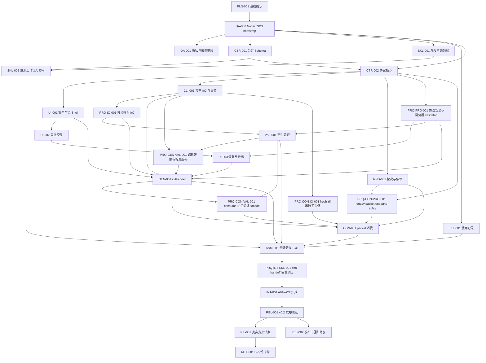

# `deliver-dual-audience-report` v0.2 实施施工单

> - 文档状态：已确认，执行中
> - 计划版本：0.2-execution
> - 总体状态：`in_progress` · W0–W6 全部 `done`，代码与发布候选已完成；W8 发布门回归修复 `done`；仅 W7 真实使用门未完成
> - 当前波次：W7 · 真实试点与指标验证（PIL-001 于 2026-08-20 `done`：一个经用户确认真实且有用的案例完成完整闭环，validation=pass，内容保持私有；MET-001 `deferred` 等待 3–5 份合格样本）
> - 协调者：主实施 Agent
> - 最后更新：2026-08-18（新增 W9：UI-004、VAL-002、RND-002 三个契约缺口修复，DOC-001 订正 DES-017，REL-003 按修复后的源码重切候选并重新绑定全部已记录摘要；需求条款未变更）
> - Spec 基线：`docs/spec.md` · SHA-256 `2459bf72298f12dc6d5938b682737516ba87145de30568847ec286da8279124b`（2026-08-19 DOC-002 视觉契约修订后重算；此前为 `6f54504182d88388f6bfd71e487a2cdf741cac9c490a858f6591c3c7af9cdcc1`）
> - Design 基线：`docs/design.md` · SHA-256 `1d1cdb83318596657e6240b70e4c78186309522c6843cf5b2f4e394e4a54b75f`（2026-08-20 W17 修订 §11.3 术语交互后重算；2026-08-19 W15 值为 `3c729a692669bee54c81b7cdf7ecfa1b1c06c5e367b2f78fab4cdbe0edc1e871`）
> - 运行事实源：[claude-code-handoff.md](claude-code-handoff.md)（候选 SHA、ZIP 摘要、PIL-001/MET-001 runbook 与剩余授权门）
> - 追踪状态：本文自 2026-08-17 起随仓库跟踪；`docs/调研/` 保持本地忽略，不进入仓库
> - 目录索引：[README.md](README.md)
> - 目标发布：v0.2.0

## 目录

1. [施工单使用规则](#1-施工单使用规则)
2. [全局边界与基线门](#2-全局边界与基线门)
3. [波次与依赖 DAG](#3-波次与依赖-dag)
4. [任务总表](#4-任务总表)
5. [详细任务卡](#5-详细任务卡)
6. [A01–A22 覆盖矩阵](#6-a01a22-覆盖矩阵)
7. [写入冲突矩阵](#7-写入冲突矩阵)
8. [集成、发布与试点门](#8-集成发布与试点门)
9. [进度更新协议](#9-进度更新协议)

## 1. 施工单使用规则

### 1.1 文档职责

本文只回答“按什么顺序、由哪个角色、修改哪些边界、运行什么验证，才能落实 [design.md](design.md)”。本文不得重新选择架构，也不得静默增加 [spec.md](spec.md) 没有定义的产品能力。

如果任务实现需要在多个技术方案中临场选择，说明 design 尚未决策完整：将相应任务设为 `blocked`，记录 blocker，并先更新 design。任务卡不得保留未解决的实现选择或未定义占位符。

### 1.2 状态枚举

| 状态 | 含义 |
|---|---|
| `blocked` | 前置决定、依赖、授权或证据未满足；不得开始写入 |
| `ready` | 依赖和写入边界满足，可以领取 |
| `in_progress` | 已有唯一 owner 正在实施 |
| `done` | outcome 已实现，全部验证通过且完成证据已记录 |
| `deferred` | 明确推迟到真实使用或未来版本，不属于当前代码完成门 |

不使用百分比。`done` 必须有：验证命令、退出结果、证据路径或摘要，以及对应提交 ID 或工作树快照。没有证据只能保持 `in_progress`。

### 1.3 单写者与协调规则

- `docs/task.md` 由协调者唯一写入；并行 worker 只回传状态和证据。
- 每个任务开始时登记 owner、时间和基线摘要，再切为 `in_progress`。
- worker 只能修改任务卡的 `write_scope`；发现需要跨界时先停止并请协调者重新排程。
- 共享源文件的所有权按第 7 节交接；同一时间只允许一个 writer。
- `.gitignore` 由用户维护。2026-08-17 用户在其中加入 `docs/调研`；任何实施任务都不得修改、暂存、还原或覆盖该文件。
- `docs/spec.md`、`docs/design.md`、`docs/task.md`、`docs/claude-code-handoff.md`、`docs/README.md` 与 `docs/int-001-external-evidence-2026-08-13.json` 自 2026-08-17 起随仓库跟踪，属于公开树，必须持续满足隐私约束：不得写入真实业务正文、方案标题、文档 ID、审批者身份、个人绝对路径或凭据。
- `docs/调研/` 保持本地忽略，不得提交，也不得把其中的正文复制进任何跟踪文件；跟踪文档只保留来源溯源记录（见 Spec §17）。

### 1.4 基线漂移规则

每次领取任务前运行：

```bash
shasum -a 256 docs/spec.md docs/design.md docs/task.md
git status --short
```

- spec 或 design 摘要不同于文首值时，全部未完成任务切回 `blocked`，执行影响审计。
- task 摘要变化是正常状态更新，但协调者必须确认变化只属于授权范围。
- 工作树出现未声明的用户修改时，保持并绕开；有重叠则暂停相应任务。
- 本施工单确认后，协调者先把 design/task 的最终摘要回填，再释放 W1。
- 2026-08-17 起三文档已跟踪，漂移可直接用 `git diff -- docs/` 与 `git log -- docs/` 定位；但文首摘要回填仍是协调者的手工职责，跟踪不替代摘要校验。

## 2. 全局边界与基线门

### 2.1 全局 in-scope

- 将现有 Skill 升级为 v0.2 审批工作台；
- Node 24 LTS + npm + strict TypeScript + esbuild；
- `review-document/1`、`review-packet/1`、`review-state/1`；
- 单文件离线 Approval HTML 和 Agent Markdown；
- init/render/validate/consume/record-usage Node CLI；
- A01–A22、浏览器、无障碍、安全、隐私和发布包验证；
- 公开 Skill 元数据、README、CI 与 v0.2 ZIP 同步。

### 2.2 全局 out-of-scope

- Info_ORG 索引、目录、归档或文件治理；
- 多人审批、跨轮 diff、深色模式、移动端专用形态；
- Todoist、队列、Agent 预填决定；
- 任意 HTML/SVG、动态插件或远程运行时资源；
- 自动执行已批准事项；
- tag、GitHub Release 或其他正式发布动作，除非另行授权。本轮用户已明确授权波次 feature/integration branch push；每次仍须先通过该波次 gate，不得借此创建 tag 或 Release。

### 2.3 W0 设计确认门

PLN-001 已完成，W1 已释放。实现严格按 DAG 推进；QA-000 的 package/config/CI bootstrap 先形成 W1 integration base，再从该基线并行启动公共合同、Skill surface、telemetry 与 QA-001 隐私/覆盖迁移，避免并行 worktree 引用尚不存在的 npm scripts。

| 控制项 | 状态 | 当前证据 |
|---|---|---|
| Spec 基线 | `done` | `docs/spec.md` 摘要已核对为文首值，且按用户指令作为已确认需求基线，不修改正文 |
| Design 确认门 | `done` | 用户于 2026-08-12 明确要求按 design/task 全量实施 |
| 实现释放 | `done` | PLN-001 已完成，W1 integration base 已释放 |

2026-08-12 的 W1 首次施工审计发现公共 Schema 的少量字段命名与三个专属验证薄入口尚未分配。协调者已在不改变 spec 行为的前提下固定 Schema Draft/URN、conflict/nextAction/content node/splitGroup/BCP-47/quote 口径，并把 schema meta、generated check 与 unit test 明确交给 CTR-001。影响审计结论：CTR-001 直接采用新口径；QA-001、SKL-001、TEL-001 的接口与写入范围不受影响，可继续执行。新的 design 摘要已回填文首。

W2 启动预检进一步固定了 standalone validator 的生成物/工具、protocol facade、语义 golden 与 browser digest 测试，以及 SKL-002 的专属测试写域。这些是既有 DES-004/009 与验证架构的施工归属澄清，不增加产品行为。影响审计结论：已完成的 QA-000/001、CTR-001、SKL-001 和正在收口的 TEL-001 均不受影响；CTR-002、SKL-002 必须采用下列精确写域，UI-001 仍须等 CTR-002 facade 冻结后开始。

2026-08-13 的 CON 开工预检在 PRQ-CON-IO 合入后发现两个公开组合面仍未闭合：现有 prototype packet migration 会从调用时 current 重建摘要/轮次，无法让同一 legacy receipt 在下一轮命中原 ledger；VAL 的旧静态合同诊断、错误/退出分类与 fresh generated exact-byte verifier 仍为私有或仅有语义版本。协调者因此冻结 PRQ-CON-PRO-001 与 PRQ-CON-VAL-001 两个互斥窄前置，并明确 assembly template loader rejection 只由 ASM 映射为 `phase:"cli"`。影响审计结论：公共 Schema/wire、现有 bound packet/state migration、VAL/GEN/render、CLI I/O、UI 与已完成任务均不变；CON-001 在两个前置都经 fixed-SHA review 与远端 CI 合入前保持 blocked。

门的解除条件：

1. 用户确认 `docs/design.md`；
2. spec/design 无开放产品或工程选择；
3. 两文档摘要回填本文；
4. A01–A22 恰有一个主责 owner；
5. 写入冲突矩阵无同时 writer；
6. 当前工作树和 `.gitignore` 用户变更被记录且不受影响。

## 3. 波次与依赖 DAG

### 3.1 依赖图



### 3.2 波次

| 波次 | 任务 | 并行策略 | 释放条件 |
|---|---|---|---|
| W0 | PLN-001 | 单线程 | 用户确认设计并冻结摘要 |
| W1 | QA-000 先建立 integration base；随后 QA-001、CTR-001、SKL-001、TEL-001 四 lane 并行 | bootstrap 串行，后续四 lane 写入互斥 | Node 24 渐进 CI 与各任务专属验证通过 |
| W2 | CTR-002 与 SKL-002 并行；CTR-002 合入后完成 UI-001 | UI shell 可预研，但共享 validator/digest 未冻结前不得合并或 done | Contract gate 与安全 shell 通过 |
| W3 | CLI-001、RND-001、UI-002 | 三 lane 并行 | 协议核心/安全 shell 通过 |
| W4 | PRQ-PRO-001 与 PRQ-IO-001 先并行；合入后恢复 UI-003 与 VAL-001；UI-003 完成后启动 GEN-001；GEN 后补 PRQ-CON-IO-001；CON 预检再并行补 PRQ-CON-PRO-001 与 PRQ-CON-VAL-001，三前置均合入后再 CON-001、ASM-001 | prerequisite 写域互斥；CON/ASM 只按 DAG 解锁，PRQ-CON-PRO + PRQ-CON-VAL → CON → ASM 严格收口 | 全部前置门、组件门和分发表面门通过 |
| W5 | INT-001 先执行；真实 fresh final reply 发现产品合同缺口后，冻结 INT 并串行完成 PRQ-INT-SKL-001，再回到 INT | prerequisite 期间只有 Skill body/test 窄写权；INT acceptance 写域保持冻结 | prerequisite fixed-SHA/CI 合入，随后同协议 fresh reply 与 A01–A22 全量回归通过 |
| W6 | REL-001 | 独占 README/CI/dist | 集成门通过 |
| W7 | PIL-001 `done`（2026-08-20）；MET-001 deferred | 真实使用 | 真实案例闭环经用户确认；指标等样本 |
| W8 | REL-002 | 单线程；与 W7 无写入交集 | 候选 HEAD 全量门（含 `scan:legacy-surface`）恢复全绿 |
| W9 | UI-004、VAL-002、RND-002 三 lane 并行；DOC-001 独立；全部合入后由 REL-003 重切候选 | 三 lane 写域互斥（workbench / cli-validate / transition）；REL-003 串行收口 | 四项契约缺口各有失败-通过变异证明；候选重建且全部门全绿 |
| W10 | IO-001、VAL-003、GEN-002、TEL-002；REL-004 收口重切 | 单线程；四个缺口分属 CLI I/O、validate/consume、generators 与 telemetry | 五项缺口各有失败-通过变异证明；候选重建且全部门全绿 |
| W11 | UI-005；REL-005 收口重切 | 单线程；只写 workbench 与其测试 | 审批台与已批准原型视觉一致；三浏览器全绿；候选重建 |
| W12 | CI-001 浏览器安装硬化 | 单线程；只写 `.github/**` | 安装步骤有界、可重试、可降级；PR #69 自验证与 PR #68 复跑全绿 |
| W13 | DOC-002 视觉契约固化 | 文档-only；只写 spec/design/task/handoff 及摘要回填 | 三份规划文档同步修订、摘要重新绑定、文档门全绿 |
| W14 | CI-002 浏览器 lane 容器化 | 单线程；只写 `.github/**`、锁步断言测试与文档台账 | 用户审批回执（round 1 全 PASS）授权；PR 自验证四 job 全绿；锁步断言经双向变异验证 |
| W15 | UI-006 工作台使用反馈修复；REL-006 收口重切 | 单线程；写 workbench、Skill 写作规范与测试 | 用户 5 条使用反馈逐条裁定并落地；三浏览器全绿；候选重建 |
| W17 | UI-007 术语交互简化；REL-007 收口重切 | 单线程；写 workbench 渲染器与测试 | termRef 单锚点（悬停预览 + 点击跳附录）；三浏览器全绿；候选重建 |

W0–W6 的 milestone 均已关闭。W7 的 PIL-001 已于 2026-08-20 完成：一次用户授权的真实业务闭环（生成→审批→回执→消费→定稿）经全套验证通过并获用户确认真实且有用，Issue #61 以内容无关模板关闭；内容保持私有，公开面只记录本句去标识状态。W7 剩余 MET-001：等待累计 3–5 份合格真实案例，绿色 CI、fixture 与 replay no-op 仍不能替代。执行细节与授权门见 [claude-code-handoff.md](claude-code-handoff.md) §6–§7。

W8 是候选冻结后的维护波次，不推进 W7，也不改变任何产品行为。它只修复 2026-08-17 规划文档跟踪化在候选分支上引入的发布门回归：`docs/{spec,design,task}.md` 记录了已退役的 v0.1 实现与迁移口径，被 `scan:legacy-surface` 当作当前公开承诺而阻断。W8 恢复该门，并补上一条能在 `npm run test:unit` 中复现同类回归的测试。

## 4. 任务总表

| ID | Outcome | Depends on | Lane | Status | Owner | 主要写入范围 | 主要验收 |
|---|---|---|---|---|---|---|---|
| PLN-001 | 冻结三文档基线和完整追溯 | 无 | control | `done` | 协调者 | `docs/design.md`、`docs/task.md` | 基线门 |
| QA-000 | 建立 Node 24、package/config/scripts 与渐进 CI integration base | PLN-001 | bootstrap | `done` | QA/tooling engineer | package/config/CI/common helpers | Node/CI bootstrap |
| QA-001 | 修复并迁移公开树隐私基线，完成覆盖检查工具 | QA-000 | qa | `done` | QA/tooling engineer | public-tree tests/coverage checker | 隐私/覆盖基线 |
| CTR-001 | 固定三个公共 Schema 和协议夹具 | QA-000 | protocol | `done` | protocol engineer | references schemas、schema fixtures | Contract gate |
| SKL-001 | 公开触发与 UI metadata 准确路由 | QA-000 | surface | `done` | Skill surface engineer | SKILL frontmatter、openai.yaml、trigger tests | A14 |
| TEL-001 | Node 使用记录满足非阻断隐私合同 | QA-000 | telemetry | `done` | privacy/telemetry engineer | usage module/tests | 隐私回归 |
| CTR-002 | 共享协议验证、摘要、身份、迁移和版本不变量可用 | QA-000、CTR-001 | protocol | `done` | w2_protocol Agent | 固定 protocol 文件、专属 tests | A09/A12/A18 |
| UI-001 | 安全自足 shell 与结构化内容 renderer 可用 | CTR-002 | ui | `done` | w2_ui_shell Agent | workbench shell/renderer、专属 browser test | A19 |
| SKL-002 | Skill 工作流、模板和 references 完成新版语义 | CTR-001、SKL-001 | surface | `done` | w2_skill_workflow Agent | SKILL body、Agent template、references | reader isolation |
| CLI-001 | 共享路径边界、事务与崩溃恢复可供各命令复用 | CTR-002 | cli-core | `done` | w3_cli_io Agent | `src/cli/io/**`、专属 tests | atomic I/O gate |
| RND-001 | 轮次、冻结、依赖资格和 TOPIC 幂等完整 | CTR-002 | protocol | `done` | w3_transition Agent | transition core/tests | A04–A07/A16/A17/A21 |
| UI-002 | 四动作、bulk、检索、引用和纯键盘流完成 | UI-001 | ui | `done` | w3_ui_interactions Agent | workbench reducer/UI、actions browser test | A03/A20 |
| PRQ-PRO-001 | 协议链接 fail-closed 且浏览器可在体积门内完整校验三协议 | CTR-002 | protocol-prereq | `done` | w4_protocol_prereq Agent | protocol validator/invariant/build probes | A12/A19 |
| PRQ-IO-001 | validate 获得无副作用、TOCTOU 关闭的只读输入 facade | CLI-001 | cli-prereq | `done` | w4_read_io_prereq Agent | CLI I/O facade/read tests | read-only gate |
| PRQ-PKT-001 | 历史 Markdown packet 可在身份绑定前完成完整自校验并进入 replay no-op | CTR-002、RND-001 | protocol-prereq | `done` | w4_protocol_prereq Agent | packet Markdown facade/tests | A07/A15 |
| VAL-001 | 双产物、handoff、隐私和旧接口验证完成 | PRQ-PRO-001、PRQ-IO-001 | cli | `done` | w4_validation Agent | validate command/tests | A15 |
| UI-003 | packet/state、恢复、复制降级和重开完成 | UI-002、PRQ-PRO-001 | ui | `done` | w4_ui_recovery Agent | workbench storage/export、recovery browser test | A02/A08/A10/A11/A22 |
| CON-001 | consume 验证候选轮次并原子幂等提交 | RND-001、GEN-001、PRQ-CON-IO-001、PRQ-CON-PRO-001、PRQ-CON-VAL-001 | cli | `done` | w4_consume Agent | consume command/tests | A04–A07/A21 |
| PRQ-GEN-VAL-001 | 跨轮 replace 身份与 Agent H1 唯一编码 | VAL-001、CLI-001 | cli | `done` | gen-val-prereq Agent | VAL parser/facade 窄扩展 | GEN replace gate |
| PRQ-CON-IO-001 | fresh 输出根在同一 claim 下先恢复、再判空并整体提交 | CLI-001 | cli-prereq | `done` | fresh-I/O prerequisite Agent | CLI I/O fresh facade/tests | CON crash/replay gate |
| PRQ-CON-PRO-001 | 同一 self-sufficient legacy packet 跨轮规范化为同一 receipt | CTR-002、RND-001 | protocol-prereq | `done` | con-pro-prereq Agent | protocol migration facade/tests | CON legacy replay gate |
| PRQ-CON-VAL-001 | VAL 为 CON 提供闭合诊断、退出分类与 fresh exact-byte verifier | VAL-001、GEN-001 | validation-prereq | `done` | con-val-prereq Agent | VAL public facade/tests | CON composition gate |
| GEN-001 | init/render 确定性生成双产物并安全提交 | PRQ-PRO-001、PRQ-IO-001、UI-001、UI-003、VAL-001、PRQ-GEN-VAL-001 | cli | `done` | gen Agent | generators、init/render command/tests | A01/A13 |
| ASM-001 | 组装唯一公开 CLI/Skill 分发面并退役旧入口 | GEN-001、VAL-001、CON-001、SKL-002、TEL-001 | assembly | `done` | w4_assembly Agent | CLI main、分发 bundle、旧资源退役 | installed-skill gate |
| PRQ-INT-SKL-001 | fresh final reply 精确绑定 handoff 身份与 uncertainty count | ASM-001 | surface-prereq | `done` | prq_int_skl Agent | Skill body、skill-workflow test/fixture | fresh final reply gate |
| INT-001 | A01–A22、浏览器、安全和 reader isolation 全通过 | 全部组件任务、PRQ-INT-SKL-001 | integration | `done` | w4_integration Agent | acceptance tests/evidence only | Integration gate |
| REL-001 | README/CI/v0.2 ZIP 与新接口一致、可回滚 | INT-001 | release | `done` | w6_release Agent | README、CI、dist、专属 release E2E | Release gate |
| PIL-001 | 一份真实业务方案完成闭环 | REL-001 | pilot | `done` | 用户 + 协调者 | 脱敏本地证据 | Pilot gate |
| MET-001 | 3–5 份真实方案验证时间/轮次/负担指标 | PIL-001 | metrics | `deferred` | 未分配 | 内容无关指标摘要 | Spec §6.3 |
| REL-002 | 恢复候选 HEAD 的 `scan:legacy-surface` 门并防止同类回归复发 | REL-001 | release | `done` | w8_release_gate Agent | legacy-surface scanner、专属回归测试、CI 触发面 | Release gate |
| UI-004 | 随手记编辑绑定自身来源块；被拒动作给出可理解的本地化提示 | REL-002 | ui | `done` | w9_ui_feedback Agent | `src/workbench/{interactions,i18n}.ts`、i18n/reducer-interactions/actions 测试 | A20；Spec §9.3、§13.5 |
| VAL-002 | 个人绝对路径与作者遗留占位符不再漏检 | REL-002 | cli | `done` | w9_validate Agent | `src/cli/validate/**`、privacy/parsers 测试 | A15；Spec §13.2、§14.1 |
| RND-002 | 未触及待处理块不得被候选自声明的影响集改写 | REL-002 | protocol | `done` | w9_transition Agent | `src/protocol/transition/transition.ts`、rounds-invariants 测试 | A04/A16；Spec §11.3 |
| DOC-001 | DES-017 与已跟踪现状及发布门断言一致 | REL-002 | control | `done` | 协调者 | `docs/design.md` DES-017 行与变更说明 | 基线门 |
| REL-003 | 按修复后的源码重切 v0.2 候选并重新绑定全部已记录摘要 | UI-004、VAL-002、RND-002、DOC-001 | release | `done` | w9_release Agent | `dist/**`、生成分发面、handoff §1、task/handoff 摘要、claude-handoff 测试 | Release gate |
| IO-001 | 字节相同的 replace 不再制造无法判读的事务，也不再丢失既有交付文件 | REL-003 | cli-core | `done` | w10_io Agent | `src/cli/io/transaction.ts`、cli-io 与 replace-generated 测试 | atomic I/O gate |
| VAL-003 | render 具备退役合同诊断；`/derived/N` 指针索引空间统一 | REL-003 | cli | `done` | w10_validate Agent | `src/cli/render/index.ts`、`src/cli/{consume,validate}/**`、legacy-interface 测试 | A12/A15；Spec §10.5、§11.1 |
| GEN-002 | 步骤中的首个代码块保持惰性，不被解析为文档结构 | REL-003 | generators | `done` | w10_generators Agent | `src/generators/markdown.ts`、generators 测试 | A19；Spec §13.3 |
| TEL-002 | summarize 不再静默截断合规样本 | REL-003 | telemetry | `done` | w10_telemetry Agent | `src/cli/record-usage.ts`、record-usage 测试 | Spec §6.3 |
| REL-004 | 按 W10 修复重切候选并重新绑定摘要 | IO-001、VAL-003、GEN-002、TEL-002 | release | `done` | w10_release Agent | `dist/**`、生成分发面、handoff §1、claude-handoff 测试 | Release gate |
| UI-005 | 审批 HTML 采用用户已批准的审批工作台原型视觉系统与阅读顺序 | REL-004 | ui | `done` | w11_ui Agent + 协调者 | `src/workbench/**`、`src/generators/approval.ts`、build/check 工具、workbench 测试 | A19/A20；用户 2026-08-18 指令 |
| REL-005 | 按 W11 重切候选并重新绑定摘要 | UI-005 | release | `done` | w11_release Agent | `dist/**`、生成分发面、handoff §1、claude-handoff 测试 | Release gate |
| CI-001 | 浏览器安装步骤有界、可重试、可降级，不再无限挂起 | REL-005 | infra | `done` | w12_ci Agent | `.github/workflows/validate.yml`、`.github/scripts/install-playwright.sh` | PR #69 自验证与 PR #68 复跑全绿 |
| DOC-002 | 审批台视觉契约固化为需求条款与工程决定 | UI-005、CI-001 | control | `done` | 协调者 | `docs/{spec,design,task}.md`、`docs/claude-code-handoff.md` 摘要 | Spec §18.2 影响审计；文档门 |
| CI-002 | 浏览器 lane 容器化：apt 与浏览器下载移出 CI 关键路径 | CI-001、DOC-002 | infra | `done` | w14_ci Agent | `.github/workflows/validate.yml`、锁步断言测试、docs 台账 | 用户审批回执；PR 自验证全绿 |
| UI-006 | 同动作开关语义、随手记目标可见、术语悬停预览与写作规范强化 | CI-002 | ui | `done` | w15_ui Agent | `src/workbench/**`、Skill references、workbench 测试 | A20；用户 2026-08-19 使用反馈 |
| REL-006 | 按 W15 重切候选并重新绑定摘要 | UI-006 | release | `done` | w15_release Agent | `dist/**`、生成分发面、handoff §1/§6.2、claude-handoff 测试 | Release gate |
| UI-007 | termRef 简化为悬停预览 + 点击跳术语表的单一锚点 | UI-006 | ui | `done` | w17_ui Agent | `src/workbench/{content-renderer,bootstrap,shell,i18n}.ts`、renderer 测试 | A19；用户 2026-08-20 反馈 |
| REL-007 | 按 W17 重切候选并重新绑定摘要 | UI-007 | release | `done` | w17_release Agent | `dist/**`、生成分发面、handoff §1/§6.2、claude-handoff 测试 | Release gate |

## 5. 详细任务卡

### PLN-001 · 冻结 spec/design/task 基线

- **状态 / owner_role / owner / last_updated**：`done` / coordinator / 协调者 / 2026-08-12
- **Outcome**：用户确认设计后，三文档摘要、DES-001–DES-018、任务 DAG、A01–A22 主责和写入范围一致，无实施者待决选择。
- **Depends on / unlocks**：无 / W1 全部任务。
- **Parallel / conflicts**：不可并行 / 与任何产品实现写入冲突。
- **Write scope**：`docs/design.md`、`docs/task.md`；只允许协调者写。
- **Refs**：Spec 全文；Design §1、§4、§17、§18；A01–A22。
- **Implementation contract**：不修改 spec 的需求条款；复核其 SHA-256。用户确认 design 后重新计算 design/task 摘要并回填；`.gitignore` 不得由实施任务修改。2026-08-17 起跟踪口径反转：改为检查三文件已随仓库跟踪，且 `docs/调研/` 仍被忽略。
- **Failure rules**：摘要漂移、开放决定、重复/缺失 Axx 主责或用户修改重叠时保持 blocked。
- **Validation**：

  ```bash
  shasum -a 256 docs/spec.md docs/design.md docs/task.md
  if rg -n '\b(T[O]DO|T[D]B|F[I]XME|待[补]充|待[填]写)\b' docs/{design,task}.md; then exit 1; fi
  pandoc --from=gfm --to=html docs/design.md -o /tmp/deliver-design-check.html
  pandoc --from=gfm --to=html docs/task.md -o /tmp/deliver-task-check.html
  ruby -e 'ARGV.each{|f|s=File.read(f);ids=s.scan(/\bid="([^"]+)"/).flatten.to_h{|x|[x,true]};missing=s.scan(/href="#([^"]+)"/).flatten.uniq.reject{|x|ids[x]};abort("#{f}: #{missing.join(",")}") unless missing.empty?}' /tmp/deliver-design-check.html /tmp/deliver-task-check.html
  ruby -e 's=File.read("docs/task.md");got=s.scan(/^\| (A(?:0[1-9]|1[0-9]|2[0-2])) \|/).flatten;want=(1..22).map{|i|format("A%02d",i)};abort("Axx rows: #{got.inspect}") unless got.sort==want'
  test -f docs/spec.md && test -f docs/design.md && test -f docs/task.md
  git ls-files --error-unmatch docs/spec.md docs/design.md docs/task.md
  git check-ignore -v docs/调研
  git diff --check -- .gitignore
  git diff --no-index --check /dev/null docs/design.md >/tmp/deliver-design-whitespace.diff; design_check_rc=$?; test "$design_check_rc" -eq 1
  git diff --no-index --check /dev/null docs/task.md >/tmp/deliver-task-whitespace.diff; task_check_rc=$?; test "$task_check_rc" -eq 1
  ```

  预期：spec 摘要等于文首；design/task 无未决标记，均能按 GFM 解析；目录内部锚点和本地链接有效；A01–A22 在覆盖矩阵中各出现一次；三文件均已跟踪且 `docs/调研/` 仍被 `.gitignore` 忽略；所有跟踪文档均无空白错误。
- **Completion evidence**：W0 冻结时 Spec SHA-256 `677f56b36ff881058fa9054786a095a15780efe105f9fbbe992abc34a45cfbb5`；W0 冻结时 Design SHA-256 `d0c73862db2e40da5109be500d40ab9712f7b0befdb2410c8c9e5356bb76659b`（design 在 W1–W2 施工审计后按授权范围多次回填，spec 在 2026-08-17 文档整合中更新状态元数据；两者当前值以文首为准）；A01–A22、DES-001–DES-018、Markdown/链接/隐私/空白与三类独立终审均通过；用户于 2026-08-12 明确授权全量实施。实施启动审计补齐依赖、量化覆盖门、跨环境摘要/Unicode/数组规范、packet serializer 单一归属、渐进 CI 与可执行 DAG；W1 首次施工审计固定公共 Schema 字段级口径，W2/W3 预检进一步固定 tree-shakeable standalone validator、core/transition/workbench/CLI-I/O facade、纯字节摘要、portable path key、事务 manifest/恢复状态机、轮次 plan/no-op/资格 selector、六类摘要、语义 golden、测试层与体积预算归属，均不改变产品语义。

### QA-000 · Node 24、TypeScript 与渐进 CI bootstrap

- **状态 / owner_role / owner / last_updated**：`done` / QA/tooling engineer / 主实施 Agent / 2026-08-12
- **Outcome**：所有后续 worktree 从同一个 Node 24 integration base 获得锁定依赖、严格 TypeScript、构建/测试配置、预注册 npm scripts、公共 helper 与能按当前波次逐步升级的远端 CI。
- **Depends on / unlocks**：PLN-001 / QA-001、CTR-001、SKL-001、TEL-001。
- **Parallel / conflicts**：bootstrap 独占；完成并合入 integration 前不启动其他写入 lane。合入后 package/config/common helper 冻结到 REL-001 的最终 CI 扩充。
- **Write scope**：`package.json`、`package-lock.json`、`.npmrc`、`.node-version`、`tsconfig.json`、`eslint.config.mjs`、Vitest/Playwright/esbuild 配置、`tests/helpers/**`、基础 `tools/{build,component-not-implemented,validate-skill}.mjs`、`.github/workflows/validate.yml` 的 Node 24 渐进 CI 骨架。
- **Refs**：Spec §13–§14；Design DES-001/002/004/015、§14–§15。
- **Implementation contract**：package version 从首日固定为 `0.2.0`；engine `>=24 <25` 且 `.npmrc` 为 `engine-strict=true`；lockfile 固定 Design §15.1 全部依赖；strict/noUncheckedIndexedAccess/exactOptionalPropertyTypes 开启；Playwright 声明 Chromium/WebKit/Firefox；全部施工 scripts 一次性注册，尚无实现的脚本必须以稳定 `component not implemented` 非零退出。CI 使用 Node 24、`npm ci`、当前已实现的波次门与保留的 Python 回归，并固定外部 Skill/Schema validator 版本或 commit，不从浮动 HEAD 安装。
- **Failure rules**：不得在 Node 26 生成 lockfile/bundle；不得以空脚本或跳过冒充通过；不得改产品实现或删除旧 Python/模板/schema。
- **Validation**：

  ```bash
  node -e 'if (Number(process.versions.node.split(".")[0]) !== 24) process.exit(1)'
  npm ci
  npm run build -- --infrastructure-only
  npm run typecheck
  npm run lint
  npm run test:browser -- --list
  git diff --check
  ```

  预期：全部退出 0；lockfile 无漂移；浏览器项目完整；普通未实现产品 build 明确非零；GitHub workflow 语法合法且只运行当前已存在的门。
- **Completion evidence**：原 bootstrap 提交 `ae103d8d89aa3525e7aced535919288ac07c4e0e` 经 PR #11 合入 `codex/v0.2.0`（合并提交 `b8e7e8d4c1538722d93c95ae40d98a7638c92d09`）；GitHub Actions run `31577614145` 的 `test` job 通过。Node `24.19.0` 下 `npm ci`、infrastructure build、typecheck、lint、三浏览器 bootstrap smoke、空 unit/e2e/coverage 与普通 product build 的稳定 rc=3 负门、Python 7/7 基线、`npm audit`（0 vulnerabilities）及 `git diff --check` 均通过。后续发现的 suite/filter 假绿由 Issue #6 跟踪；修复提交 `661889f28f79c043a97bb2973f7b6035e5b6b0f7` 经 PR #18 合入（合并提交 `15c28d9c73aec94223a37c4ae26d230a8a1db2fc`），GitHub Actions run `31581277971` 通过。最终运行器对 suite 边界、稳定 rc=3、Windows 路径及 Vitest 参数透传均通过黑盒回归，独立复核 PASS；Issue #6 已关闭。

### QA-001 · 隐私基线迁移与覆盖检查

- **状态 / owner_role / owner / last_updated**：`done` / QA/tooling engineer / 主实施 Agent / 2026-08-12
- **Outcome**：旧公开树隐私误报被修复并迁移到 Node，负例保护不削弱；A01–A22 双向追溯与 V8 数值覆盖门可机械检查。
- **Depends on / unlocks**：QA-000 / INT-001。
- **Parallel**：CTR-001、SKL-001、TEL-001。
- **Conflicts**：只写本卡路径；不得修改已冻结 package/config/common helper。
- **Write scope**：`tools/check-acceptance-coverage.mjs`、`tests/test_delivery.py` 的迁移前修复与退役、`tests/unit/public-tree.test.ts`、coverage checker 自测 fixture，以及 `.github/workflows/validate.yml` 中按文件存在性启用已实现 unit/e2e/coverage/schema/browser/build 门的渐进调度；不修改 package/config 或最终发布矩阵。
- **Refs**：Spec §13–§14；Design §14–§15；A01–A22。
- **Implementation contract**：先把 Python 扫描改用 `git ls-files`，只在 Session ID 语境匹配 UUID，保留用户名、token、私人路径和真实 Session ID 负例并记录 7/7；再迁移仍适用于 v0.2 的断言并删除旧单体测试。coverage checker 要求 A01–A22 各出现一次、primaryTask/testId 唯一且 testId 可发现；V8 门强制 statements/lines/functions ≥90%、branches ≥85%。
- **Failure rules**：不得通过删除隐私断言或降低阈值取绿；不得扫描或修改 ignored 调研材料。
- **Validation**：

  ```bash
  PYTHONDONTWRITEBYTECODE=1 python3 -m unittest discover -s tests -p 'test_delivery.py' -v
  npm run test:unit -- public-tree
  node tools/check-acceptance-coverage.mjs --self-test
  test ! -e tests/test_delivery.py
  git diff --check
  ```

  预期：迁移前 Python 7/7；迁移后 Node 隐私正反例、coverage checker 自测与覆盖率阈值正反自测全部通过；旧单体文件已退役。自测在临时目录证明满足阈值时为绿、低于分支阈值时为红，并核对真实 Vitest 配置仍为 90/85；真实 `src/**/*.ts` 数值门从首个产品组件合并起由渐进 CI 在每波次强制运行。
- **Completion evidence**：提交 `fc7bbcea3367a5f422068a5b39c457cfbdbb7c74` 经 PR #12 合入集成分支（merge `93545d3addc5efc9ff6974b69744fa7118baa413`）；GitHub Actions run `31579324105` 通过。迁移前 `PYTHONDONTWRITEBYTECODE=1 python3 -m unittest discover -s tests -p 'test_delivery.py' -v` 为 7/7；迁移后 Node24 public-tree 3/3、A01–A22 映射正反自测、V8 90/85 门正反自测、typecheck、lint、Playwright suffix 渐进 CI 检查和空白检查均通过；独立复核在两轮修正后 PASS。
- **Blocker / unblock**：无；任务完成。

### CTR-001 · 公共 Schema 与协议夹具

- **状态 / owner_role / owner / last_updated**：`done` / protocol engineer / w1_contracts Agent / 2026-08-12
- **Outcome**：`review-document/1`、`review-packet/1`、`review-state/1` Schema 和正反 fixture 冻结，能派生 TS 类型。
- **Depends on / unlocks**：QA-000 / CTR-002、SKL-002。
- **Parallel**：QA-001、SKL-001、TEL-001。
- **Conflicts**：CTR-002 只能在 Schema freeze 后写 protocol；其他任务只读 schemas。
- **Write scope**：Skill `references/review-document.schema.json`、`review-packet.schema.json`、`review-state.schema.json`、`tools/{check-schema-meta,generate-schema-types,check-generated}.mjs`、生成的 `src/protocol/types.generated.ts`、`tests/fixtures/schemas/**`、`tests/unit/schemas.test.ts`；旧 `report-contract.schema.json` 保留到 ASM-001 统一退役，本任务不得删除。
- **Refs**：Spec §7–§10、§15；Design DES-003–006/009、§7–§8；A01/A02/A09/A12/A18。
- **Implementation contract**：Schema 默认拒绝未知字段；content node 判别联合；三个协议身份、摘要、approval history/currentFrozen、含 source 在内的七维 IdHighWater、四动作、reopened、topic/sideNote、带 sourcePacketId/feedbackDigest 的 feedbackResolution、flow 文字替代和 splitGroup 按 design 固定；SourceRef 与 SharedItem 的稳定前缀、非空唯一 sourceRefs 和引用完整性按 Design §7.2 固定；review document 不含自声明 validation 快照；使用正反 fixture 证明每条硬不变量。
- **Failure rules**：不得保留旧报告字段的同名新义；不得把汇总设为权威；任何 Schema/类型漂移阻断 W2。
- **Validation**：

  ```bash
  npm run schema:meta
  npm run schema:types
  npm run check:generated
  npm run test:unit -- schemas
  ```

  预期：Schema metaschema 合法；类型重建无 diff；全部正例通过、每个反例命中特定 error code/path。
- **Completion evidence**：提交 `c42ce31c9da351dd8a5da534ae46caec47661900` 经 PR #14 合入集成分支（merge `7bfeaed4180479fba8a4438bb066e671d13ca843`）；GitHub Actions run `31580520627` 通过。三份 Draft 2020-12 Schema、生成类型与漂移工具完成；31 个 Schema 负例、26 个 CTR-002 语义负例和 TRIM/EXPAND 规范化夹具冻结；Node24 schema meta/type/drift、39/39 tests、typecheck、lint 和空白检查通过；独立复核在 URI、相对路径、跨文件 valid fixture 与语义负例补齐后 PASS。
- **Blocker / unblock**：无；任务完成，公共 Schema/fixture 冻结并交给 CTR-002 只读消费。

### SKL-001 · 公开触发合同与 UI metadata

- **状态 / owner_role / owner / last_updated**：`done` / Skill surface engineer / w1_skill_interface Agent / 2026-08-12
- **Outcome**：Skill 仅在“单人 + 明确审批目标 + 初始至少 4 个独立裁决项 + 双产物”时触发，反例不误触发。
- **Depends on / unlocks**：QA-000 / SKL-002、INT-001。
- **Parallel**：QA-001、CTR-001、TEL-001。
- **Conflicts**：先独占 `SKILL.md` frontmatter，完成后把正文所有权交给 SKL-002。
- **Write scope**：`SKILL.md` frontmatter、`agents/openai.yaml`、trigger fixtures 和独立 interface tests。
- **Refs**：Spec §5、§15–§16；Design DES-013/014/016、§6.4；A14。
- **Implementation contract**：description 与 default prompt 同时表达四项触发合同；旧静态双报告、多审阅者、少于 4 块、自由阅读、单报告、聊天和纯代码均为反例；不为凑数拆块。
- **Failure rules**：不得把触发逻辑藏在 body；不得继续承诺 `_HUMAN.html`。
- **Validation**：

  ```bash
  npm run test:unit -- skill-interface
  npm run validate:skill
  ```

  预期：正反 fixture 全部符合预期，Skill validator 退出 0。
- **Completion evidence**：提交 `48f70853cf64711ae1a438abcc4d3a41eeb18158` 经 PR #13 合入集成分支（merge `3a49eed0da6235a15d76148e788af79efeebe5e9`）；GitHub Actions run `31579887452` 通过。Node24 静态 interface tests 5/5、typecheck、lint、固定版 skills-ref、skill-creator quick validation 和空白检查通过；SKILL 正文保持不变。独立复核在删除伪 prompt classifier、明确 INT-001 fresh-agent 语义责任并加入中英边界语料后 PASS。
- **Blocker / unblock**：无；任务完成，SKILL 正文所有权交给 SKL-002。

### TEL-001 · 内容无关使用记录

- **状态 / owner_role / owner / last_updated**：`done` / privacy/telemetry engineer / w1_telemetry Agent / 2026-08-12
- **Outcome**：`record-usage` Node command 可并发安全记录纯指标，并为真实试点提供不含业务内容的固定测量字段；记录失败不影响已验证交付。
- **Depends on / unlocks**：QA-000 / INT-001。
- **Parallel**：QA-001、CTR-001、SKL-001。
- **Conflicts**：独占 Node usage 模块及测试；旧 `record_usage.py` 只由 ASM-001 统一退役，本任务不得删除。
- **Write scope**：`src/cli/record-usage*`、专属 tests、最终 bundle 中相应 command。
- **Refs**：Spec §6.3、§13.2、§15.1；Design DES-001/013、§7.7、§12.4。
- **Implementation contract**：只允许 trigger/validation/result、纠正/中断、本地 HMAC caseId，以及 Design §13.4 固定的 sampleSequence、T0/T1 决定数/主动毫秒、整份主动毫秒、源方案返工轮次、闭环状态和五级负担对照；主动时间按可见且 60 秒内有交互累计。禁止内容、标题、文档 ID 明文、路径、文件名、项目、命令、输出、会话标识、凭据；文件权限收敛、并发追加安全、失败 `not-recorded` 非阻断。
- **Failure rules**：不得把日志失败改成 delivery 失败；不得在错误中回显路径或内容。
- **Validation**：

  ```bash
  npm run test:unit -- usage
  npm run test:e2e -- record-usage
  ```

  预期：并发/权限/隐私正反例通过；强制写失败不改变先前 delivery 结果；模块级 summarize 对不足 3 个合规样本明确返回“尚未验证”且不回显 caseId。
- **Completion evidence**：最终功能提交 `aca4a8bcadb27b5a846974993ec2d8b793dc1fd3` 经 PR #19 合入 `codex/v0.2.0`（merge `920f5f416fc9b86d4c444761affe2c6235dd276a`）；GitHub Actions run `31584997653` 在合并上下文通过。最终严格复核无 P1/P2/P3：同一 case 多序列只计一个真实案例，后续完整失败试点撤销旧资格，state/record/input 的 inode、权限、父链、容量、HMAC、锁与 crash recovery 故障路径均通过；Unit 39/39、E2E 4/4，专属合并覆盖率 statements 90.62%、branches 86.44%、functions 100%、lines 95.33%，无内容/路径/身份泄漏和临时目录残留。W1 最终 integration `920f5f4` 上又通过 90 个 unit、4 个 E2E、94 项覆盖率（91.21/86.68/100/95.85）、三浏览器 bootstrap、固定 Skill validator 与隐私全树扫描。
- **Blocker / unblock**：无；任务完成。

### CTR-002 · 协议核心、摘要、身份与迁移

- **状态 / owner_role / owner / last_updated**：`done` / protocol engineer / w2_protocol Agent / 2026-08-12
- **Outcome**：所有 Node/browser 调用共享同一 standalone Schema validator、JCS 摘要、依赖图、批准历史/ID 高水位、历史迁移和纯错误模型；模块不接触文件系统。
- **Depends on / unlocks**：QA-000、CTR-001 / CLI-001、RND-001、UI-001、GEN-001、VAL-001。
- **Parallel**：SKL-002。
- **Conflicts**：独占以下列出的 protocol 文件；明确不拥有 `src/protocol/transition/**`，后续任务不得复制协议规则。
- **Write scope**：`src/protocol/{schema,schema.generated,canonical,digest,portable-path,packet-markdown,graph,migration,identity,invariants,errors,index}.ts`、`tools/generate-schema-validators.mjs`、对 `tools/check-generated.mjs` 的 validator 漂移扩展、`tests/unit/contracts-{schema,canonical,graph,migration,identity,errors,packet-markdown,fail-closed}.test.ts`、`tests/browser/protocol-digest.spec.ts`、`tests/fixtures/protocol/**`；公共 Schema、`types.generated.ts` 与 `tests/fixtures/schemas/**` 只读，禁止写 `src/cli/**` 和 `src/protocol/transition/**`。
- **Refs**：Spec §8、§10、§12.3、§13.2–§13.3；Design DES-004/006/009/011/012、§7–§9、§12；A09/A12/A18。
- **Implementation contract**：构建期 Ajv standalone 严格验证；CTR-002 默认生成物为 `schema.generated.ts`，document 和 packet/state 两个 pure factory group、`inlineRefs:1`、`messages:false` 与锁定版 fullFormats/helper 精确内联使 runtime 无 Ajv 编译/依赖、eval/new Function。W4 仅由 PRQ-PRO-001 经同一生成入口补充 browser companion，不改变本任务的默认生成物语义。`check-generated.mjs` 按 Design §6.1 固定的保活入口/esbuild/metafile 配置执行≤235520-byte browser probe并证明 portable Unicode 表未打入，以保留 UI 预算；standalone/runtime Ajv format 判定必须逐例等义。现有 Schema valid fixtures 只证明结构，语义摘要正例必须在 `tests/fixtures/protocol/**` 使用真实 review/semantic/state digest 与 packetId。`index.ts` 冻结 core facade：Schema 验证、非修改式 canonical copy、blockContent/documentContent/review/packetSemantic/state/feedback 六类摘要与 packet ID、`sha256Bytes`、独立可 tree-shake 的 `portablePathKey`（非法输入专用 `PORTABLE_PATH_INVALID`）、唯一 packet Markdown serializer/parser、DAG/闭包、历史迁移、身份/高水位/版本/previousReviewDigest、上下文不变量与稳定错误结果；同时为 RND 预注册 Design §7.7 的专用 transition codes。所有失败为 `{ok:false,mutated:false,errors}`，errors 按 path/code 排序。按 Design §7.1/§8.3 的封闭数组矩阵执行 RFC 8785/JCS，并由 `@noble/hashes/sha2.js` 为 Node/browser 同步生成 SHA-256。SharedItem/SourceRef 重复 ID、空/重复 sourceRefs 和悬空引用可定位拒绝；DAG/cycle 和 15/7；approval history/currentFrozen、source/block/fact/decision/glossary/note/topic 七维 IdHighWater、reopened/topic/sideNote、绑定 packet/反馈摘要的 resolution；TRIM/EXPAND 原子迁移；identity confirmation；documentContentDigest 与 contentVersion 的机械一致性。不得实现跨轮动作消费、执行资格、影响裁决、冻结提交或定稿；它们归 RND-001 的独立 transition facade。符号链接、文件事务与退出码映射归 CLI-001。
- **Failure rules**：所有失败 `mutated=false`；不能信任 progress/stats/eligibility；未知未来协议拒绝；不得自动套用当前身份。
- **Validation**：

  ```bash
  npm run test:unit -- contracts canonical graph migration identity errors
  npm run test:browser -- protocol-digest
  npm run check:generated
  if rg -n 'node:fs|node:crypto|new Function|eval\(' src/protocol; then exit 1; fi
  if rg -n "from ['\"]fs['\"]" src/protocol; then exit 1; fi
  ```

  预期：A09/A12/A18、批准历史、七维高水位（含删除来源后跨轮禁止复用 `SRC-*`）和版本正反例全通过；Node 与 browser digest golden 完全一致；protocol 不导入文件系统且 bundle 无动态代码生成。
- **Completion evidence**：提交 `fc54a6f0640aed768854d32900558818eb89d13e` 经 PR #21 合入 `codex/v0.2.0`（merge `9362c532d24b4cef8409aa82d80a450c07b0a0a1`）；GitHub Actions run `31597743717` 全绿。固定提交上 full coverage 187/187（statements 92.24%、branches 87.48%、functions 98.17%、lines 94.79%）、Chromium/WebKit/Firefox digest 3/3、E2E 4/4、Schema/generated/type/lint/空白与 browser probe `198695/235520` 全部通过。两名独立 reviewer 对 exact SHA 给出 PASS：1,230 组公开 `ProtocolResult` 敌意输入零抛异常/零畸形结果、5,000 组 JCS 随机对照零差异，Proxy、原型污染、迁移原子性、DAG/恶意 Map、ID 高水位、错误路径和 unsafe integer 边界均闭合；protocol 不导入文件系统/Node crypto/DOM，也无动态代码生成。
- **Blocker / unblock**：无；任务完成，core facade 冻结并交给 UI-001、CLI-001 与 RND-001 只读消费。

### CLI-001 · 共享 I/O、路径边界与可恢复事务

- **状态 / owner_role / owner / last_updated**：`done` / CLI reliability engineer / w3_cli_io Agent / 2026-08-13
- **Outcome**：GEN/VAL/CON 可调用同一套参数错误映射、输出根/symlink 防护、同文件系统 stage/backup/manifest/fsync 事务和启动恢复；正常失败或完整回滚均报告 `mutated:false`。TEL-001 保持其已审计的私有追加路径，不纳入交付文件事务。
- **Depends on / unlocks**：CTR-002 / GEN-001、VAL-001、CON-001。
- **Parallel**：RND-001、UI-002。
- **Conflicts**：独占 CLI 公共 I/O 与事务路径；各命令任务只调用，不能复制或修改。
- **Write scope**：`src/cli/io/{index,paths,transaction,recovery,fsync}.ts`、`src/cli/{result,exit-codes}.ts`、`tests/unit/cli-io.test.ts`、`tests/e2e/{transaction-recovery,path-boundary,symlink,replace-generated}.test.ts`。
- **Refs**：Spec §7.4、§12.3、§13.2、§14.1；Design DES-012/013、§6.3、§7.8、§12.3、§12.5。
- **Implementation contract**：以 `src/cli/io/index.ts` 为唯一 facade，严格实现 Design §12.5 已锁定的函数、`CliIoResult`、manifest `/1`、phase/游标、0700/0600、fresh-root、verifyStaged/verifyExisting seam 与错误码；portable key 和原始字节摘要只调用 protocol facade。所有授权、路径、碰撞、目标状态和同设备检查在创建事务目录前完成；所有合同/Agent/Approval 目标位于同一 resolved root/filesystem；除本次新建 output root 和私有 `.review-txn` 外，目标相对路径的每级父目录必须预先存在、是无符号链接的真实目录且与 root 同设备，缺失或类型不符在创建随机事务目录前返回 `PATH_INVALID`，I/O facade 不隐式创建业务子目录。consume 合同固定落为 `<baseName>.review-document.json`；新文件 stage 后再验证并 fsync；replace 由调用方证明同身份生成物后备份；私有 manifest 每次改变均临时文件+fsync+rename+目录 fsync；成功先清理事务再返回 value；启动按 owner/version/digest 恢复，自有信息不明时阻塞且不删除；render 不改合同，consume fresh root 将候选合同和全部产物整体提交。confirm-output-scope 的 CLI 参数/业务授权判断由各写命令执行，I/O facade 只提交已经通过授权门的计划。
- **Failure rules**：不得跨设备降级为 copy；不得接受大小写/Unicode 规范化碰撞；不得只信 repositoryStatus；不得删除无已知 manifest 的目录；不得在恢复不确定时输出成功；`mutated:true` 仅允许伴随 `recoveryRequired:true`、exit 70 并阻塞后续写。
- **Validation**：

  ```bash
  npm run test:unit -- cli-io
  npm run test:e2e -- transaction-recovery
  npm run test:e2e -- path-boundary symlink replace-generated
  ```

  预期：正常创建、同身份替换、每个故障注入点、进程中止后恢复、跨设备/符号链接/未知 manifest 反例全部符合 Design §12.5；成功或成功恢复后无 `.review-txn/<transactionId>`、manifest、stage 或 backup 残留，权限与身份正确的空 `.review-txn` 父容器允许保留。
- **Completion evidence**：功能提交 `b28206feb69558a85b985b2238ffcaf604a93c23` 经独立 fixed-SHA 终审无 P1/P2/P3；Node 24 下 unit 35/35、E2E 41/41、全量 296/296，coverage statements 91.61%、branches 85.01%、functions 97.75%、lines 94.48%，跨进程同/异目标及 live recovery 交错连续 20 轮通过。PR #29 首轮仅因既有 telemetry 高竞争用例在 coverage 下超过默认 5 秒失败；独立测试提交 `00bf2b2f8b372c5d64c22c276923857fec456fdc` 只给该用例设置 15 秒测试预算，保留两轮 24/24、唯一性与零残留断言，经单独审查通过。Actions 重跑 `31616192081` 全绿，最终合入 `codex/v0.2.0` 为 `d6c6834d0035ddb38efa60784213a9b444120586`。
- **Blocker / unblock**：无；任务完成并将 I/O facade 交给 VAL/GEN/CON 只读调用。

### UI-001 · 自足安全渲染与可访问 shell

- **状态 / owner_role / owner / last_updated**：`done` / frontend/accessibility engineer / w2_ui_shell Agent / 2026-08-12
- **Outcome**：受控 ContentNode 能在离线单文件 shell 中安全渲染，具备阅读顺序、语义地标、可见焦点、窄屏和中英文 UI 基础。
- **Depends on / unlocks**：CTR-002 / UI-002、GEN-001。
- **Parallel**：SKL-002。
- **Conflicts**：UI-001→UI-002→UI-003 串行拥有全部 workbench 源和模板；CTR-002 已冻结 `tools/check-generated.mjs` 的协议检查，UI-001 只能在其末尾追加调用 UI-owned 纯工作台漂移检查，不得改写既有协议探针。
- **Write scope**：`src/workbench/{main,bootstrap,shell,content-renderer,flow-renderer,link-renderer,i18n}.ts`、`skills/deliver-dual-audience-report/assets/review-workbench.template.html`、`tools/{build-workbench,check-bundle-size}.mjs`、对 `tools/build.mjs` 的窄范围共享 workbench 配置扩展、对 `tools/check-generated.mjs` 的窄范围 workbench 漂移检查追加、`tests/unit/{content-renderer,i18n}.test.ts`、`tests/browser/workbench-render*`、`tests/fixtures/workbench/**`；禁止创建仓库根 `assets/`。
- **Refs**：Spec §7.2、§13.3–§13.5；Design DES-006/007/015/016、§11–§13；A19。
- **Implementation contract**：只从 protocol core facade 导入 `validateReviewDocument`、`computeReviewDigest` 与公开类型；Base64→严格 UTF-8→JSON→Schema/单文档不变量→reviewDigest/meta 身份全部通过后才挂载正文，失败只显示安全 code/path。按 Design §11.1 封闭 UI→GEN 表固定十个 token 和五个可变身份 `dar-*` meta name；每 token 唯一，UI build 原子固化 script/style/hash 四 token，只把六个数据 token交给 GEN，遗留/重复/身份或 CSP hash不匹配失败关闭。W4 的 UI-003 交接另加入一个无 token 的固定 `dar-artifact=review-approval-html/1` meta；最终模板精确为一个 artifact meta + 五个身份 meta，各恰好一次。可重复构建所需的十 token 原始 shell 事实源固定由已授权的 `src/workbench/shell.ts` 确定性生成；`build-workbench` 每次从该源构建并只把六 token 成品原子写入 Skill 内分发模板，禁止把上次成品作为输入原地覆盖。工作台漂移检查由 UI-owned 构建模块提供无写入副作用的纯入口；`check-generated.mjs` 仅追加调用该入口，以逐字比较预期模板与 tracked 成品并复核 CSP hash、十到六 token 合同及 358400-byte 门，既有 protocol generated/probe 判断不得改变。build-workbench、size gate 与 build.mjs 共用同一 esbuild 配置；UI 以合规占位值且空 payload、GEN 以最终 HTML移除唯一payload后分别验证 shell+精确 CSS+minified IIFE≤358400 UTF-8 bytes，meta/CSP/标签均计入。审批版的自足阅读面必须呈现 objective/scope/exclusions/current state、source hierarchy 与 freshness、核心 facts/decisions、constraints/risks/open questions/conflicts；每个块同时可见或原地展开 dependencies、claimRefs、decisionRefs 与 changed，引用能跳到同页唯一事实/决定/来源目标，不能只渲染 block body 后把判断必需信息留在 JSON。使用 createElement/textContent、受控 SVG flow + 同页文字等价、URL 白名单、完整 CSP/零请求、唯一 h1/连续 h2-h3、skip link、main/aside/footer/aria-live、至少 2px 可见焦点、非颜色承义、320px 下页面无横滚且宽表/代码仅在具名可聚焦容器内滚动；术语提供不依赖 hover 的原地展开定义和 glossary 跳转；zh-CN/en table 类型完备；UI-001 不提前实现动作/reducer/持久化/导出。
- **Failure rules**：未知节点/locale/危险 URL 失败关闭；不得使用不可信 innerHTML；不得自动外传。
- **Validation**：

  ```bash
  npm run test:unit -- content-renderer i18n
  npm run test:browser -- --grep '@A19|render|a11y-shell'
  npm run check:bundle-size
  ```

  预期：恶意 title/body/glossary/link 不执行；flow 有等价文字；bundle 无 eval/new Function；零请求；Chromium/WebKit 通过，Firefox smoke 通过；标题/焦点/颜色/320px 与体积合规。
- **Completion evidence**：功能提交 `a6715e9e848cd6d22192237c94fe2625ff4f8a14` 在同步 TEL Linux 竞争修复后，经 PR #22 合入 `codex/v0.2.0`（merge `19adb0bc1a4c279ce3cc7b68d752fb7295fee798`）；最终 GitHub Actions run `31607166072` 全绿。Node 24 下专属 unit 24/24、full coverage 220/220（statements 93.43%、branches 87.35%、functions 98.17%、lines 95.63%）、三浏览器 17 pass/1 个设计性 Firefox axe skip、E2E 4/4、typecheck/lint/generated/size/public-tree/privacy/infrastructure build 全部通过；固定 shell `235256/358400` UTF-8 bytes，六个 GEN token、五个可变身份 meta 与八项封闭 CSP 均唯一；固定 artifact meta 作为 W4 UI-003 的模板交接勘误另行加入并回归。两路 exact-SHA 终审无 P1/P2/P3：Base64/UTF-8/JSON/Schema/digest/meta/CSP/shell 篡改均失败关闭，自足 continuation/evidence/freshness/conflicts/refs/changed/frozen round/术语展开、零网络、320px 与 Chromium/WebKit axe 0 violation 均有证据；未越界实现 action/reducer/storage/export。同期发现的既有 telemetry 竞争缺陷由独立提交 `5a858b958084d21be2f544494dfb63f51d02b826`、PR #24（merge `91bef1234fc7283d4517fa25b13c7bdae97da6a9`）修复，Actions run `31606817526` 通过，24 路慢 writer 无丢记录且 live-owner 等待继续有界。
- **Blocker / unblock**：无；任务完成，workbench/build/template 单写权交给 UI-002。

### SKL-002 · Skill 工作流、Agent 模板与协议参考

- **状态 / owner_role / owner / last_updated**：`done` / Skill surface engineer / w2_skill_workflow Agent / 2026-08-12
- **Outcome**：后续 Agent 能按精简 SKILL 工作流调用新 CLI、生成两个产物、消费 packet，并按需读取协议细节。
- **Depends on / unlocks**：CTR-001、SKL-001 / INT-001。
- **Parallel**：CTR-002、UI-001。
- **Conflicts**：SKL-001 完成后独占 `SKILL.md` body；不得改 frontmatter 语义。
- **Write scope**：`SKILL.md` body（frontmatter 字节不变）、`assets/agent-context.template.md`、新增 `references/review-protocols.md`、原位迁移 `references/{audience-contracts,evidence-and-privacy}.md`、`tests/unit/skill-workflow.test.ts`、`tests/fixtures/skill-workflow/cases.json`；`agents/openai.yaml`、三个公共 Schema、既有 skill-interface fixture/test 只读；旧 scripts/templates/`report-contract.schema.json` 由 ASM-001 统一退役。
- **Refs**：Spec §4–§7、§11、§13–§16；Design DES-013/018、§5–§7、§15；A01/A15。
- **Implementation contract**：SKILL 主体保持低上下文成本；说明 init→Agent 按后果条件分诊、刷新易变来源并填合同→render→人工语义/浏览器检查→交付→consume；任何 init/render/consume 写入 tracked/public 位置前必须在当前对话说明目标范围/泄露风险并得到用户明确确认，随后才传一次性 confirm-output-scope；splitGroup 交付必须从 handoff 告知 reason、part 边界/总数和每份双链接；最终回复逐类披露 handoff 中非空的 evidenceGaps、unresolvedNonblockingConflicts、risks、openQuestions；明确 JSON 权威、两产物是综合而非事实源、旧合同拒绝、失败关闭、reader isolation 和外部执行仍需授权。
- **Failure rules**：不得复制完整字段表到 SKILL；不得恢复静态 human narrative；不得引入 Info_ORG。
- **Validation**：

  ```bash
  npm run validate:skill
  npm run test:unit -- skill-interface skill-workflow
  python3 "$SKILL_CREATOR_HOME/scripts/quick_validate.py" skills/deliver-dual-audience-report
  ```

  `$SKILL_CREATOR_HOME` 指向本地安装的 skill-creator 系统 Skill 目录，不在本仓库内，也不随本文记录为个人绝对路径；未安装时跳过该行并在证据中注明。

  预期：Skill validator 退出 0；引用全部存在且一层可达；正反流程 fixture 通过。
- **Completion evidence**：提交 `23d870946d88b7fe856503aa930a3ae281acf57f` 经 PR #20 合入 `codex/v0.2.0`（merge `c88c435fff45c5bcfc0c780f18d1a77b29e5374f`）；PR GitHub Actions run `31586799013` 通过，Issue #16 已关闭。Node 24.19.0 下专属 unit 14/14、全量 unit 99/99、E2E 4/4、合并覆盖率 103/103（statements 90.62%、branches 86.44%、functions 100%、lines 95.33%）、Chromium/WebKit/Firefox bootstrap 3/3、public-tree 3/3、typecheck、lint、infra build、acceptance self-test、固定版 skills-ref 与 skill-creator quick validation 全部通过；frontmatter 与基线字节一致，独立终审无 P1/P2/P3。
- **Blocker / unblock**：无；TEL-001、W1 全量 gate 与 W1 里程碑均已完成。

### RND-001 · 轮次、冻结、依赖与幂等核心

- **状态 / owner_role / owner / last_updated**：`done` / transition engineer / w3_transition Agent / 2026-08-13
- **Outcome**：给定 current、packet、candidate/derived，确定性产生有效 transition plan 或零修改错误。
- **Depends on / unlocks**：CTR-002 / CON-001、INT-001。
- **Parallel**：UI-002、VAL-001。
- **Conflicts**：独占 transition/eligibility 模块和 round tests。
- **Write scope**：唯一固定为 `src/protocol/transition/**`（含 `transition/index.ts` 公共 facade）、`tests/unit/rounds*`；不得修改 CTR-002 的 core protocol 文件。
- **Refs**：Spec §9.1–§9.2、§11；Design DES-009/011/018、§9–§10；A04/A05/A06/A07/A16/A17/A21。
- **Implementation contract**：transition 只能调用 CTR-002 core facade，并按 Design §7.7 的精确 `validateTransition`、`TransitionPlan` 与 `deriveExecutionEligibility` 向 CON/UI 暴露纯接口；先完整验证并规范化 current，再独立验证 packet 后执行已验证 ledger 的 no-op/碰撞分支，未消费时才校验 packet-current 身份和 candidate/derived。四动作、未触及块、partial、既有块不可删除/重排、approval history/currentFrozen、round/contentVersion 状态机、所有新增/语义变化块的 changed、candidate 已填逐维最大 IdHighWater、传递资格、每个变化上游的 impactAssessment、converted-to-block 仅当轮新增/显式重开、以 sourcePacketId/feedbackDigest 唯一绑定每条 note/overall 的 resolution、topicMappings、全冻结定稿及专用错误码全部按 design；任一失败不返回可提交 plan。
- **Failure rules**：不能生成语义正文；不能自动执行；任一 derived 失败则主题映射和原方案都不提交。
- **Validation**：

  ```bash
  npm run test:unit -- rounds eligibility idempotency topics finalization
  ```

  预期：A04–A07/A16/A17/A21 全部以 ID 命名的 facade unit 测试通过；重复消费无副作用。CLI subprocess 的 transition 证据由 VAL-001 的 validate-transition、CON-001 的 consume 与 INT-001 全量门承担。
- **Completion evidence**：功能提交 `a713c4924dad1f27bca18794d261e306e3764d19` 经独立 fixed-SHA 终审无 P1/P2/P3；Node 24 定向 38/38、全量 coverage 258/258（statements 93.89%、branches 88.13%、functions 98.30%、lines 96.01%），hostile public-call 零抛、ledger no-op 对 candidate/derived 零读取，browser eligibility probe 201932 bytes 且 transition 实现可 tree-shake。PR #28 Actions `31614194485` 全绿，合入 `codex/v0.2.0` 为 `d9d382bb78f3a1d7260030b556eb70a043b7fc42`。
- **Blocker / unblock**：无；任务完成并将 transition facade 交给 UI/CON 只读调用。

### UI-002 · 四动作、bulk、搜索、引用与键盘

- **状态 / owner_role / owner / last_updated**：`done` / frontend/accessibility engineer / w3_ui_interactions Agent / 2026-08-13
- **Outcome**：单人审批者可仅用键盘完成四动作、覆盖/撤销、成对 TOPIC 管理、bulk、搜索过滤和引用。
- **Depends on / unlocks**：UI-001；RND-001 是 execution-eligibility 完成门 / UI-003。
- **Parallel**：RND-001、VAL-001；可先完成动作/reducer/检索，但必须在 RND facade 合入后接入共享 `deriveExecutionEligibility` 才能 done。
- **Conflicts**：继续独占 workbench 源；UI-001 完成交接后开始。
- **Write scope**：workbench reducer/selectors/actions/focus UI、`tests/unit/{reducer,selectors}*`、`tests/browser/workbench-actions*`；允许对 `tests/browser/workbench-render.spec.ts` 与 `tests/unit/content-renderer.test.ts` 各做一次最小阶段交接更新，仅将 UI-001 的“除术语外没有动作按钮”断言替换为“阅读壳不自行执行审批动作”及“初始状态没有预填决定、四动作均未选中”，具体动作行为必须由 `workbench-actions*` 证明，不得削弱其余 UI-001 安全、离线、自足或无障碍断言。
- **Refs**：Spec §9；Design DES-007/008、§9、§11.3–§11.5；A03/A20。
- **Implementation contract**：T2 默认展开并直显 whyTier/ask，T1 摘要优先，T0 文字/结构弱化但可展开，所有 tier 均可选四动作；后写覆盖、撤销 PENDING；TOPIC 进入/离开/换 ID 与配对 topic 单次原子转换；EDIT/HOLD/TOPIC 必填；bulk 二次确认显示总数、T0/T1 分项与排除 T2，完成反馈再次说明 T2 未变；引用仅来自当前块；j/k/n/1–4/Esc/submit；dialog 焦点约束和恢复；指针 PASS 最多 1 点击、其他动作最多 2 点击；动作后可返回改判。
- **Failure rules**：typing 时停用全局快捷键；T2 永不 bulk；删除 TOPIC 同步主题；失败输入不改状态。
- **Validation**：

  ```bash
  npm run test:unit -- reducer selectors
  npm run test:browser -- --grep '@A03|@A20'
  ```

  预期：A03/A20 全流程 Chromium/WebKit 通过，Firefox smoke；TOPIC 覆盖无孤儿；bulk 前后计数与决定集合一致；三层默认呈现、点击上限、焦点/aria-live 可感知。
- **Completion evidence**：功能提交 `e94dab5577e834576211cab81ac76ab7c04e23b1` 基于含 RND/CLI 的最终 W3 基线完成，独立 fixed-SHA 复核无剩余 P1/P2/P3；unit 309/309、E2E 45/45、browser 40 pass + 2 个设计性 Firefox axe skip，coverage 354/354（statements 92.22%、branches 85.47%、functions 98.12%、lines 95.01%），workbench 271172/358400 bytes。T0/T1/T2 采用 2/4/6px 非颜色边框层级与 650/750/800 标题字重，并由三浏览器 computed style 证明；共享 `deriveExecutionEligibility` 直接接线。PR #30 Actions `31618196914` 全绿，最终合入 `codex/v0.2.0` 为 `6dbf0bf59dd1c3017b9b1c6e3f1c331ce524139c`。
- **Blocker / unblock**：无；任务完成并将 workbench 单写权交给 UI-003。

### PRQ-PRO-001 · 协议链接安全与浏览器 validator topology

- **状态 / owner_role / owner / last_updated**：`done` / protocol prerequisite engineer / w4_protocol_prereq Agent / 2026-08-13
- **Outcome**：core 对全部 InlineNode link 统一失败关闭，且工作台可以在不削弱协议验证的前提下同步校验 document/packet/state 并通过 358400-byte 门。
- **Depends on / unlocks**：CTR-002 / UI-003、VAL-001、GEN-001。
- **Parallel / conflicts**：与 PRQ-IO-001 并行；独占 protocol 生成物/生成工具/invariant 与 build-workbench 的窄范围 validator substitution，不改 workbench 源、CLI 或公共 Schema。因 build substitution 会改变现有 UI2 script bytes，PRQ 可用既有 build-workbench 机械刷新一次 tracked Skill template，随后把模板写权交回 UI-003；两者不得同时生成。
- **Write scope**：`src/protocol/{invariants,schema,index,schema.generated,schema.browser.generated}.ts` 中必要的窄范围修改、`tools/{generate-schema-validators,check-generated,build-workbench}.mjs`、由既有构建器确定性生成的 `skills/deliver-dual-audience-report/assets/review-workbench.template.html`、对应 `tests/unit/{contracts-schema,fail-closed}*` 与 protocol browser/size test；不得手改模板，不得修改三份公共 Schema、wire、transition、workbench 产品源码、package/config 或 docs。
- **Refs**：Design §6.1、§11.1–§11.2、§12.2；A12/A19。
- **Implementation contract**：href 只接受冻结 fragment 或无凭据绝对 http/https 并在精确 path 返回 `SCHEMA_FORMAT`；renderer 防御保留。browser-only combined 生成物只能抽取规范 JSON 深等的 shared defs，使用与默认生成物完全相同的 Ajv/formats 参数和原始 roots；esbuild plugin 只替换 generated leaf，UI 仍调用 core facade。default document probe≤235520，真实 UI3 工作台三 validator 保活后≤358400；两份生成物都由 check-generated 逐字重建核对，无 runtime Ajv/eval/new Function/网络。
- **Failure rules**：任何 shared def 不同、Node/browser 判定漂移、错误路径漂移、生成物漂移或真实 UI3 体积超门都阻断；不得删除验证、改 public Schema、复制手写 validator 或把校验推迟到 CLI。
- **Validation**：

  ```bash
  npm run schema:meta
  npm run check:generated
  npm run test:unit -- contracts-schema fail-closed
  npm run test:browser -- protocol-digest
  npm run check:bundle-size
  ```

  预期：危险/合法 href 表驱动矩阵与 Node/browser parity 通过；default probe、combined probe 与合入 UI3 WIP 的真实最终 shell 均通过固定体积和离线扫描。
- **Completion evidence**：功能提交 `34d8d3b81bfaddefff5b001ff6b68031dd290810` 经 PR #39 合入 `codex/v0.2.0`（merge `995664b6322aaa3bce669b1f4d303f7b5c05468c`），GitHub Actions run `31624836322` 全绿。固定 SHA 独立终审无 P1/P2/P3；公共 Schema 与默认 `schema.generated.ts` 逐字不变，Node 24 下 schema meta、定向 unit 47/47、default/combined generated probe `200672/235520` 与 `209820/235520`、三浏览器 protocol digest 6/6、3000 组保序 raw parity、typecheck/lint/diff/离线扫描全部通过。以复制前后 source hash 相同的真实 UI3 WIP 快照执行完整 build，最终 shell `351436/358400`、script `340362`，artifact/五身份 meta 唯一且 runtime Ajv/dynamic code/网络 API 为零。
- **Blocker / unblock**：无；protocol 前置已合入 W4 integration base，validator/template 写权已交回 UI-003。

### PRQ-IO-001 · 无副作用安全读取 facade

- **状态 / owner_role / owner / last_updated**：`done` / CLI I/O prerequisite engineer / w4_read_io_prereq Agent / 2026-08-13
- **Outcome**：VAL 可从既存根安全读取受品牌约束的相对普通文件，成功与失败均不创建事务目录或产生任何文件系统写入。
- **Depends on / unlocks**：CLI-001 / VAL-001、GEN-001。
- **Parallel / conflicts**：与 PRQ-PRO-001 并行；窄范围重开 CLI-001 facade，VAL/GEN 只调用公开入口，不得导入或复制 I/O 内部策略。
- **Write scope**：`src/cli/io/{index,paths,fsync}.ts`、`tests/unit/cli-read-io.test.ts`、`tests/e2e/read-input.test.ts`；不得修改事务/恢复语义、CLI main、validate/generator、package/config 或 docs。
- **Refs**：Design §12.3、§12.5。
- **Implementation contract**：精确实现 `ResolvedInputRoot`、`MAX_INPUT_FILE_BYTES`、`resolveExistingInputRoot`、`readRelativeRegularFile`；复用 `ValidatedRelativeTarget`。系统祖先只绑定真实路径/身份并拒绝 symlink/换位，不因 owner/sticky writable 拒绝；input root 与根内目标父目录则要求当前用户拥有且 `mode&022==0`。再以 realpath/inode/uid/gid/mode/device/nlink/size/EOF 前后守卫和 `O_NOFOLLOW` 关闭 symlink、escape、hardlink、TOCTOU 与超限；只返回原始 bytes 和摘要。所有失败 `mutated:false,recoveryRequired:false` 且只使用四个安全参数 path。
- **Failure rules**：不得 mkdir/recover/chmod/write/fsync/rename/unlink；品牌伪造、父/目标换位、权限变化、跨设备、非普通文件、短读/增长/收缩都失败关闭且不回显真实路径/异常。
- **Validation**：

  ```bash
  npm run test:unit -- cli-read-io
  npm run test:e2e -- read-input
  npm run typecheck
  npm run lint
  ```

  预期：正常/上限边界读取通过；missing、symlink、escape、hardlink、mode/device/size/identity 换位与 hostile brand 全部只读失败；前后文件树字节/目录集合一致。
- **Completion evidence**：原固定补丁 `68ad1c7ce164b33a9adc87e6c3c81a1dfdbe8ba1` 经独立终审无 P1/P2/P3；在 protocol 前置合入后以 `git range-diff` 证明补丁逐字等价并重放为 `abf490ddd955cc59a5997750660d35bca0f3ba4d`，经 PR #38 合入 `codex/v0.2.0`（merge `b1e980f8be56fb9b83e1cb59a2c1aaa50bbbc411`），GitHub Actions run `31625165662` attempt 2 全绿。Node 24 下定向 unit 13/13、E2E 3/3、full coverage 370/370（statements 92.19%、branches 85.52%、functions 98.16%、lines 95.00%）、typecheck/lint/generated/diff 全部通过；真实 regular→FIFO 换位由 `O_RDONLY|O_NOFOLLOW|O_NONBLOCK` 有界失败，完整 parent/final TOCTOU、权限、设备、link、size/EOF、close 后换位与零写入矩阵均已复核。
- **Blocker / unblock**：无；只读 I/O facade 已合入 W4 integration base并解除 VAL-001/GEN-001 的该项依赖。

### PRQ-PKT-001 · 历史 packet Markdown 无绑定解析

- **状态 / owner_role / owner / last_updated**：`done` / protocol prerequisite engineer / w4_protocol_prereq Agent / 2026-08-13
- **Outcome**：唯一 packet Markdown parser 可在 current 身份绑定前完成 payload、packet 摘要/ID 与静态摘要自校验，使已经消费的历史 Markdown packet 能先进入 transition ledger no-op；需要实际应用时仍由原 bound parser 对 current document 全文精确验证。
- **Depends on / unlocks**：CTR-002、RND-001 / VAL-001。
- **Write scope**：`src/protocol/index.ts`、`src/protocol/packet-markdown.ts`、`tests/unit/contracts-packet-markdown.test.ts`；不得改 serializer/renderer 字节、Schema、transition、CLI 或 UI。
- **Implementation contract**：新增 `parseReviewPacketMarkdownUnbound(markdown)`；严格要求唯一单行四反引号 payload、完整 packet 内部语义/摘要/ID、固定 heading/rules/count/order/fence 与 canonical JSON 全文。只有 decision title 来自 document 且历史 replay 无法再取原 snapshot，因此 unbound 仅在已验证 decision blockId 对应的精确行允许一个非空、单行、按现有 `readable()` 可 canonical round-trip 的 title suffix；其他字节逐行精确。原 `parseReviewPacketMarkdown(markdown,document)` 与两个 serializer 保持原行为。VAL 对同一次读取先 unbound parse→transition ledger；命中 no-op 不读 candidate/derived，未命中后才以同一 Markdown string 调 bound parser(current) 并继续验证。
- **Validation / evidence**：功能提交 `15e19ac1ddb8dfe08c1d9953250baf6fe7c3f313` 经独立 fixed-SHA 终审无 P1/P2/P3，由 PR #42 合入 `codex/v0.2.0`（merge `fddce322e763b7000c19b8e3507c689c75feb39a`）。Node 24 定向 9/9、contracts 104/104、coverage 420/420（statements 91.58%、branches 85.02%、functions 96.81%、lines 94.39%）、typecheck/lint/generated/diff 全绿；renderer 与两 serializer 函数块逐字不变。GitHub Actions run `31629686567` attempt 2 全绿；attempt 1 唯一失败为未触及的 UI3 Firefox 用例在解析确认按钮前耗尽 30 秒，exact SHA 重跑、独立 Firefox 单 worker 5/5 与原 UI3 合入 run 均通过，因此未把无关 UI 改动混入该协议 PR。
- **Blocker / unblock**：无；已合入 W4 integration 并解除 VAL transition Markdown/no-op 完成门。

### VAL-001 · 交付、packet/state 与隐私验证

- **状态 / owner_role / owner / last_updated**：`done` / validation engineer / w4_validation Agent / 2026-08-13
- **Outcome**：validate 子命令只读验证两个产物、packet/state/transition、隐私和旧接口，并在成功 stdout 返回供最终回复使用的精确 handoff 对象；不写 receipt 或回改合同。
- **Depends on / unlocks**：PRQ-PRO-001、PRQ-IO-001、PRQ-PKT-001（仅 transition Markdown/no-op 收口门） / GEN-001、ASM-001、INT-001。
- **Parallel**：UI-003；两个 prerequisite 合入后恢复。
- **Conflicts**：独占 validate command 与专属 tests，不改生成器和 workbench。
- **Write scope**：`src/cli/validate/**`（含 command、delivery/packet/state/transition/privacy/parsers/handoff）以及必要的 `src/cli/validate.ts` 公开入口、`tests/fixtures/validate/**`、`tests/unit/{validators,privacy,parsers}*`、`tests/e2e/{validate-delivery,validate-legacy,validate-transition}*`；packet Markdown 必须调用 CTR-002 parser，不得复制，不得写生成器、workbench、CLI main 或 CLI-001 I/O 内部文件。
- **Refs**：Spec §7.3–§7.4、§10、§13–§15；Design DES-003/012/013、§7.7–§7.8、§12、§14；A12/A15/A19。
- **Implementation contract**：始终只读且只调用 PRQ-IO facade；按 Design §5.3 的七行 marker/H1/H2/H3 冻结语法解析 Agent Markdown，按固定 artifact/meta/template/CSP 验证 Approval，并验证同一生成快照、身份/摘要、内部链接、外部资源、CSP、隐私；核心 evidence 引用的 time-sensitive 来源必须满足 checkedAt≤document.asOf<expiresAt，静态/易变 freshness 形状完整，SharedItem 的 sourceRefs 非空、唯一且无悬空引用；先执行交付业务门，再严格输出 Design §7.7 的封闭 `ValidateSuccess`/handoff；四类 uncertainty 分别返回精确 count 与完整 safeSummaries，batch 按固定 part 结构；legacy packet/state 仅在显式 profile/身份确认后通过 `normalized` 返回完整规范化对象，普通 `/1` 不回显输入；旧报告 schema 返回专用 incompatibility。VAL-local code 与退出类别只使用 Design §7.8 封闭表，protocol/I/O code 原样透传。CLI 从 read facade 得到的 missing/nonregular/unsafe target 保持 `PATH_INVALID`/exit 2；`ARTIFACT_MISSING`/exit 5 只用于纯内存 facade 漏传必需 artifact slot，禁止二次探测文件系统改名。命令最外层对尚未分类的未知异常只返回净化的 `INTERNAL_ERROR`/exit 70，固定 `mutated:false,recoveryRequired:false`，不得冒充 I/O 错误或泄露异常文本。
- **Failure rules**：不得回写被验证合同或创建 receipt；不得用 summary 修正明细；失败不产生 handoff/normalized；不回显秘密。
- **Validation**：

  ```bash
  npm run test:unit -- validators privacy parsers
  npm run test:e2e -- validate-delivery validate-legacy validate-transition
  ```

  预期：A12/A15/A19 正反例及 transition 只读 CLI subprocess 通过；旧合同得到稳定专用错误；失败 mutated=false。可写消费的 transition E2E 仍由 CON-001/INT-001 负责。
- **Completion evidence**：功能提交 `28a0899d5dfb95d4883778b28121bdb6d165b814` 经 PR #43 合入 `codex/v0.2.0`（merge `fb46300c929adbb5f2ac7e05d77f5e235c9a6cc4`），issue #32 已关闭；fixed-SHA 与三次窄修独立审查均无 P1/P2/P3。Node 24 下 unit 412/412、E2E 74/74、coverage 486/486（statements 91.60%、branches 85.34%、functions 96.40%、lines 94.65%）、typecheck/lint/schema/generated/size/public-tree/infrastructure/diff 全绿；GitHub Actions run `31636207026` attempt 2 的 Node、三浏览器与产品构建全部通过。VAL public facade 同时冻结 `decodeStrictUtf8`、`parseStrictJson`、`validatePrivateData` 供 GEN 使用；tracked-tree 隐私样本改为运行时构造而未削弱 scanner，Approval 30-case shell 锁定矩阵仅获具名 15 秒局部 coverage 预算，断言完整保留。
- **Blocker / unblock**：无；已合入 W4 integration 并解锁 GEN-001/ASM-001/INT-001。

### UI-003 · packet/state、恢复、复制降级与重新打开

- **状态 / owner_role / owner / last_updated**：`done` / frontend/accessibility engineer / w4_ui_recovery Agent / 2026-08-13
- **Outcome**：工作台从同一状态快照导出 JSON/Markdown packet 与 state；立即保存、成功恢复反馈、清空重启和受限环境降级均可观察且不复用 ID。
- **Depends on / unlocks**：UI-002、PRQ-PRO-001 / GEN-001、INT-001。
- **Parallel**：VAL-001；不与其他 UI writer 并行。
- **Conflicts**：继续独占 workbench 源和 recovery tests。
- **Write scope**：`src/workbench/persistence/**`、`src/workbench/{packet,state,reopen}.ts`，以及为接入恢复/导出/重开所必需的既有 `bootstrap.ts`、`interactions.ts`、`reducer.ts`、`selectors.ts`、`i18n.ts`、`shell.ts` 窄范围修改；同步更新 `skills/deliver-dual-audience-report/assets/review-workbench.template.html`；新增 `tests/unit/{packet,state,persistence,reopen}*`、`tests/browser/workbench-recovery*` 和专属 `tests/fixtures/workbench-recovery/**`。允许对 `tests/browser/workbench-actions.spec.ts` 做一次最小阶段交接更新：把 reload 后状态为空的旧假设替换为先断言 UI-003 已恢复既有三项决定，再显式撤销 B003/B004 后继续原 bulk=2 断言；其余 UI-002 行为、三浏览器和无障碍断言不得改变。不得修改 protocol/CLI/generator、公共 build 配置或削弱 UI-001/UI-002 既有测试。
- **Refs**：Spec §9.3、§9.5、§10、§12；Design DES-005/008/010、§7.4–§7.6、§10.3–§10.4、§11.6；A02/A08/A10/A11/A17/A18/A22。
- **Implementation contract**：JSON 权威；同一 stateDigest 的 JSON/Markdown 共用一个 packet/reviewedAt，Markdown 文末只有一个 `json review-packet/1` 四反引号 fence且 fence payload 与 JSON 对象相等；packet/state 携带 IdHighWater；state 身份四元组；每次业务 action 同步 localStorage save，pagehide/hidden 差异 flush；成功恢复播报 savedAt 和固定记录数；清空以一次 set 原子写入保留高水位的空 ReviewState，成功后再切内存；lastExportedDigest 只在 Clipboard API 成功，或下载/手动复制后用户显式确认且 currentDigest 未变时更新，打开 fallback/触发下载不算成功；显式导入同时支持 packet/state，先按 format 走完整 core facade；精确 `/1` 失败不回退 legacy，legacy 只在显式 profile+身份确认时迁移，localStorage 自动恢复永不迁移；导入 high-water 还须逐维不低于当前内存；历史导入原子并可立即导出规范 `/1`；剪贴板失败展示全文；reopened/frozenCarried 无歧义，重开后立即恢复动作控件。
- **Failure rules**：导入失败不覆盖内存；清空状态写失败不清内存；复制/下载/fallback 打开不误报成功；确认前 digest 已变化则不更新导出摘要；导出后任何变更恢复告警；未知旧数据拒绝；删除/清空不得降低 ID 高水位。
- **Validation**：

  ```bash
  npm run test:unit -- packet state persistence
  npm run test:browser -- --grep '@A02|@A08|@A10|@A11|@A17|@A18|@A22'
  ```

  预期：七个 Axx 场景及 fence 边界恶意文本、恢复时间/计数、表态后立即关闭再恢复、清空成功/失败、旧动作规范导出完整通过，含 storage 初始化失败、运行写失败、手动导出后再修改和纯键盘路径。
- **Completion evidence**：功能提交 `4fb926754083997df6c4d7f8d18484c68b719707` 经 PR #40 合入 `codex/v0.2.0`（merge `e521f13e620db4fe44af1bc297c370e90ddbc154`），GitHub Actions run `31628122539` 全绿；fixed-SHA 独立终审无 P1/P2/P3。Node 24 下 targeted 44/44、full coverage 417/417（statements 91.62%、branches 85.03%、functions 96.78%、lines 94.38%）、E2E 48/48、三浏览器 88 pass/2 个设计性 Firefox axe skip、typecheck/lint/schema/generated/size/privacy/infrastructure/acceptance/diff 全绿；最终 workbench shell `351962/358400` bytes。验证覆盖同一 packet JSON/Markdown snapshot、exact `/1`/显式 legacy、当前高水位、即时持久化与原子 clear、损坏恢复+当前 unsaved/manual-exported 并行状态、clipboard/download/manual digest race、重开冻结块、editor reset、unknown meta 与 A03 精确恢复交接。
- **Blocker / unblock**：无；template/workbench 已冻结并交接给 GEN-001，只能由后续生成器填六个 token，不再修改 UI 源。

### PRQ-CON-IO-001 · fresh 输出根的同 claim 恢复与提交

- **状态 / owner_role / owner / last_updated**：`done` / CLI I/O prerequisite engineer / fresh-I/O prerequisite Agent / 2026-08-13
- **Outcome**：公开一个 atomic fresh transaction facade，在单一 writer claim 内完成 recover → fresh-root check → commit，使 consume 的崩溃重放可恢复，同时既有普通业务目录不会因 fresh 检查失败而产生可观察修改。
- **Depends on / unlocks**：CLI-001 / CON-001。
- **Parallel / conflicts**：可与 GEN-001 并行；独占 CLI I/O transaction/paths facade 与专属 tests，CON 只调用合入后的公开入口。
- **Write scope**：`src/cli/io/{index,transaction,paths}.ts`，以及仅为 recovery probe witness 在第一次 claim candidate 写入紧前复核所必需的 `src/cli/io/fsync.ts` 私有 `acquireWriterClaim` 输入窄扩；必要的同目录私有测试 seam、`tests/unit/cli-io-fresh-transaction.test.ts`、`tests/e2e/fresh-transaction-recovery.test.ts`；不得修改 protocol、VAL、GEN、consume、公共 Schema、manifest wire、package/config 或 docs。
- **Refs**：Design §12.5；Spec §12.3、§13.2、§14.1；A16/A17。
- **Implementation contract**：精确公开 `commitFreshFileTransaction({outputDir,generatorVersion,targets})`。任何 FS 访问前安全 snapshot 全部输入、品牌/数量/portable set/disposition/callback，并执行第一次 staged verifier；失败时 output root 不出现。既存根有业务条目且无恢复现场时返回 `PATH_INVALID /outputDir / false/false`，不得创建 `.review-txn` 或 claim、不得改变 mtime。恢复 probe 必须绑定 root/container 与至少一个既存 scene witness；fresh facade 通过 private prewrite guard 在 `acquireWriterClaim` 第一次 candidate 写入紧前复核该 witness，消失/换位/scene 已空不得创建自己的 claim 并稳定失败，普通 transaction/recovery 调用不变。不存在/空根或绑定恢复现场才创建或验证私有容器并取得一次 claim；同 claim 内先复用既有 recovery，再复核根除 `.review-txn` 外为空，在 target/parent preflight 后且随机事务目录创建前再次复核 fresh，然后复用原 transaction state machine 提交。普通 `commitFileTransaction` 继续先重新绑定 root、后 snapshot target/调用 staged verifier，不因共享重构提前执行用户 callback。未 committed crash 成功回滚后可继续本次 commit；committed crash 只清理私有事务、保留业务目标，并让本次 fresh 调用以 `PATH_INVALID /outputDir / false/false` 失败，调用方须只读 validate，不得冒充旧 success。新建空 root 的 pre-manifest 正常失败必须 inode-bound 清理；清理/claim/recovery 不确定沿用既有恢复 code 与 `true/true`。
- **Failure rules**：不新增错误码或 manifest 版本；未知 owner/version、orphan、坏 manifest、摘要/身份不确定必须保留现场并阻断；不得跨 claim 组合 recover/commit，不得把已 committed 旧事务当本次成功，不得在普通非空目录留下 container/claim。
- **Validation**：

  ```bash
  npm run test:unit -- cli-io-fresh-transaction
  npm run test:e2e -- fresh-transaction-recovery
  npm run typecheck
  npm run lint
  ```

  预期：普通非空根零 mtime/零 container；纯预检失败零 root；staged/installing crash 回滚后 fresh commit；committed crash 清理后保留目标并 fresh 拒绝；orphan/坏 manifest/version/owner/digest、并发 claim、symlink/TOCTOU/跨设备、每个 checkpoint、新 root cleanup 成功/失败全部闭合。
- **Completion evidence**：fixed-SHA `cc7bd6de1028494c623df220b409da0b5ead86e3`（parent `0888c322207812f653ec381c2ba4bfde46ef067a`）经两路独立 fixed-SHA 终审 PASS，无 P1/P2/P3；范围精确为 4 个 CLI I/O source 与 2 个专属测试。Node 24 下 unit 466/466、E2E 115/115、coverage 581/581（statements 91.54%、branches 85.26%、functions 96.75%、lines 94.59%），三浏览器 88 pass/2 个设计性 Firefox axe skip，typecheck/lint/generated/size/schema/public-tree/infrastructure/acceptance/diff 全绿。PR #48 的 GitHub Actions run `31647439034` 全绿，合入 W4 integration `f43630a8547bce801bf87a21e4fc380b1641e7c2`；实现覆盖绝对路径首绑定、recovery root/container/witness、紧邻 claim 首写的 guard、same-claim recover/fresh/commit、全部 checkpoint、新根 cleanup 与 ordinary transaction proxy/accessor/error-path 兼容。
- **Blocker / unblock**：已解除；PRQ-CON-PRO-001 与 PRQ-CON-VAL-001 均已合入，CON-001 已释放。

### PRQ-CON-PRO-001 · legacy packet 的 unbound 幂等迁移前置

- **状态 / owner_role / owner / last_updated**：`done` / protocol prerequisite engineer / con-pro-prereq Agent / 2026-08-13
- **Outcome**：同一份 self-sufficient prototype-v1 packet bytes 在首次 apply 与后续 current 上规范化为同一 `review-packet/1`、packetId 与 semanticDigest，使 transition 能在 current 绑定前命中 ledger no-op。
- **Depends on / unlocks**：CTR-002、RND-001 / CON-001。
- **Parallel / conflicts**：可与 PRQ-CON-VAL-001 并行；独占 `migration.ts`/core export 与专属 migration/replay tests，禁止修改 transition、VAL、GEN、CON、Schema、digest、I/O 或 workbench。
- **Write scope**：`src/protocol/{migration,index}.ts`、`tests/unit/contracts-migration*.test.ts`，以及仅用于真实 ledger replay 的专属 transition unit test。若新增 public export 仅令既有 esbuild minifier 的局部符号分配发生确定性变化，允许通过既有 `build-workbench` 机械刷新 `skills/deliver-dual-audience-report/assets/review-workbench.template.html`；不得手改模板，也不得修改 workbench 产品源码、构建配置、公共 Schema/wire/error code、既有 bound migration 语义或 package/config/docs。
- **Refs**：Spec §10.4、§11.1；Design §7.7、§10.4–§10.5；A09/A18/A21。
- **Implementation contract**：公开 `PrototypePacketUnboundMigrationOptions` 与 `migratePrototypePacketUnbound(input,options)`；options 只含 `profile:"prototype-v1"` 和可选三元 `confirmation`，不接受 document。安全 snapshot 后保留输入 title/reviewDigest 与完整 identity；三元身份缺项只能由 confirmation 补齐且冲突失败。输入必须自身携带 title、reviewDigest、progress.total、frozenCarried，不从 current 猜测；reopened 可缺省空。复用既有 TRIM/EXPAND、derived-container、Schema、摘要、packet invariant，重算 decided/partial/stats/format/digest/ID；同一输入不受 current 轮次影响。CON 只调用一次该 facade 后立即进入 transition，miss 时不得再调用 bound migrator；现有 `migratePrototypePacket`/`migratePrototypeState` 及 UI/validate 行为逐字段不变。
- **Failure rules**：不增加 unbound state；不吞 Schema error；缺 unbound context 或 identity confirmation 失败关闭且不修改输入；hostile JS 不抛异常。
- **Validation**：

  ```bash
  npm run test:unit -- contracts-migration rounds
  npm run typecheck
  npm run lint
  npm run test:coverage
  npm run check:generated
  npm run check:bundle-size
  ```

  预期：matching current 下 unbound 与 bound 规范输出逐字一致；真实首次 apply 后同一 raw legacy bytes 在 next current 得到相同 packetId/digest 并在 candidate/derived getter 读取 0 次时 noop；confirmation、缺 context、hostile Proxy/getter/cycle/sparse/prototype 与全部既有 migration/state 回归通过。若模板被机械刷新，生成检查必须证明其来自当前 source，workbench runtime/CSP/token/无网络语义不变、体积仍低于固定门，diff 只能是构建器确定性输出，不得以 stub、改 export topology 或放宽 drift gate 保留旧字节。
- **Completion evidence**：fixed-SHA `52b389c82bbb253fb08dbd0b19e15fa8a9d8de56`（parent `f43630a8547bce801bf87a21e4fc380b1641e7c2`）经独立终审 PASS，无 P1/P2/P3；范围精确为 protocol index/migration、两个专项测试与获批的机械 workbench 模板刷新。Node 24 下 targeted 62/62、unit 475/475、E2E 115/115、coverage 590/590（statements 91.51%、branches 85.31%、functions 96.68%、lines 94.52%）、三浏览器 88 pass/2 个设计性 Firefox axe skip，typecheck/lint/schema/generated/bundle/CSP/token/no-network/acceptance/pinned-skill/diff 全绿。PR #51 的 GitHub Actions run `31650686230` 全绿，合入 W4 integration `e33bb5d44cd440dbeb4ae872bd392d166e594c6a`。
- **Blocker / unblock**：已解除；PRQ-CON-VAL-001 已合入，CON-001 已释放。

### PRQ-CON-VAL-001 · consume 的闭合 VAL 组合 facade 前置

- **状态 / owner_role / owner / last_updated**：`done` / validation prerequisite engineer / con-val-prereq Agent / 2026-08-13
- **Outcome**：CON 仅通过 VAL public index 就能拒绝旧静态合同、重建稳定 validation failure/exit，并为本次生成的 Agent/Approval pair 获得 exact-byte staged verifiers。
- **Depends on / unlocks**：VAL-001、GEN-001 / CON-001。
- **Parallel / conflicts**：可与 PRQ-CON-PRO-001 并行；独占 VAL public facade/必要私有复用与专属 tests，不修改 CON、GEN、I/O、protocol、workbench、package/config/docs。
- **Write scope**：`src/cli/validate/{facade,index,types,parsers}.ts`；仅为安全复用可窄改 `src/cli/validate/{text,errors}.ts`；`tests/unit/{validators,parsers,validate-consume-facade}*.test.ts` 与必要的 `tests/e2e/validate-delivery.test.ts`。
- **Refs**：Design §7.7–§7.8、§12.5；A12/A15/A19。
- **Implementation contract**：只公开 Design 冻结的 `rejectLegacyStaticContract`、`createValidationFailureResult`、`exitCodeForValidationResult` 与 `createExactGeneratedArtifactByteVerifiers` 及其类型。旧静态诊断必须 descriptor-safe/no-throw；failure facade 只从固定 code/path 或 protocol code/path/blockId 重建 message/hint并去敏 additional-property path；exit facade 取最高严重度且 hostile/empty 为 70。exact generated facade 一次安全 snapshot document/version/template/Agent/Approval，成对复用既有静态/身份/隐私/CSP 规则并返回只接受精确 copied bytes 的 callbacks。禁止公开 bare internal builders、复制 GEN、复用 replacement old/current 规则或改变 existing semantic/replacement verifier 与 render。
- **Failure rules**：hostile Proxy/revoked/getter/cycle/bytes 均不抛、不回显、零 getter；I/O failure 仍由 `exitCodeForCliIoResult` 处理，不能丢失 recovery flags。
- **Validation**：

  ```bash
  npm run test:unit -- validators parsers validate-consume-facade
  npm run test:e2e -- validate-delivery
  npm run typecheck
  npm run lint
  npm run test:coverage
  ```

  预期：public-index-only imports、旧 marker/near miss、hostile no-throw、固定 code/protocol error 重建、全部 exit 类、真实 GEN pair exact callbacks、漂移/换位/另一合法 snapshot/version/template/CSP/privacy/identity 负例与既有 verifier 回归全部通过。
- **Completion evidence**：fixed-SHA `7f15e735cb15106243c64e1afc8972942d6f8c09`（parent `e33bb5d44cd440dbeb4ae872bd392d166e594c6a`，tree `acea3c48ef783f95fab8bb64ac3d96934141304b`）经两路独立终审 PASS，无 P1/P2/P3；范围精确为 4 个 VAL source 与 2 个专属测试。Node 24 下 targeted unit 39/39、E2E 11/11、typecheck/lint/generated/diff 全绿；完整覆盖率基线 589/589（statements 91.54%、branches 85.60%、functions 96.80%、lines 94.55%）。exact callbacks 的 Array/fake array-like/Proxy 假字节绕过已关闭。PR #52 的 GitHub Actions run `31651485409` attempt 2 通过 Node、三浏览器与 product build；合入 W4 integration `fc471370470843dee8dcfb59cbc2c107fb73fb97`，Issue #50 已关闭。首轮唯一 WebKit 原生 details click timeout 在 exact SHA 串行复跑 5/5 与完整 CI rerun 中均通过，未改产品或测试。
- **Blocker / unblock**：已解除；CON-001 所有 depends_on 均为 done，已切换为 in_progress。

### CON-001 · 回执消费与原子提交

- **状态 / owner_role / owner / last_updated**：`done` / integration engineer / w4_consume Agent / 2026-08-13
- **Outcome**：consume 命令验证 Agent 编写的 candidate/derived，幂等地发布下一轮双产物或保持所有现有状态不变。
- **Depends on / unlocks**：RND-001、GEN-001、PRQ-CON-IO-001、PRQ-CON-PRO-001、PRQ-CON-VAL-001 / ASM-001、INT-001。
- **Parallel**：无；fresh transaction 与两个 CON public-facade prerequisite 都合入后开始。
- **Conflicts**：独占 consume command/tests；只组合 RND/protocol、VAL、GEN 与 CLI-001 的公开 facade，不自行实现、导入内部文件或修改其中任一层。
- **Write scope**：`src/cli/consume*`、`tests/unit/consume*.test.ts`、`tests/e2e/consume*`。
- **Refs**：Spec §11；Design DES-011–013/018、§7.7、§10.5–§10.7、§12.5；A04–A07/A16/A17/A21。
- **Implementation contract**：按 Design §7.7 的固定顺序完整验证 current，同次读取 packet 后做 independent JSON/Markdown/显式 legacy unbound 校验并立即探测 replay；相同 packet no-op 且不得读取 candidate/derived、解析 output root、读取 runtime loader 或要求写授权。未命中才用同一 Markdown 字符串做 current-bound 校验并读取 candidate/derived；legacy 不再做第二次 bound migration，首次 binding 由 transition 完成；ID 碰撞/高水位回退拒绝。candidate/derived 合同按各自唯一 baseName 落为 `<baseName>.review-document.json`，全部合同名/baseName/Agent/Approval portable key 在一个集合两两唯一；topic mapping、候选合同、派生合同及各自双产物只通过 `commitFreshFileTransaction` 使用一个 fresh-root 整体事务。tracked/public 要求当前用户授权后传当次 confirm-output-scope；所有 preflight 通过后才调用一次 assembly-owned loader，loader rejection 原样逃逸供 ASM 映射 `phase:"cli"`，其他失败闭合为 consume Result。fsync/清理后才按 Design 封闭 `ConsumeSuccess` 输出 noop summary 或 apply handoff；candidate/derived 不伪装 split batch，不自动写 EDIT/HOLD 正文。
- **Failure rules**：任一 candidate/derived/输出失败则无消费记录、无 topic 映射、无有效新交付；不执行外部动作。
- **Validation**：

  ```bash
  npm run test:e2e -- consume
  npm run test:unit -- consume replay
  ```

  预期：相关 Axx 与可写 consume transition CLI subprocess 通过；故障注入每个提交点都保持旧文件并不输出 success JSON；INT-001 统一复跑完整跨轮闭环。
- **Loader seam proof**：unit 必须分别证明 replay noop 对 loader 调用 0 次；apply 的同步 throw 与 rejected Promise 原样拒绝且不被包装为 consume failure；loader 成功但 template bytes 无效则返回正常 `phase:"consume"` Result。ASM-001 的 installed subprocess 再证明两种 loader 读取失败都固定为净化的 `phase:"cli"`、`INTERNAL_ERROR`、`/runtime/approvalTemplateBytes`、exit 70 且不泄露异常。
- **Completion evidence**：功能提交 `093afa40a451678056b477042325418450e1d030`（parent `fc471370470843dee8dcfb59cbc2c107fb73fb97`，tree `68f666487ba4c9e7a39cb10e40743c6024e00d89`）经两路独立 fixed-SHA 终审 PASS，P1/P2/P3=0/0/0；范围精确为 3 个 consume source 与 3 个专属测试。Node 24 下 targeted unit 27/27、consume E2E 10/10、typecheck/lint/generated/size/infrastructure/public-tree 全绿；全量 coverage 54 files/627 tests（statements 91.52%、branches 85.47%、functions 97.30%、lines 94.73%）。JSON/Markdown/显式 legacy replay、candidate/derived split 拒绝、最严格授权、单一 portable set、完整 VAL handoff、prebuilt success、relative output 绑定与 hostile thenable loader 边界均有回归。PR #53 GitHub Actions run `31665504418` 通过 Node、三浏览器与 product build，合入 W4 integration 为 `16429ca3d02e19a75cc5b646c5f2b5894f800e94`，Issue #34 已关闭。
- **Blocker / unblock**：已完成；CON-001 已释放 ASM-001 与 INT-001 的对应依赖。

### PRQ-GEN-VAL-001 · 跨轮替换身份与 Agent 标题编码前置

- **状态 / owner_role / owner / last_updated**：`done` / validation prerequisite engineer / gen-val-prereq Agent / 2026-08-13
- **Outcome**：VAL 公开 facade 为 GEN 提供唯一可逆、无注入的 Agent H1 标题编码，以及绑定同一旧快照且允许跨 round/version 替换的 paired byte verifiers。
- **Depends on / unlocks**：VAL-001、CLI-001 / GEN-001。
- **Write scope**：`src/cli/validate/{index,parsers,types}.ts`、必要的 `src/cli/validate.ts` re-export，以及 `tests/unit/{parsers,validators}*`、`tests/e2e/validate-delivery*`；不得修改 generator、CLI I/O/transaction、protocol/Schema、workbench/template、package/config/docs。
- **Implementation contract**：实现并公开 `encodeAgentMarkdownHeadingText`，精确执行 Design §5.3 的 scalar/CommonMark/control 编码；现有 bound/unbound Agent parser 都使用该函数验证 H1。实现并公开 `createGeneratedReplacementByteVerifiers`：一次安全 snapshot current document/generatorVersion/template/existing Agent/existing Approval，用 Approval 嵌入文档重建旧 HTML，再把旧 Agent 绑定到同一嵌入文档；只要求旧/current delivery.id 与 document.id 分别一致，且本发布唯一支持的 generatorVersion 精确为 `0.2.0`，明确允许旧 contentVersion/round/reviewDigest 不同。成功返回 `agent`/`approval` callbacks，两者只接受预检时精确字节；公开 facade 对 getter/Proxy/cycle/hostile bytes 不抛异常且不回显输入。原 exact-current parser/verifier 语义不变。
- **Validation**：单元覆盖 newline/CRLF、尾随 `#`、HTML/Markdown/反斜杠、emoji/bidi、首尾空格和 lone surrogate；替换覆盖同 ID 旧轮正例、任一 ID/generator 错误、旧双产物快照不一致、template/CSP/privacy/marker 损坏、预检后字节换位与 hostile JS no-throw。
- **Completion evidence**：fixed-SHA `2124c92cea2a9e14c0e3b5b45c05c0dbe33198a4` 经两路独立终审 PASS；Node 24 typecheck/lint/generated/diff 通过，unit 32/32、E2E 10/10、full coverage 494/494（S91.48/B85.41/F96.33/L94.56）；PR #45 的远端 Node、三浏览器与 product-build CI 全绿，合入 W4 integration `2fbc9c18bbd3738d12818fffa8e9f7bec2de1857`，issue #44 已关闭。
- **Blocker / unblock**：已解除；GEN 必须从 integration `2fbc9c18bbd3738d12818fffa8e9f7bec2de1857` 接入公开标题 encoder 与 paired replacement verifier，不得复制实现。

### GEN-001 · 初始化与双产物生成

- **状态 / owner_role / owner / last_updated**：`done` / generator engineer / gen Agent / 2026-08-13
- **Outcome**：init 创建安全 draft；render 从有效合同确定性生成 Agent Markdown 与单文件 Approval HTML，并支持合规 splitGroup 全有或全无提交。
- **Depends on / unlocks**：CTR-002、CLI-001、UI-001、UI-003、PRQ-GEN-VAL-001 / CON-001、INT-001。
- **Parallel**：VAL-001；不修改 workbench，只读取冻结 bundle/template。
- **Conflicts**：独占 generators、init/render command 和专属 tests。
- **Write scope**：`src/generators/**`、`src/cli/init*`、`src/cli/render*`、Agent/Approval assembler tests。
- **Refs**：Spec §7–§8、§13；Design DES-002/003/006/012/013、§7.2–§7.3、§10.1、§11.1、§12.5；A01/A13。
- **Implementation contract**：init 只创建 draft 合同，repositoryStatus 默认 local-only，单份默认 `review-document.json`，split 用安全的 `<baseName>.review-document.json`；其 Schema-required 四块固定为 `B001…B004` 的 T0 draft decision slots，所有 evidence/approval/ledger 引用为空、block high-water=4，绝不伪造事实或决定，且 draft/slot 文本在 Agent 完整替换并显式改为 in-review 前持续阻塞 render。Agent 显式改为 in-review 后 render 才接受；render 只读合同并通过 CLI-001 提交两个默认产物，不写 validation、不复制同名合同；合同读取与 init 隐私检查只调用 VAL public facade 的 `decodeStrictUtf8`、`parseStrictJson`、`validatePrivateData`，不得导入或复制 VAL 内部规则；Agent MD 开头与 Approval 证据区固定声明“证据综合、非事实源”并显示 asOf；Approval assembler 只填 Design §11.1 的六个数据 token，验证其各出现一次、四个 UI token已固化、CSP hash与内联字节匹配且无 `@@DAR_` 遗留；最终 HTML移除唯一 Base64 payload后复跑358400字节门。一个 batch 内合同名/baseName/两个产物按 portable key 两两唯一；默认拒绝覆盖，replace 只同身份生成物且可恢复；tracked/public 仅在当前用户确认后传当次 confirm-output-scope；splitGroup part 完整、身份独立、依赖闭合、同根同文件系统、每份双产物，handoff 含 reason/边界/part/total；Ajv standalone、确定性字节输出和 success handoff。
- **Failure rules**：超限不自动猜测拆分；任何 part 失败整组不提交；路径/symlink/冲突失败关闭。
- **Validation**：

  ```bash
  npm run test:unit -- generators
  npm run test:e2e -- init-render split-group atomic-write
  npm run check:generated
  ```

  预期：A01/A13 通过；相同输入两次构建字节一致；故障注入无有效半成品。
- **Completion evidence**：最终 exact SHA `8c476a433ae978fe1ea1ff1a325d16dabe3f49d3` 经浮动与 fixed-SHA 独立终审 PASS，无 P1/P2/P3；Node 24 下 full unit 434/434、E2E 94/94、coverage 532/532（statements 91.64%、branches 85.21%、functions 96.46%、lines 94.68%），typecheck/lint/generated/size/public-tree/infrastructure/diff 全绿。首次 PR CI 的三条重型测试仅触发默认 5 秒预算，最终只在两份专属测试中为原三条完整断言增加具名局部 15 秒 timeout，独立短审确认未改产品、runner、断言或并发。PR #47 的 GitHub Actions run `31642849600` 在 exact SHA 上通过 Node、Chromium/WebKit/Firefox 与 product-build 全门，合入 W4 integration `0888c322207812f653ec381c2ba4bfde46ef067a`；Issue #33 已关闭。
- **Blocker / unblock**：已解除；GEN-001 与 PRQ-CON-IO-001 已完成，但 CON 仍须等待 PRQ-CON-PRO-001 与 PRQ-CON-VAL-001。

### ASM-001 · 公开 CLI、Skill 分发面与旧入口退役

- **状态 / owner_role / owner / last_updated**：`done` / release integration engineer / w4_assembly Agent / 2026-08-13
- **Outcome**：所有已验证 command、Schema、模板和 references 被组装为唯一 `scripts/review-delivery.mjs` 与完整 Skill 目录；安装后不需要 npm install，旧 Python/静态报告资源不再出现在现行路径。
- **Depends on / unlocks**：GEN-001、VAL-001、CON-001、SKL-002、TEL-001 / INT-001。
- **Parallel / conflicts**：W4 串行收口；组装期间产品和 Skill surface 文件冻结，其他任务不得修改分发路径。
- **Write scope**：`src/cli/main.ts`、esbuild 分发入口、生成的 `skills/deliver-dual-audience-report/scripts/review-delivery.mjs`、`tests/e2e/{installed-skill,legacy-interface}.test.ts`；唯一负责删除 `scripts/{init_delivery,validate_delivery,record_usage}.py`、`assets/{agent-report.template.md,human-report.template.html}`、`references/report-contract.schema.json`，以及把已完成的新资源装配到 Design §6.2 的固定分发路径。
- **Refs**：Spec §7、§10–§15；Design DES-002/003/013/014、§6.2、§7.7、§15；A01/A09/A14/A15/A18。
- **Implementation contract**：公开 CLI 只暴露 init/render/validate/consume/record-usage；bundle 内含 Node 运行所需依赖；CLI 精确单参数 `--help`、Skill references 和实际子命令一致，help 是退出 0、stderr 空且不读取业务资产的唯一顶层纯文本面，不接受 `help`/`-h` 别名。缺失/未知顶层命令只返回 Design §7.7 冻结的 `phase:"cli"`/`ARGUMENT_INVALID`/`/arguments/command`/exit 2 单错误 JSON；Approval asset 失败返回 `/runtime/approvalTemplateBytes`，其他未知组装异常返回空 path，两者均为净化 `phase:"cli"`/`INTERNAL_ERROR`/exit 70，不借用业务 phase、不泄露路径/异常。Approval template 只以 `new URL("../assets/review-workbench.template.html", import.meta.url)` 从安装 bundle 相对位置读取；render 与 validate delivery/batch 注入 bytes，其余 validate/init/record-usage 不读；consume 由 main 注入惰性 loader 且 replay noop 不读模板。除 help 外 stdout 恰有一行 JSON+LF、stderr 为空；业务 runner 结果原样透传。旧 `dual-audience-report-contract-v1` 只由专用诊断识别；删除旧运行入口后，从 `v0.1.0` tag 与 GitHub Release v0.1.0 的同版本资产验证旧合同回滚仍可获得，不依赖 ignored 本地副本。
- **Failure rules**：不得手改生成 bundle；不得留下第二套可执行旧入口或 `_HUMAN.html` 模板；不得删除 v0.1 历史 tag/zip；组装漂移阻断 INT-001。
- **Validation**：

  ```bash
  npm run build
  npm run check:generated
  node skills/deliver-dual-audience-report/scripts/review-delivery.mjs --help
  npm run test:e2e -- installed-skill legacy-interface
  npm run validate:skill
  git rev-parse --verify refs/tags/v0.1.0
  test "$(gh release view v0.1.0 --repo xiuyu0000/agent-reporting-skills --json assets --jq '[.assets[] | select(.name == "deliver-dual-audience-report-v0.1.0.zip" and .digest == "sha256:3f7f22465c26b8eb88776ce5dcd5c7863c0763cb855464a463b0b7f5fa4f855b")] | length')" -eq 1
  rollback_dir=$(mktemp -d)
  gh release download v0.1.0 --repo xiuyu0000/agent-reporting-skills --pattern 'deliver-dual-audience-report-v0.1.0.zip' --dir "$rollback_dir"
  (cd "$rollback_dir" && printf '%s  %s\n' '3f7f22465c26b8eb88776ce5dcd5c7863c0763cb855464a463b0b7f5fa4f855b' 'deliver-dual-audience-report-v0.1.0.zip' | shasum -a 256 -c -)
  ```

  预期：全部退出 0；两份专属 E2E 存在并通过；临时目录只复制 Skill 后可直接执行；GitHub Release 资产名称、元数据 digest 与受控下载重算结果均匹配固定回滚摘要；旧文件只在迁移/测试证据中出现，不在现行运行资源中出现。
- **Loader seam proof**：installed CLI 对 consume noop 不读取或要求 Approval asset；apply 期间 bundle-relative loader 的同步读取异常与 Promise rejection 均只输出一行净化 `phase:"cli"`/`INTERNAL_ERROR`/`/runtime/approvalTemplateBytes` JSON、exit 70、stderr 空，且不回显 URL/绝对路径/异常；成功读取但 bytes 漂移继续原样透传 consume 的业务 Result。
- **Completion evidence**：功能提交 `32527ead2564511624b4a4d718d52c185a9d475c` 经双 fixed-SHA review（P1/P2/P3=0/0/0）及 PR #54 远端 Node 24 全门后合入，integration merge 为 `b6de9ff7453b682de75e37ea57c057e966f03863`。安装态 Skill 固定 11 文件，唯一 `review-delivery.mjs` 为 517786 bytes、无 export/node_modules/绝对路径/source map/runtime code injection；双 physical dependency roots 与连续两次 build 字节一致。专属 installed/legacy E2E 11/11、full unit 501/501、E2E 135/135、coverage 91.48/85.42/97.30/94.70、三浏览器 88 pass + 2 designed skip、typecheck/lint/generated/schema/size/pinned Skill validator/diff-check 均通过。六个旧运行资源已精确退役；`v0.1.0` tag `03fc1185aee022e6bc08c596bcb5dfc8eecfb637` 与 Release ZIP `sha256:3f7f22465c26b8eb88776ce5dcd5c7863c0763cb855464a463b0b7f5fa4f855b`（18026 bytes）仍可下载并重算匹配。
- **Blocker / unblock**：已完成并释放 INT-001；无剩余 blocker。

### PRQ-INT-SKL-001 · fresh final reply 的 handoff 身份与 count 前置

- **状态 / owner_role / owner / last_updated**：`done` / Skill surface engineer / prq_int_skl Agent / 2026-08-13
- **Outcome**：fresh Agent 只根据当前成功 handoff 就能在最终回复中给出两份真实产物、精确 document/version/round/asOf，并逐类给出每个非空 uncertainty 的精确 count 与全部 safeSummary。
- **Depends on / unlocks**：ASM-001 / INT-001。
- **Parallel / conflicts**：INT-001 产品与 acceptance WIP 冻结；本前置独占 Skill body 窄修复，完成并合入后 INT 才恢复同协议外部证据和全门。
- **Write scope**：仅 `skills/deliver-dual-audience-report/SKILL.md` body（frontmatter 字节不变）、`tests/unit/skill-workflow.test.ts`，以及只有在锁定同一 handoff 语义时才允许窄改 `tests/fixtures/skill-workflow/cases.json`；不得修改 trigger/openai.yaml、CLI、Schema、protocol、generated bundle、references、package/config、INT tests/evidence、README、CI、release 文件或 docs。
- **Refs**：Spec §7.4、§14.1；Design §7.7；Task INT-001 §796；GitHub Issue #56。
- **Implementation contract**：保持 Skill 低上下文成本，在 “Deliver from the validated handoff” 中明确：路径与身份只取当前成功 handoff；最终回复必须写出 `documentId`、`contentVersion`、`round` 与精确 `asOf`；对 `evidenceGaps`、`unresolvedNonblockingConflicts`、`risks`、`openQuestions` 中每个 count 非零的类别，写出类别名、精确 count 和每条 safeSummary；同时链接 handoff 的两份真实产物。不得复制完整 handoff schema，也不得固定聊天格式或链接标签。
- **Failure rules**：不得用 INT verifier 放宽产品要求；不得挑选一次更幸运的模型输出来替换原失败证据；不得泄漏 expected reply；不得更改 frontmatter 或触发边界。
- **Validation**：

  ```bash
  npm run test:unit -- skill-interface skill-workflow
  npm run validate:skill
  npm run test:e2e -- installed-skill legacy-interface
  npm run test:public-tree
  git diff --check
  ```

  预期：全部退出 0；frontmatter 字节不变；Skill workflow 精确锁定 identity/asOf/count/summaries 但不复制 wire；独立 floating/fixed-SHA review 无 P1/P2/P3。合入后 INT 必须用同一隔离 Codex 协议和无预期答案的 prompt 重新生成 fresh final reply，并让启用的 external hook 通过。
- **Completion evidence**：提交 `f06bec008b35248860011ec7cf55c2eed6def8aa`（parent `b6de9ff7453b682de75e37ea57c057e966f03863`，tree `40fc95b374412dda09b833365d567f649466107f`）经两路独立 fixed-SHA review PASS，P1/P2/P3=0/0/0；范围精确为 Skill body、workflow fixture 与 workflow unit 三文件，frontmatter 前后均为 817 bytes、SHA-256 `5acb84cec2d1d4e645cf393b399c91ba15af2f58a19057992c318b6fe42e00a2`。Node 24 下 skill-interface+workflow 15/15、installed+legacy 11/11、public-tree 3/3、固定版 skills-ref validator 与 diff-check 全绿。PR #57 GitHub Actions run `31677499505` 通过 Node、三浏览器与 product build，合入 integration 为 `21e500c4b24bed0c7b42772445b469fa3bb12817`；Issue #56 已关闭。原真实失败 capture 继续作为缺陷发现证据保留，不计为修后通过证据。
- **Blocker / unblock**：已完成并解除 INT-001；修后 fresh reply 必须在 INT 中以同一无 expected-answer 泄漏协议重新生成和验证。

### INT-001 · A01–A22 集成、浏览器与 reader isolation

- **状态 / owner_role / owner / last_updated**：`done` / integration QA lead / w4_integration Agent / 2026-08-13
- **Outcome**：冻结产品代码后，22 个场景、完整闭环、浏览器、安全、隐私、Skill 触发和两类零上下文读者全部通过。
- **Depends on / unlocks**：ASM-001 及其全部上游组件任务、PRQ-INT-SKL-001 / REL-001。
- **Parallel / conflicts**：独占集成窗口；不得修改产品文件，只能新增 acceptance tests、fixture 和证据清单。发现缺陷退回责任任务。
- **Write scope**：`tests/acceptance/**`（含 `coverage-map.json`、`packet-markdown-forward.test.ts`）、`tests/e2e/{full-loop,final-handoff}*`、本地脱敏验证证据。
- **Refs**：Spec §6、§14；Design §14、§17；A01–A22。
- **Implementation contract**：coverage-map 固定列出 A01–A22、唯一 primaryTask 与唯一 testId，并由 QA-001 的 checker 证明每个 testId 在 tests 中可发现；运行 Chromium/WebKit/Firefox smoke；零网络；恶意 payload；portable path key 的大小写/Unicode 碰撞；local-only 默认及 init/render/consume 当次 confirm-output-scope 正反例；Agent-only continuation；zero-context Approval 决策；直接粘贴 gate 将包含三/四反引号、HTML 结束标签、双向文本与 emoji 的原始 Markdown packet 交给只接收普通 Markdown 的隔离 Agent，要求只恢复一个相同 semanticDigest 的 packet；final-handoff E2E 捕获 fresh Agent 最终回复，要求恰有 Agent/Approval 两个真实可访问链接，其规范路径与 document/version/round 精确等于 validate handoff，并包含 asOf；分别构造仅 evidenceGaps、仅 unresolvedNonblockingConflicts、仅 risks、仅 openQuestions 及四类并存的 handoff，任一非空类别的 count 与每条 safeSummary 都必须在最终回复中明确披露；fresh-agent tests 不泄露预期答案。
- **Failure rules**：不能在集成测试内绕过产品验证；自动通过不替代人工语义/reader-isolation；任一 Axx 缺证据即失败。
- **Validation**：

  ```bash
  npm ci
  npm run build
  npm run check:generated
  npm run typecheck
  npm run lint
  npm run test:unit
  npm run test:browser
  npm run test:e2e
  npm run test:e2e -- final-handoff
  npm run check:acceptance-coverage
  npm run validate:skill
  npm run test:e2e -- installed-skill legacy-interface
  git diff --check
  ```

  预期：全部退出 0；coverage checker 报告 A01–A22 无缺失、无重复 primary/testId；隔离 Agent 直接粘贴只恢复一个相同 packet；最终回复双链接可访问并与 handoff 精确一致、包含 asOf，且四类不确定性逐类无遗漏；publish 授权与 portable path 冲突正反例通过；人工证据表完整。INT 只验证安装态 Skill 目录与唯一公开 CLI；ZIP inventory、可复现性和 `verify:dist` 由 REL-001 对真实候选 ZIP 完成，INT 不提前声称 dist 已验证。
- **Completion evidence**：PRQ-INT-SKL-001 合入后，以修后精确 candidate 和无 expected-answer 泄漏协议重跑外部证据：A14 正/负边界、普通 packet 唯一 digest、Agent-only continuation、zero-context Approval 与 fresh final reply 均通过；fresh reply 精确披露 document/version/round/asOf、两个当前 handoff 链接以及四类 uncertainty 的 count/全部 safeSummary。最终 Node 24 门：unit 502/502；Chromium/WebKit/Firefox 88 pass + 2 designed skip；E2E 150/150 + 2 external-evidence skip；acceptance 30/30 + 2 external-evidence skip；coverage 682 pass + 4 external-evidence skip 且 91.53/85.47/97.30/94.75%；A01–A22 checker 22/22/65；build/generated/type/lint/schema/Skill validator/installed+legacy/public-tree/diff 全绿。六文件提交 `f8cc60a17a6fbaeb46f0b18d4b9649ce3932cb33` 经两路 floating 与 fixed-SHA 终审（P1/P2/P3=0/0/0），PR #58 Actions run `31681741191` 全绿并合入 integration `cb2781578d3af42ce7e3549975ce55bef40e03d2`；Issue #55 已关闭。原始隔离 capture 与授权材料未提交，仅保留本地脱敏证据摘要。
- **Blocker / unblock**：已完成并释放 REL-001；无剩余 blocker。

### REL-001 · README、CI 与 v0.2 发布候选

- **状态 / owner_role / owner / last_updated**：`done` / release engineer / w6_release Agent / 2026-08-13
- **Outcome**：公开说明、CI、Skill 目录和可复现 v0.2 ZIP 只描述新版接口；旧 v0.1 可定位回滚但不被静默调用。
- **Depends on / unlocks**：INT-001 / PIL-001。
- **Parallel / conflicts**：独占发布面；实现任务不得提前改 README、workflow 或 dist。
- **Write scope**：README、`.github/workflows/validate.yml` 的最终发布矩阵与发布门、release manifest、dist 构建脚本、唯一专属 `tests/e2e/release-candidate.test.ts` 和 v0.2 ZIP；不做 tag/release。该专属测试只验证 deterministic archive/manifest、hostile archive 拒绝与解包后运行，不得修改 runner/config、复制产品算法或扩展其他测试文件。QA-000 已拥有并冻结 Node 24 渐进 CI 骨架和 `package.json.version=0.2.0`，本任务只扩充最终全量门并验证版本，不回改 package/config。
- **Refs**：Spec §15；Design DES-002/014/015、§14.3、§15；A14/A15；GitHub Issue #59。
- **Implementation contract**：CI 固定 Node 24 和 lockfile，固定 validator/Playwright；安装后 Skill 无 npm install；ZIP 稳定顺序/时间戳；README 给新 CLI、Node 要求、破坏迁移和 `v0.1.0` tag + 同版本 ZIP 回滚说明；反向扫描清除旧静态合同承诺。
- **Failure rules**：不得手改 ZIP；不得删除历史 tag/包；不得擅自发布外部版本。
- **Validation**：

  ```bash
  npm run release:build -- --version 0.2.0
  npm run verify:dist
  unzip -l dist/deliver-dual-audience-report-v0.2.0.zip
  npm run scan:legacy-surface
  git rev-parse --verify refs/tags/v0.1.0
  test "$(gh release view v0.1.0 --repo xiuyu0000/agent-reporting-skills --json assets --jq '[.assets[] | select(.name == "deliver-dual-audience-report-v0.1.0.zip" and .digest == "sha256:3f7f22465c26b8eb88776ce5dcd5c7863c0763cb855464a463b0b7f5fa4f855b")] | length')" -eq 1
  rollback_dir=$(mktemp -d)
  gh release download v0.1.0 --repo xiuyu0000/agent-reporting-skills --pattern 'deliver-dual-audience-report-v0.1.0.zip' --dir "$rollback_dir"
  (cd "$rollback_dir" && printf '%s  %s\n' '3f7f22465c26b8eb88776ce5dcd5c7863c0763cb855464a463b0b7f5fa4f855b' 'deliver-dual-audience-report-v0.1.0.zip' | shasum -a 256 -c -)
  git diff --check
  ```

  预期：v0.2 ZIP 只含允许资源、解压后 Node 24 直接调用 CLI；v0.1.0 release 资产名称、元数据 digest 与受控下载重算结果均匹配固定回滚摘要；旧公开语义只出现在明确迁移说明中。
- **Completion evidence**：功能提交 `0b8e14be96ab57213b20e243134b9f9b1180c67a`（parent `cb2781578d3af42ce7e3549975ce55bef40e03d2`，tree `730303b5eaa6513a4c3468819c115c99aa36e863`）经两路 floating 与两路 fixed-SHA 终审 PASS，P1/P2/P3=0/0/0；精确范围为 README、最终 CI、三个 release tools、唯一 release E2E 与 v0.2 ZIP/manifest 八路径，历史 v0.1.1 ZIP blob 保持不变。Node 24 下 unit 502/502、E2E 157 pass/2 个外部证据 skip、coverage 689 pass/4 skip（statements 91.53%、branches 85.47%、functions 97.30%、lines 94.75%）、三浏览器 88 pass/2 个设计性 skip、release E2E 7/7、typecheck/lint/generated/schema/acceptance/官方固定 Skill validator/diff 全绿。v0.2 ZIP 为 952704 bytes、SHA-256 `ae207e27643390b2b02ff7e8bc56cd49fe7031b1e71a9678fc4b2384f2290b59`；外部 manifest SHA-256 `9d520f3d4c50a24e1d9303109f075775cdd3547b4df5c14858c4a00fd458eb85`。v0.1.0 tag、Release 资产名称/metadata digest/18026 bytes 与受控下载重算摘要均匹配固定回滚基线。PR #60 GitHub Actions run `31693584641` 的 Node、Chromium、WebKit、Firefox smoke 全绿，合入 integration 为 `dae53e5b76e6507592b37c1a241e7ad6c6e22905`；Issue #59 已关闭。未创建 v0.2 tag 或 GitHub Release。
- **Blocker / unblock**：已完成并释放 PIL-001 的代码依赖；无剩余 REL blocker。

### PIL-001 · 首份真实业务方案闭环

- **状态 / owner_role / owner / last_updated**：`done` / product pilot owner / 用户 + 协调者 / 2026-08-20
- **Outcome**：一份非调研元方案的真实业务方案完成生成→审批→packet→修订或定稿闭环，并记录内容无关负担反馈。
- **Depends on / unlocks**：REL-001 / MET-001 样本累计。
- **Parallel / conflicts**：不与发布候选文件写入并行；不得把真实内容提交到公开仓库。
- **Write scope**：用户确认的私有输出目录和本地脱敏证据；不写仓库公开 fixtures。
- **Refs**：Spec §6.2–§6.3、§13；Design §13.4、§14.1、§15.4；A01–A22 中实际适用场景；GitHub Issue #61。
- **Implementation contract**：真实审批目标且初始方案至少 4 个天然独立决策项；每份输出文档 4–15 块且 T2≤7，超限时只按依赖闭合边界形成 splitGroup；双产物使用发布候选 ZIP；完成至少一次 packet 消费；按 Design §13.4 记录 T0/T1 数量/主动毫秒、整份主动毫秒、源方案返工轮次、闭环状态和五级主观负担，不记录内容。
- **Failure rules**：测试 fixture 不算真实试点；隐私不允许时只报告阻塞，不复制业务材料。
- **Validation**：

  ```text
  使用 v0.2 候选执行完整 CLI 流程；保存 validate success/handoff 摘要、两产物存在性和内容无关指标。
  ```

  预期：功能门全部通过，用户确认可用；失败则回到对应组件任务，不伪称真实有效。
- **Completion evidence**：PIL-001: status=completed; validation=pass; content remains private. 一个真实业务方案在用户授权的私有输出根内完成生成→审批→回执→消费→定稿的完整闭环：双产物由经 `verify:dist` 与摘要核对的候选 ZIP 运行时生成，回执经 `validate packet` 验证，消费产出定稿轮且正文摘要在定稿前后逐字节一致；用户于 2026-08-20 确认该案例真实且有用，并单独授权以内容无关模板关闭 Issue #61 与本条去标识记录。诚实缺口：Design §13.4 的内容无关负担指标未采集——用户对指标状态目录选择暂不授权，按 runbook 只在私有收口记录中登记该授权阻塞，不作任何 CLI 背书的指标声明；负担证据留待 MET-001 样本期在获授权后补足。
- **Blocker / unblock**：无。MET-001 样本累计自本案例起为 0（无指标授权即不计入），继续 `deferred`。

### MET-001 · 3–5 份真实方案指标验证

- **状态 / owner_role / owner / last_updated**：`deferred` / product validation analyst / 未分配 / 2026-08-12
- **Outcome**：累计 3–5 份后验证 T0/T1 平均少于 10 秒、整份不超过 30 分钟、返工不超过 2 轮和主观负担低于旧流程。
- **Depends on**：PIL-001 及后续真实样本。
- **Parallel / conflicts**：可随真实样本逐份追加；不与产品或发布文件写入冲突。
- **Write scope**：内容无关本地指标摘要；无产品代码写入。
- **Refs**：Spec §6.3；Design §13.1、§13.4、§14.1；GitHub Issue #62。
- **Implementation contract**：只纳入完整真实闭环且字段齐全的案例；T0/T1 阈值按全部主动毫秒/全部决定数，整份与返工按每案例，负担按五级评分中位数；样本少于 3、字段缺失或无旧流程对照只写“尚未验证”；不记录方案内容、标题、文档 ID、路径或项目名。
- **Failure rules**：不得用测试 fixture、演示或未定稿案例补足样本；不得估算缺失时长/评分；任何隐私字段命中先移除该案例，不为凑数保留。
- **Validation**：

  ```bash
  node skills/deliver-dual-audience-report/scripts/review-delivery.mjs record-usage summarize --min-samples 3 --max-samples 5
  ```

  预期：stdout 只含 3–5 个有效样本的内容无关聚合；aggregate T0/T1 <10 秒、每份 ≤30 分钟、每份返工 ≤2、负担中位数 <0 时为“通过”，否则为“未达标”；样本/字段不足为“尚未验证”。人工复核分母、返工排除项和隐私字段。
- **Completion evidence**：尚无。
- **Blocker / unblock**：GitHub Issue #62 已登记于 W7；累计至少 3 份真实方案后从 deferred 切 ready。

### REL-002 · 发布门回归修复与规划记录边界

- **状态 / owner_role / owner / last_updated**：`done` / release engineer / w8_release_gate Agent / 2026-08-17
- **Outcome**：候选分支 HEAD 重新通过全部发布门；退役合同扫描获得显式的“规划记录”边界；同类回归可由 `npm run test:unit` 直接复现，不再依赖只在 PR 上运行的 CI。
- **Depends on / unlocks**：REL-001 / 无（不解锁 PIL-001，也不改变 W7 阻塞条件）。
- **Parallel / conflicts**：与 W7 无写入交集；不触碰 `src/**`、Skill 分发面、dist ZIP/manifest 与 `package.json`。
- **Write scope**：`tools/scan-legacy-surface.mjs`、新增 `tests/unit/legacy-surface.test.ts`、`.github/workflows/validate.yml` 的 push 触发分支、`docs/{task,claude-code-handoff,README}.md` 的状态同步；不修改 `docs/spec.md`、`docs/design.md` 与 `.gitignore`。
- **Refs**：Spec §15.2；Design §14.3、§15；本文 §8.4 Release gate；REL-001 完成证据。
- **Implementation contract**：退役合同扫描保留全部既有断言，只新增一个**显式路径清单**边界 `docs/{design,spec,task}.md`，不得使用 `docs/` 前缀或通配；边界内路径必须仍被 Git 跟踪，否则扫描失败关闭；边界外的任何新增文档（含 `docs/README.md`、`docs/claude-code-handoff.md`）继续全量扫描。回归测试必须调用真实扫描器扫描真实工作树，而不是复制断言或断言夹具。CI 的 push 触发面必须覆盖候选集成分支，使直接推送不再绕过发布门。
- **Failure rules**：不得通过删除断言、放宽 `RETIRED_PROMISE_PATTERNS` 或整目录排除 `docs/` 取绿；不得修改 spec/design 的需求或设计条款来迁就工具；不得改动 dist ZIP/manifest 字节或候选摘要。
- **Validation**：

  ```bash
  npm run scan:legacy-surface -- --self-test
  npm run scan:legacy-surface
  npm run test:unit -- legacy-surface
  npm run test:unit
  npm run test:e2e
  npm run typecheck
  npm run lint
  npm run verify:dist
  git diff --check
  ```

  预期：全部退出 0；扫描输出的 `allowedLegacyHits` 仍恰好只落在 README 迁移段、SKILL、review-protocols、`src/cli/validate/text.ts` 与安装态 CLI 的固定拒绝上下文内；移除边界后回归测试必须复现与发布门相同的失败信息；`verify:dist` 摘要与 REL-001 记录一致。
- **Completion evidence**：修复前，候选 HEAD `04e8f59` 上 `npm run scan:legacy-surface` 以 rc=3 失败于 `docs/design.md: legacy contract escaped an exact rejection or migration context`；`docs/{spec,design,task}.md` 分别命中退役合同标记 2/3/1 次、`_HUMAN.html` 0/2/2 次、退役文件名 0/6/4 次，并触发两条 `RETIRED_PROMISE_PATTERNS`。原因是该门只在 `pull_request` 与 `push: main` 上运行，而 `04e8f59` 直接推送到 `codex/v0.2.0`，未经任何 CI。修复后 Node 24.19.0 下 self-test、全量扫描（118 个当前面 + 13 个发布面）、新增 7 个 legacy-surface 回归断言、unit 515/515、e2e 157 pass + 2 skip、typecheck、lint 与 `verify:dist`（`ae207e27…2f2290b59`，952704 bytes）全部通过；移除边界的变异测试复现了发布门的同一条失败信息。dist ZIP/manifest 字节未变。
- **Blocker / unblock**：无；发布门已恢复，W7 的阻塞条件不受影响。

### UI-004 · 随手记绑定与可理解的失败提示

- **状态 / owner_role / owner / last_updated**：`done` / ui engineer / w9_ui_feedback Agent / 2026-08-18
- **Outcome**：编辑中的随手记始终写回它自己的来源块；任何被 reducer 拒绝的动作都以本地化、可操作的提示出现在 aria-live 状态区和对话框错误区，不再回显机器码。
- **Depends on / unlocks**：REL-002 / REL-003。
- **Parallel / conflicts**：与 VAL-002、RND-002 并行，写域互斥；只写 workbench 源与其专属测试。
- **Write scope**：`src/workbench/interactions.ts`、`src/workbench/i18n.ts`、`tests/unit/{i18n,reducer-interactions}.test.ts`、`tests/browser/workbench-actions.spec.ts`；生成的 workbench 模板由 build 重建。
- **Refs**：Spec §9.3、§9.6、§13.5；Design DES-016；A20。
- **Implementation contract**：随手记编辑期捕获 `{noteId, blockId}`，保存时使用捕获值而非活动审阅游标；游标由 focusin、pointerdown、决定按钮、`focusBlock()` 与筛选回退五条路径改写，任一条都不得改变编辑目标。reducer 的 16 个错误码必须在 `zh-CN` 与 `en` 下各有唯一、可区分且不含机器码的提示，映射对 `ReviewReducerErrorCode` 穷尽（新增码不加提示则类型检查失败）；未知或敌意码降级为中性提示而不是回显输入。两个失败出口（`acceptResult` 的 announce 与决定对话框的 `.dialog-error`）必须使用同一映射。
- **Failure rules**：不得通过在游标变化时静默丢弃编辑来“修复”；不得把提示写成单一通用文案而失去可区分性；不得超出 workbench 体积预算。
- **Validation**：

  ```bash
  npm run test:unit -- i18n reducer-interactions
  npm run test:browser -- --grep "note edit stays bound|rejected action reports"
  npm run check:bundle-size
  npm run typecheck
  npm run lint
  ```

  预期：全部退出 0；变异测试中，把保存目标改回活动游标、或把 announce 改回 `result.code`，两条浏览器断言必须失败。
- **Completion evidence**：Node 24.19.0 下 unit 518/518（i18n 新增 3 条穷尽/降级断言，reducer-interactions 的 4 处原始枚举断言改为本地化文案）、三浏览器 94 pass + 2 designed skip（新增 2 条 × 3 引擎）。变异证明：保存目标改回 `currentBlockId` 且 announce 改回 `result.code` 后，两条新浏览器断言同时失败；还原后通过。workbench shell 355882/358400 字节，仍在预算内。
- **Blocker / unblock**：无。

### VAL-002 · 隐私路径与作者占位符的漏检修复

- **状态 / owner_role / owner / last_updated**：`done` / validation engineer / w9_validate Agent / 2026-08-18
- **Outcome**：个人绝对路径在裸家目录形式与非空白前缀（含中文紧邻）下同样被拒绝；作者遗留在文档正文字段中的 `@@DAR_*@@` / `{{UPPER}}` 占位符不再通过 `validate delivery`。
- **Depends on / unlocks**：REL-002 / REL-003。
- **Parallel / conflicts**：与 UI-004、RND-002 并行；只写 `src/cli/validate/**` 与其专属测试。
- **Write scope**：`src/cli/validate/**`、`tests/unit/{privacy,parsers}.test.ts`；生成的安装态 CLI 由 build 重建。
- **Refs**：Spec §13.2、§14.1、§7.4；Design §12.4；A15。
- **Implementation contract**：复用既有 PLACEHOLDER 正则与既有错误码/退出分类，不新增第二套占位符模式或新错误码；正则保持线性时间，不得引入灾难性回溯；既有合法内容与 `/Users/example/` 类文档占位必须继续不误报。
- **Failure rules**：不得以放宽既有负例换取新命中；不得只在测试里断言而不在产品路径上强制。
- **Validation**：

  ```bash
  npm run test:unit -- privacy
  npm run test:e2e -- validate-delivery
  npm run test:unit
  npm run typecheck
  npm run lint
  ```

  预期：全部退出 0；把两条路径正则或 `visitReviewDocumentContent` 的占位符钩子任一还原，新增断言必须失败。
- **Completion evidence**：修复前实测：`/Users/example`、`/home/example`、`C:\Users\example`、`path=/Users/example/notes.md`、`**/Users/example/notes.md**` 与中文紧邻的 `见/Users/example/notes.md` 全部不报隐私违规；带 `@@DAR_OWNER@@` 标题与 `{{PROJECT}}` 正文的文档在 `render` 与 `validate delivery` 均返回 `ok`，且 Agent Markdown 因数字实体转义不含原始 token。修复后 POSIX 模式改为负向后顾 `(?<![\w.~/-])` 并去掉尾部分隔符要求，Windows 模式只去掉尾部分隔符；后顾断言把 `docs/home/index.md`、`src/home/page.tsx` 与 `https://…/home/…`、`https://…/Users/…` 等相对路径与 URL 段继续排除在外，`file://` 仍由独立规则覆盖；两条模式均为定宽后顾 + 字面前缀 + 单个贪婪字符类，20 万字符敌意输入 0.35 ms 完成。占位符检查复用既有 PLACEHOLDER 语法与既有 `PLACEHOLDER_REMAINS`/exit 5 分类，挂在 `validateDeliverableSnapshot` 上并覆盖 `validate delivery`、`validate batch`、`render` 与 fresh exact-byte verifier；内容遍历由新增的唯一 walker `src/cli/validate/document-content.ts` 提供，内部链接检查改为消费同一 walker，其路径与覆盖范围逐字节不变。Node 24.19.0 下 unit 528/528、e2e 158 pass + 2 skip、typecheck、lint、`check:generated`、`check:acceptance-coverage` 22/22 全绿。变异证明：还原两条正则后 8 条新正例中 7 条失败（第 8 条 `见C:\Users\…` 在旧 Windows 正则下也通过，保留为回归护栏）；移除 `business.ts` 的占位符钩子后新 e2e 断言在第一例即失败。
- **Blocker / unblock**：无。

### RND-002 · 未触及待处理块的写权限收紧

- **状态 / owner_role / owner / last_updated**：`done` / protocol engineer / w9_transition Agent / 2026-08-18
- **Outcome**：`permittedChanges` 不再包含候选自声明的 `impact.affectedIds`，因此一次 EDIT 不能授权改写任何未被回执触及的待处理块。
- **Depends on / unlocks**：REL-002 / REL-003。
- **Parallel / conflicts**：与 UI-004、VAL-002 并行；只写 transition 核心与其专属测试。
- **Write scope**：`src/protocol/transition/transition.ts`、`tests/unit/rounds-invariants.test.ts`。
- **Refs**：Spec §11.3、§11.2；Design DES-011、§10.6；A04/A16。
- **Implementation contract**：影响评估继续承担它本来的职责——暂停下游执行资格、并要求冻结下游必须显式重开；但不得再充当写权限来源。写权限只来自回执的 EDIT/HOLD 决定与 `feedback.convertedTargets`。修复必须同时封住更锐利的变体：影响闭包取当前图与候选图的并集，因此候选原本可以先自造依赖边、再据此改写无关待处理块。
- **Failure rules**：不得放宽 `IMPACT_ASSESSMENT_INVALID` 既有校验来补偿；不得让冻结块保护退化。
- **Validation**：

  ```bash
  npm run test:unit -- rounds-invariants
  npm run test:unit
  npm run test:e2e
  node tools/run-test-suite.mjs tests/acceptance
  ```

  预期：全部退出 0；把 `impact.affectedIds` 加回 `permittedChanges` 后，新增回归断言必须失败。
- **Completion evidence**：Node 24.19.0 下 rounds-invariants 24/24、unit 全量、e2e 157 pass + 2 skip、acceptance 30/30 + 2 skip 均通过——收紧后没有任何既有轮次/消费/验收测试失败，说明该缺口此前完全没有测试覆盖。新增断言覆盖三种形态：候选自声明改写下游、候选自造依赖边后改写无关待处理块、以及“只声明影响不改正文”的合法形态仍然通过。变异证明：恢复 `...impact.affectedIds` 后新断言失败，还原后通过。
- **Blocker / unblock**：无。

### DOC-001 · DES-017 与跟踪现状对齐

- **状态 / owner_role / owner / last_updated**：`done` / coordinator / 协调者 / 2026-08-18
- **Outcome**：DES-017 不再声称 spec/design/task “保持本地忽略、不进入 CI”，与 2026-08-17 的用户决定、已跟踪现状以及 REL-002 新增的 CI 断言一致。
- **Depends on / unlocks**：REL-002 / REL-003（摘要回填）。
- **Parallel / conflicts**：只写 `docs/design.md`；与三个代码 lane 无交集。
- **Write scope**：`docs/design.md` 的 DES-017 行、§4 变更说明与文首更新日期。
- **Refs**：Design §1 权威顺序、§4、§18；Spec §18.2。
- **Implementation contract**：保留原文以便追溯，不改动其余 DES 行，不改动需求条款；`不修改用户的 .gitignore` 与 SHA-256 绑定义务保持有效。修订后必须重算 design 摘要并回填 [task.md](task.md) 文首与 [claude-code-handoff.md](claude-code-handoff.md) §1。
- **Failure rules**：不得静默改写既有 DES 决定而不留变更说明；不得让 §18 继续声称本文自确认以来无 DES 行文变更。
- **Completion evidence**：DES-017 行订正为“随仓库跟踪”，§4 增加带原文的变更说明，§18 收尾段落改为记录这是确认以来唯一一次 DES 行文变更；design SHA-256 由 `6d6916d7af9d49d317c8138c243cd00ca5d66e89a8196aac8a25a77b13aef61b` 变为 `351936e60706be85b34c79f4420efb775666316265c7eefe61162137cd9fba52`，并已回填本文文首与 [claude-code-handoff.md](claude-code-handoff.md) §1。
- **Blocker / unblock**：无。

### REL-003 · 候选重切与摘要重新绑定

- **状态 / owner_role / owner / last_updated**：`done` / release engineer / w9_release Agent / 2026-08-18
- **Outcome**：v0.2 候选按修复后的源码确定性重建，源码、生成分发面与 ZIP/manifest 重新一致；全部已记录摘要指向同一个当前候选。
- **Depends on / unlocks**：UI-004、VAL-002、RND-002、DOC-001 / 无。
- **Parallel / conflicts**：串行收口；三个代码 lane 全部合入后才执行，且只有本任务写 `dist/**` 与已记录摘要。
- **Write scope**：`dist/deliver-dual-audience-report-v0.2.0.{zip,manifest.json}`、生成的 Skill 分发面、[claude-code-handoff.md](claude-code-handoff.md) §1 与 §6.2 预检、`tests/unit/claude-handoff.test.ts` 的两个固定摘要、本文文首与本卡证据。
- **Refs**：Spec §15.1；Design DES-014、§15；本文 §8.4 Release gate；REL-001 完成证据。
- **Implementation contract**：只重建，不手改 ZIP 字节；重建必须可复现（连续两次构建摘要相同）；`ae207e27…` 及其字节数只保留在 REL-001/REL-002 的历史完成证据中，不得被改写；`dae53e5b76e6507592b37c1a241e7ad6c6e22905` 仍是 §6.2 预检的祖先基线，本任务不改它；v0.1.0 回滚基线不受影响；不创建 tag 或 GitHub Release。
- **Failure rules**：不得在三个 lane 未全绿前重切；不得只改文档摘要而不重建产物，或只重建产物而漏掉任一处已记录摘要。
- **Validation**：

  ```bash
  npm run build
  npm run check:generated
  npm run release:build -- --version 0.2.0
  npm run verify:dist
  npm run scan:legacy-surface
  npm run test:unit
  npm run test:e2e
  npm run test:browser
  npm run test:coverage
  npm run validate:skill
  npm run check:acceptance-coverage
  npm run check:bundle-size
  git diff --check
  ```

  预期：全部退出 0；`verify:dist` 与 `tests/unit/claude-handoff.test.ts` 报告同一个新摘要；连续两次 `release:build` 得到相同 ZIP 摘要。
- **Completion evidence**：新候选 ZIP 为 958943 bytes、SHA-256 `712c1f21b60ccc407a36537ff13bbd8cd84da517eff462305e32d24684034539`；manifest SHA-256 `c057d29d5845df8e68cbc6ca98690034befac00d8e300b7d5b2457cc7fa6d4e6`；entryCount 仍为 11。连续两次 `release:build` 得到同一 ZIP 摘要，确定性成立。摘要已同步到 [claude-code-handoff.md](claude-code-handoff.md) §1 候选表、§6.2 预检的 `shasum -c` 常量与 `tests/unit/claude-handoff.test.ts` 的两个固定值，四处一致。旧值 `ae207e27…2f2290b59` / `9d520f3d…d458eb85` 只保留在 REL-001、REL-002 的历史证据中作为当时事实。用户于 2026-08-18 明确选择“重切 v0.2 候选”而非另开 v0.2.1；PIL-001 从未开始，因此没有依赖旧 ZIP 的真实试点。未创建 v0.2 tag 或 GitHub Release。
- **Blocker / unblock**：无。W7 的阻塞条件不变；PIL-001 若开始，必须以本卡记录的新摘要执行 §6.2 预检。

### IO-001 · 字节相同的 replace 不得制造歧义事务

- **状态 / owner_role / owner / last_updated**：`done` / cli-core engineer / w10_io Agent / 2026-08-18
- **Outcome**：`expectedOldDigest === expectedNewDigest` 的事务记录不再产生；重复写入同样字节是健康的 no-op，输出根保持可写，崩溃窗口内也不会删除既有交付文件。
- **Depends on / unlocks**：REL-003 / REL-004。
- **Write scope**：`src/cli/io/transaction.ts`、`tests/unit/cli-io.test.ts`、`tests/e2e/replace-generated.test.ts`。
- **Refs**：Spec §7.4「没有静默覆盖既有文件」；Design §12.5 事务与恢复状态机；A15。
- **Implementation contract**：恢复游标的全部判据都是纯摘要比较，因此两个摘要相等时 final/stage/backup 状态互相混淆。修复必须在事务开始前消除该状态，而不是在恢复端增加特例：preflight 已完成身份、父目录与 verifier 校验后，若既有字节等于请求字节，则该目标不进入事务，也不写入 manifest。全部目标都无需写入时不创建事务目录。既有的身份校验、权限约束与跨设备拒绝不得放宽。
- **Failure rules**：不得靠删除 `finalOld && backupOld` 判据取绿；不得让未变更目标从 `CommitValue` 中消失，调用方仍须看到它的最终状态。
- **Validation**：

  ```bash
  npm run test:unit -- cli-io
  npm run test:e2e -- replace-generated
  npm run test:unit
  npm run test:e2e
  ```

  预期：全部退出 0；移除 preflight 的相等判断后，两条新单元断言必须失败。
- **Completion evidence**：修复前实测：对未修改的文档重跑 `render --replace-generated` 退出 70、`recoveryRequired:true`，留下 `phase:"committed"` 且两个摘要相等的 manifest，此后该输出根的任何 render/consume 都返回 `TRANSACTION_RECOVERY_BLOCKED`，只能由人手动删除私有事务目录；在 `manifest-published:staged` 注入失败时，既有交付文件被 unlink 且无法恢复，而同样注入下字节不同的对照组文件完好。修复后 Node 24.19.0 下 cli-io 66/66（新增 2 条）、replace-generated 6/6（新增 1 条）、unit 532/532、e2e 158 pass + 2 skip 全通过。变异证明：移除相等判断后两条新断言同时失败，还原后通过。

### VAL-003 · render 的退役合同诊断与统一的派生索引空间

- **状态 / owner_role / owner / last_updated**：`done` / validation engineer / w10_validate Agent / 2026-08-18
- **Outcome**：`render` 对旧静态合同给出与其他入口一致的单条 `LEGACY_CONTRACT_INCOMPATIBLE`；`/derived/N` 指针在 CLI 与协议两侧指向同一条目。
- **Depends on / unlocks**：REL-003 / REL-004。
- **Write scope**：`src/cli/render/index.ts`、`src/cli/consume/index.ts`、`src/cli/validate/command.ts`、`tests/e2e/legacy-interface.test.ts`。
- **Refs**：Spec §10.5、§11.1「可定位的错误」；A12/A15。
- **Implementation contract**：render 复用已导出的 `rejectLegacyStaticContract`，位置与 validate 相同（隐私校验之后、结构校验之前），不新增错误码也不改退出码映射。`validateTransition` 按 topicId 排序后再报告 `/derived/N`，因此 CLI 必须以同一顺序读取派生文档，使读取期错误与协议错误共用一个索引空间；下游本就消费排序后的数组，顺序不变。
- **Failure rules**：不得在 render 里复制 validate 的诊断逻辑；不得为对齐索引而改动协议的排序或公开错误路径格式。
- **Completion evidence**：修复前 `render --document <legacy.json>` 返回 12 条通用 schema 错误且不含 `LEGACY_CONTRACT_INCOMPATIBLE`，而同一文件经 `validate delivery` 返回唯一正确诊断；`/derived/N` 在协议侧按排序索引、在 CLI preflight 侧按 argv 索引，同一指针指向不同条目。修复后两种旧合同形态（`schema_version` 与 `format`）都返回退出 3 与恰好一条 `LEGACY_CONTRACT_INCOMPATIBLE /format`。Node 24.19.0 下 legacy-interface 3/3（新增 1 条）、unit 532/532、e2e 158 pass + 2 skip 通过。变异证明：移除 render 的 legacy 判据后新断言失败，还原后通过。

### GEN-002 · 步骤首个代码块必须保持惰性

- **状态 / owner_role / owner / last_updated**：`done` / generator engineer / w10_generators Agent / 2026-08-18
- **Outcome**：步骤标题与其首个代码块之间恢复空行，使缩进真正构成代码块，而不是把未转义正文当作段落续行解析。
- **Depends on / unlocks**：REL-003 / REL-004。
- **Write scope**：`src/generators/markdown.ts`、`tests/unit/generators.test.ts`。
- **Refs**：Spec §13.3 不可信内容；A19。
- **Implementation contract**：`indentedCode` 逐字输出代码文本，仅靠缩进使其惰性，因此前置空行是安全前提。`callout` 已经输出该空行，`steps` 缺失。修复只在首个条目是代码节点时补空行，段落开头的既有输出保持字节不变。
- **Failure rules**：不得改为转义代码正文（会破坏代码块语义）；不得对全部步骤无条件加空行而改动既有产物字节。
- **Completion evidence**：修复前，步骤首个代码节点的内容紧随 `1. **标题**` 输出且无空行，含 `## Injected heading` 与链接语法的不可信文本被解析为文档结构；同一文本位于第二个条目时因既有空行而正确惰性化，二者对照精确定位了成因。修复后两处代码行均缩进 ≥7 空格且各自前置空行。Node 24.19.0 下 generators 18/18（新增 1 条）通过。变异证明：还原为无条件跳过空行后新断言失败，还原修复后通过。

### TEL-002 · summarize 不得静默截断合规样本

- **状态 / owner_role / owner / last_updated**：`done` / telemetry engineer / w10_telemetry Agent / 2026-08-18
- **Outcome**：全部合规案例都参与聚合与逐案例阈值表；样本数超出声明窗口时报告真实样本数并拒绝下结论，而不是用前 N 条得出 `通过`。
- **Depends on / unlocks**：REL-003 / REL-004。
- **Write scope**：`src/cli/record-usage.ts`、`tests/unit/record-usage.test.ts`。
- **Refs**：Spec §6.3「测量时必须记录所用口径与样本数…不得将目标写成已达成事实」；Design §13.4。
- **Implementation contract**：删除 `slice(0, maximumSamples)`；聚合、中位数与逐案例布尔表覆盖全部合规案例。样本数低于下限或高于上限都返回 `尚未验证` 并带真实 `sampleCount`，只有落在 `[min, max]` 内才给出 `通过`/`未达标`。不改记录格式、不改字段、不放宽合规判据。
- **Failure rules**：不得在超窗口时给出 `通过` 或 `未达标`；不得为凑窗口丢弃案例或改写 `sampleSequence`。
- **Completion evidence**：修复前实测：7 个合规案例（后 2 个主动时长 24 小时、返工 90 轮、负担 +2）经 `summarize --min-samples 3 --max-samples 5` 得到 `通过`、`sampleCount: 5`，两个灾难性真实案例完全不可见；同一存储用 `--max-samples 3` 得到 `通过`、用 `--max-samples 5` 得到 `未达标`，结论随窗口翻转。修复后同样数据分别返回 `未达标`（5 例）与 `尚未验证`（6 例，`cases` 长度 6）。Node 24.19.0 下 record-usage 40/40（新增 1 条）通过。变异证明：恢复截断后新断言失败，还原后通过。
- **Blocker / unblock**：MET-001 仍为 `deferred`；spec §6.3 只为 3–5 份定义验收口径，超过 5 份时本命令按上述规则拒绝下结论。若要对更大样本量下结论，属于需求变更，须先修改 spec。

### REL-004 · W10 修复后的候选重切

- **状态 / owner_role / owner / last_updated**：`done` / release engineer / w10_release Agent / 2026-08-18
- **Outcome**：候选按 W10 修复重建，源码、生成分发面与 ZIP/manifest 再次一致，全部已记录摘要指向同一候选。
- **Depends on / unlocks**：IO-001、VAL-003、GEN-002、TEL-002 / 无。
- **Write scope**：`dist/**`、生成的 Skill 分发面、[claude-code-handoff.md](claude-code-handoff.md) §1 与 §6.2、`tests/unit/claude-handoff.test.ts`、本文摘要与证据。
- **Refs**：Spec §15.1；Design DES-014；本文 §8.4 Release gate。
- **Implementation contract**：与 REL-003 相同——只重建、可复现、不手改字节、不创建 tag 或 Release；REL-001/REL-002/REL-003 的历史摘要保持不变。
- **Completion evidence**：新候选 ZIP 为 959266 bytes、SHA-256 `5999fd8bd129fc0127423d0afad8ca7915962681dea67aa93a9ab3e61b772b34`；manifest SHA-256 `59a0c4984a9f35a5e68b60994620ba59e4e4dd81d3ac716f457e034619fe3f02`；entryCount 仍为 11。连续两次 `release:build` 得到相同摘要。摘要已同步到 handoff §1 候选表、§6.2 预检常量与 `tests/unit/claude-handoff.test.ts`。REL-003 记录的 `712c1f21…` 与 REL-001 的 `ae207e27…` 保留为各自时点的历史事实。
- **Blocker / unblock**：无。W7 阻塞条件不变；PIL-001 若开始，必须以本卡摘要执行 §6.2 预检。

### UI-005 · 审批台采用已批准的原型视觉系统

- **状态 / owner_role / owner / last_updated**：`done` / ui engineer / w11_ui Agent + 协调者 / 2026-08-18
- **Outcome**：审批 HTML 的视觉系统与阅读顺序与用户已批准并实际使用的审批工作台原型一致，同时保留无障碍契约与离线/CSP 保证。
- **Depends on / unlocks**：REL-004 / REL-005。
- **Write scope**：`src/workbench/{shell,bootstrap,interactions,i18n}.ts`、`src/workbench/persistence/ui.ts`、`src/generators/approval.ts` 的 shell 上限、`tools/{build-workbench,check-generated}.mjs`、workbench 的 browser/unit 测试。
- **Refs**：Spec §7.2 自足性、§9.6 键盘、§13.3–§13.5 安全与可访问性；A19/A20；用户 2026-08-18 的 UI 指令与选项 A。
- **Implementation contract**：视觉系统取自已批准原型——暖纸色 `--page:#f9f9f7` / `--surface:#fcfcfb`、发丝线、分诊左边框（T2 橙 / T1 蓝 / T0 base）并在有决定后切为决定态色、分诊 pill、带键帽的四动作 chip、真实进度填充条、筛选 pill、1280px 网格与 340px 侧栏。**只采纳视觉系统，不得把 `docs/调研/` 的业务正文、示例块内容或方案标题复制进跟踪文件。** 阅读顺序按用户选择的方案 A：决策块居前，审批上下文与证据快照仍在同一文件内但折叠为默认关闭的 disclosure，以同时满足 Spec §7.2 自足性；侧栏编辑器同样折叠，使导出 CTA 无需滚动即可见，任何以编程方式聚焦编辑器的路径必须先展开其 fold。landmarks、skip link、`aria-live` 状态区、`aria-pressed`、可见焦点与 `j/k/n/1-4/Esc/Cmd+Enter` 不得回退。
- **Failure rules**：不得为压进体积预算而删减已批准样式；不得以降低对比度换取与原型逐像素一致；不得引入任何外部资源或放宽 CSP。
- **Validation**：

  ```bash
  npm run build
  npm run check:generated
  npm run check:bundle-size
  npm run typecheck
  npm run lint
  npm run test:unit
  npm run test:browser
  ```

  预期：全部退出 0；三浏览器 97 pass + 2 designed skip；新增视觉系统断言覆盖调色板、分诊/决定态左边框、进度填充条与筛选 pill 状态。
- **Completion evidence**：改版前审批台使用与原型完全不同的冷蓝配色与类名体系，且主列先渲染审批上下文与证据快照——实测首个决策块位于 y≈1656（总高 2695），审阅者需滚动过 60% 页面才能做第一个决定。改版后同一文档的首个决策块位于 **y≈369**，上下文改为两个默认关闭的 disclosure，侧栏的黑色「复制回执 Markdown」CTA 首屏可见。三条原型规则经实测替换而非照搬：`.blk.frozen{opacity:.75}` 会把文字一同合成，axe 实测 6 条 serious 对比度违规（3.04–4.08:1），改为 `--page` 底色内凹；`--muted`/`--blue` 保留原值用于装饰，正文改用新增的 `--muted-ink`(4.98:1) 与 `--link`(5.25:1)；模态保留原生 `<dialog>` + `::backdrop` 以维持焦点陷阱。`color-mix()` 在 Chromium 151 / WebKit 26.5 / Firefox 153 实测均受支持，仍为每处补了静态 sRGB 回退。工作台体积上限由 358400 提升至 393216（`tools/build-workbench.mjs` 与 `src/generators/approval.ts` 两处门），实测 369026/393216。Node 24.19.0 下 unit 532/532、三浏览器 97 pass + 2 designed skip、typecheck、lint、check:generated、check:acceptance-coverage 22/22、固定版 Skill validator 全绿。
- **Blocker / unblock**：无。视觉契约最初只由本卡的浏览器断言守护；2026-08-19 已由 DOC-002 落为 Spec §7.2 条款与 Design DES-019/§11.8，断言与契约自此互为印证。

### REL-005 · W11 后的候选重切

- **状态 / owner_role / owner / last_updated**：`done` / release engineer / w11_release Agent / 2026-08-18
- **Outcome**：候选按 W11 的审批台改版重建，源码、生成分发面与 ZIP/manifest 再次一致。
- **Depends on / unlocks**：UI-005 / 无。
- **Write scope**：`dist/**`、生成的 Skill 分发面、[claude-code-handoff.md](claude-code-handoff.md) §1 与 §6.2、`tests/unit/claude-handoff.test.ts`、本文摘要与证据。
- **Implementation contract**：与 REL-003/REL-004 相同——只重建、可复现、不手改字节、不创建 tag 或 Release。
- **Completion evidence**：新候选 ZIP 为 972385 bytes、SHA-256 `99ad801fea85330e2341faaebc2bf04a7d5c97702de431e99adace98e5c5782e`；manifest SHA-256 `7cce8a15373d31035d5b05e92df244452e3fa4427e389eab2c166d989e62284e`；entryCount 仍为 11。摘要已同步到 handoff §1、§6.2 预检常量与 `tests/unit/claude-handoff.test.ts`。此前各次重切的摘要保留在 REL-001..REL-004 的历史证据中。
- **Blocker / unblock**：无。W7 阻塞条件不变；PIL-001 的 round 1 需以本卡摘要重新生成，使审批者在改版后的工作台上审阅。

### CI-001 · 浏览器安装步骤硬化

- **状态 / owner_role / owner / last_updated**：`done` / infra engineer / w12_ci Agent / 2026-08-19
- **Outcome**：CI 的 Playwright 浏览器安装不再因 apt 镜像退化而无限挂起：下载与系统依赖两阶段分离、每次尝试有界超时、失败自动清锁重试、系统依赖不可得时降级为警告继续，浏览器目录跨 run 缓存。
- **Depends on / unlocks**：REL-005 / DOC-002（顺序由用户 2026-08-19 指令固定：先修 CI，再复跑并合并 W11）。
- **Parallel / conflicts**：只写 `.github/**`；与产品代码、Skill 分发面、`dist/**` 零交集，候选摘要不变。
- **Write scope**：`.github/workflows/validate.yml`（cache、`timeout-minutes: 30`、SHA 固定 actions）、`.github/scripts/install-playwright.sh`（新建）。
- **Refs**：Design §14 CI 结构；用户 2026-08-19 暂停 PR #68 CI 并要求先修 CI 的指令。
- **Implementation contract**：浏览器下载失败仍为致命；只有 apt 系统依赖阶段允许降级为 `::warning` 继续，由后续真实测试暴露缺库。重试脚本必须用 `|| status=$?` 捕获管道退出码，防止绿色 CI 掩盖失败；重试预算（240s × 3 + 清锁）必须小于 job 的 `timeout-minutes`。actions 一律按 commit SHA 固定。
- **Failure rules**：不得以取消超时代替根因修复；不得让任何安装路径既不成功也不告警地静默通过。
- **Completion evidence**：故障现场：PR #68 首跑 webkit 在 `azure.archive.ubuntu.com` 后静默挂起 3h05m（run `32224663093` 前身），同一步骤在 chromium job 退化 5–13 分钟，证明是镜像层退化而非套件问题。修复自验证 run `32226504889` 四 job 全绿（webkit 安装 1m10s、firefox 5m02s、chromium 未命中缓存 12m47s）；PR #68 带修复复跑 run `32229834599` 四 job 全绿后合入。首版脚本的两处缺陷（`if` 块吞退出码导致失败报 0；3×420s 重试预算超出 20 分钟 job 上限）在自验证中暴露并修正。
- **Blocker / unblock**：无。apt 镜像退化是上游条件，本卡只保证有界与可降级；根治方案（容器镜像等）由 W14 调研提案另行决策。

### DOC-002 · 审批台视觉契约固化

- **状态 / owner_role / owner / last_updated**：`done` / coordinator / 协调者 / 2026-08-19
- **Outcome**：W11 已实施并获用户批准的审批台视觉系统与方案 A 阅读顺序从任务卡备注升格为契约：Spec §1 例外、§7.2 一致性条款、§17.2 冲突收敛行、§18.1 变更记录；Design 新增 DES-019 与 §11.8 规范性 token 清单；三文档摘要重新绑定。
- **Depends on / unlocks**：UI-005、CI-001 / 无。
- **Parallel / conflicts**：文档-only；不改任何源码、测试、分发面或 `dist/**`，候选 ZIP/manifest 摘要不变。
- **Write scope**：`docs/spec.md`、`docs/design.md`、本文（波次表、任务总表、本卡、UI-005 blocker 注记、§9 记录、文首摘要）、[claude-code-handoff.md](claude-code-handoff.md) 规划文档摘要表与叙述。
- **Refs**：Spec §18.2 变更规则；Design §4 DES-019、§11.8；UI-005 完成证据；用户 2026-08-19 指令。
- **Implementation contract**：只把已获批准且已实施的事实纳入契约，不新增产品能力、不改变任何运行行为；被修订条款的原文按 DES-017 先例保留在变更记录中；`docs/调研/` 的业务正文仍不得进入跟踪文件；修订后按 DOC-001 先例重算 spec/design 摘要回填本文文首，再重算本文摘要回填 handoff。
- **Failure rules**：不得让 §1 的排除声明与 §7.2 的视觉条款继续互相矛盾；不得只改 spec 或只改 design；不得遗漏任一处已记录摘要。
- **Completion evidence**：见本卡所列修订点；spec/design/task 新摘要以本文文首与 handoff 摘要表为准（合并前由本 PR 最终提交固定）。
- **Blocker / unblock**：无。

### CI-002 · 浏览器 lane 容器化根治

- **状态 / owner_role / owner / last_updated**：`done` / infra engineer / w14_ci Agent / 2026-08-19
- **Outcome**：两个 browser job 与 firefox-smoke 全部运行在按 digest 固定的官方 Playwright 容器镜像内，浏览器与系统依赖来自镜像——apt 与浏览器下载从 CI 关键路径整体消失，azure apt 镜像退化不再能影响任何 lane。
- **Depends on / unlocks**：CI-001、DOC-002 / 无。
- **Parallel / conflicts**：只写 `.github/**` 与一个新单元测试文件；产品代码、Skill 分发面与 `dist/**` 零变更，候选摘要不变。
- **Write scope**：`.github/workflows/validate.yml`（container、concurrency、Node 断言）、`.github/scripts/install-playwright.sh`（退役删除）、`tests/unit/playwright-container-lockstep.test.ts`（新建）、docs 台账。
- **Refs**：用户 2026-08-19 审批工作台回执（round 1，9/9 全 PASS，含四个 T2：主方案、锁步守护、旧路径处置、并发取消）；CI-001 完成证据；调研结论（8 个并行研究/核查 agent，一手来源）。
- **Implementation contract**：镜像 `mcr.microsoft.com/playwright:v1.62.1-noble` 按 digest 固定；`--user 1001`（挂载 tool cache 可写、Firefox 拒绝 root）与 `--ipc=host`（Chromium 共享内存）为必需 options。容器内保留 `actions/setup-node` 精确钉 24.19.0（宿主 tool cache 挂载为 `/__t`，PATH 前置遮蔽镜像自带浮动 24.x），两个 lane 增加与 node job 相同的版本断言；`engine-strict` 语义不变。镜像 tag 与 package-lock 的 `@playwright/test` 版本锁步由单元测试断言（tag 漂移、双 lane 不一致、options 缺失、安装步骤复活四类回归均为红）。升级 checklist：升 `@playwright/test` 时同一提交内更新镜像 tag 与 digest。`concurrency` 只在 PR 分支取消被取代 run，`codex/v0.2.0` 与 `main` 的 push 校验永不取消。
- **Failure rules**：不得使用浮动镜像 tag；不得让任一 lane 的镜像引用与另一 lane 或 npm 版本漂移而不红；不得在容器方案下保留无调用方的安装/缓存死代码。
- **Validation**：

  ```bash
  npm run test:unit
  npx vitest run tests/unit/playwright-container-lockstep.test.ts
  ```

  预期：全部通过；锁步断言经双向变异验证（tag 改为 v1.61.0 时 2 断言红，去掉 `--ipc=host` 时 1 断言红，还原后全绿）。
- **Completion evidence**：授权链：用户 2026-08-19 审批工作台 round 1 回执 9/9 全 PASS，经 `validate packet` 验证后 `consume` 定稿（round 2，status `finalized`，全块冻结）。自验证 run `32238656661`（PR #71）四 job 全绿：Initialize containers 45s/27s/26s（chromium/webkit/firefox），容器内 `setup-node` 命中挂载 tool cache 仅 1s、零网络下载，安装步骤在三个 lane 均不复存在；套件 22s/1m08s/13s，browser job 全程 1m19s/1m48s/52s——对照 W12 前的 3h05m 静默挂起与 W12 后每 run 5–13 分钟的退化税。Node 24.19.0 断言三 lane 全过。锁步断言经双向变异验证：镜像 tag 漂移为 v1.61.0 时 2 断言红、去掉 `--ipc=host` 时 1 断言红、还原后 5/5 绿；Node 24.19.0 下 unit 537/537（含新增 5 项）。产品字节零变更，候选 ZIP/manifest 摘要保持 REL-005 值。
- **Blocker / unblock**：无。apt 退化的 B 计划（分浏览器裁剪 + 镜像降级 + 版本键控缓存）作为已批准的备选规格保留在审批文档 B005，仅在容器方案失效时启用。

### UI-006 · 工作台使用反馈修复

- **状态 / owner_role / owner / last_updated**：`done` / ui engineer / w15_ui Agent / 2026-08-19
- **Outcome**：用户实际使用审批台后提出的 5 条反馈逐条裁定并落地：动作 chip 兑现 `aria-pressed` 开关语义（PASS 重复触发撤销回待处理；输入型动作重复触发打开预填编辑器并内置显式撤销按钮）；随手记编辑器显示写入目标块；termRef 增加悬停/聚焦定义预览（仅补充，点击展开与术语表附录不变）；表格表头/斑马纹等契约内可读性增强；Skill 写作规范新增零上下文直白语言、termRef 强制绑定与结构化可视化要求。
- **Depends on / unlocks**：CI-002 / REL-006。
- **Parallel / conflicts**：单线程；写 `src/workbench/{interactions,content-renderer,shell,i18n}.ts`、`skills/.../references/{audience-contracts,review-protocols}.md` 与对应测试。
- **Write scope**：见上；不改协议、Schema、CLI 或调色板 token（DES-019/§11.8 不变）。
- **Refs**：Spec §9.1（撤销要求）、§9.3、§7.2（悬停只能补充）、§13.5；Design §11.3/§11.4（2026-08-19 补充）；用户 2026-08-19 五条使用反馈。
- **Implementation contract**：同动作开关只对 `PASS` 直接撤销；`EDIT`/`TOPIC`/`HOLD` 重复触发必须走预填编辑器，防止一次按键销毁已输入文字；撤销在编辑器与状态芯片两处均为显式按钮。随手记目标行随当前块与编辑态实时同步。悬停预览不得成为定义的唯一载体。调色板与布局 token 严格保持 §11.8 值；新增样式只使用既有 token。
- **Validation**：

  ```bash
  npm run test:unit
  npm run test:browser -- --project=chromium
  npm run test:browser -- --project=webkit
  npm run test:browser -- --project=firefox
  ```

  预期：unit 538/538；三浏览器 100 pass + 2 designed skip（新增 @A20 开关/撤销/目标标注用例 ×3）。
- **Completion evidence**：unit 538/538；chromium 34、webkit 34、firefox 32 pass + 2 designed skip；typecheck/lint/check:generated/acceptance 22/22/bundle 370796/393216 全绿。两处变异验证：移除开关分支 → 新单测红；移除编辑器撤销按钮 → 新单测红；还原后全绿。5 条反馈的裁定记录见 §9 的 2026-08-19 W15 记录（其中配色重设计部分未采纳，理由与替代方案已呈用户）。
- **Blocker / unblock**：无。

### REL-006 · W15 后的候选重切

- **状态 / owner_role / owner / last_updated**：`done` / release engineer / w15_release Agent / 2026-08-19
- **Outcome**：候选按 W15 的工作台修复与写作规范重建，源码、生成分发面与 ZIP/manifest 再次一致。
- **Depends on / unlocks**：UI-006 / 无。
- **Write scope**：`dist/**`、生成的 Skill 分发面、[claude-code-handoff.md](claude-code-handoff.md) §1 与 §6.2、`tests/unit/claude-handoff.test.ts`、本文摘要与证据。
- **Implementation contract**：与 REL-003..REL-005 相同——只重建、可复现、不手改字节、不创建 tag 或 Release。
- **Completion evidence**：新候选 ZIP 为 975548 bytes、SHA-256 `31aee980f839f1ac388829da362415616cbe5fc693e901ad7a4b1c7b5ecaf869`；manifest SHA-256 `c8594010d431a7e4e6902a3bd5b7536d132b63e382440f54d25d679bc65274c2`；entryCount 仍为 11。摘要已同步到 handoff §1、§6.2 预检常量与 `tests/unit/claude-handoff.test.ts`。此前各次重切的摘要保留在 REL-001..REL-005 的历史证据中。
- **Blocker / unblock**：无。PIL-001 的 round 1 需以本卡摘要（而非 REL-005 摘要）重新生成。

### UI-007 · 术语交互简化为单一锚点

- **状态 / owner_role / owner / last_updated**：`done` / ui engineer / w17_ui Agent / 2026-08-20
- **Outcome**：termRef 从“展开按钮 + 独立跳转链接”简化为一个锚点：悬停/聚焦预览定义（data-tip），激活即跳转文件内术语表附录；块内展开按钮与其两个 i18n 键退役。
- **Depends on / unlocks**：UI-006 / REL-007。
- **Write scope**：`src/workbench/content-renderer.ts`（termRef 单锚点 + 屏读者可见的“跳到术语表”隐藏说明）、`bootstrap.ts`（移除 disclosure id 生成器）、`shell.ts`（`.term-ref` 样式与 tooltip 选择器迁移）、`i18n.ts`（删 showDefinition/hideDefinition）、renderer 单测与浏览器断言。
- **Refs**：Spec §7.2（悬停只能补充；定义的文件内载体为术语表附录，满足“同一文件内可见”）、§13.5；Design §11.3（2026-08-20 修订）；用户 2026-08-20 截图反馈。
- **Implementation contract**：锚点保留 `data-internal-ref` 与目标存在性；键盘路径完整（聚焦出预览、Enter 跳转）；术语表 dt 的 scroll-margin 保证跳转不被粘性 header 遮挡；调色板与布局 token 不变。
- **Validation**：

  ```bash
  npm run test:unit
  npm run test:browser -- --project=chromium
  npm run test:browser -- --project=webkit
  npm run test:browser -- --project=firefox
  ```

  预期：unit 538/538；三浏览器 100 pass + 2 designed skip；渲染断言覆盖单锚点结构、data-tip、无展开按钮与跳转入视口。
- **Completion evidence**：unit 538/538；chromium 34、webkit 34、firefox 32 pass + 2 designed skip；typecheck/lint/check:generated/bundle 369633/393216 全绿。变异验证：移除 data-tip 赋值 → renderer 单测红；还原后全绿。浏览器断言含聚焦 + Enter 后术语表条目进入视口。
- **Blocker / unblock**：无。

### REL-007 · W17 后的候选重切

- **状态 / owner_role / owner / last_updated**：`done` / release engineer / w17_release Agent / 2026-08-20
- **Outcome**：候选按 W17 的术语交互简化重建，源码、生成分发面与 ZIP/manifest 再次一致。
- **Write scope**：`dist/**`、生成的 Skill 分发面、[claude-code-handoff.md](claude-code-handoff.md) §1 与 §6.2、`tests/unit/claude-handoff.test.ts`、本文摘要与证据。
- **Implementation contract**：与 REL-003..REL-006 相同——只重建、可复现、不手改字节、不创建 tag 或 Release。
- **Completion evidence**：新候选 ZIP 为 974385 bytes、SHA-256 `e33d05ba296e5b4436c49179c9bac34ea2dd9fc3a9a04090d464176d1eb49e1c`；manifest SHA-256 `3d20833ce1398d23e5793851869d2b57c366d61a2779dffe7a4ce2794a922fa6`；entryCount 仍为 11。摘要已同步 handoff §1、§6.2 与 `tests/unit/claude-handoff.test.ts`；此前各次重切摘要保留在 REL-001..REL-006 历史证据中。
- **Blocker / unblock**：无。后续新渲染的审批文档自动获得新交互；已定稿的历史产物不回溯重生成。

## 6. A01–A22 覆盖矩阵

每个 ID 恰有一个 primary proof owner。INT-001 统一复跑，但不抢占主责。测试名称必须包含 Axx；coverage 命令必须验证 22 个 ID 均出现且 primary 无重复。

| ID | Spec 期望摘要 | Primary task | Contributing | 自动测试 ID | 人工/浏览器证据 | 状态 | Evidence |
|---|---|---|---|---|---|---|---|
| A01 | 正常双产物完整审批 | GEN-001 | INT-001 | `A01_complete_review` | zero-context 工作台 | `done` | GEN proof + INT coverage/full-loop；PR #58 CI `31681741191` |
| A02 | 部分回执不默认通过 | UI-003 | RND-001 | `A02_partial_packet` | packet 人工复核 | `done` | UI/RND proof + INT coverage；PR #58 CI `31681741191` |
| A03 | bulk 排除 T2 | UI-002 | INT-001 | `A03_bulk_excludes_t2` | 键盘、处理/排除计数 | `done` | UI browser proof + INT coverage；PR #58 CI `31681741191` |
| A04 | EDIT 只改触及块 | RND-001 | CON-001、RND-002 | `A04_edit_incremental` | 跨轮 diff 证据 | `done` | CON E2E + INT full-loop 统一复跑；PR #58 CI `31681741191`；W9/RND-002 补充“候选自声明影响集不得授权改写未触及块”回归 |
| A05 | HOLD 先回答再审 | RND-001 | CON-001 | `A05_hold_answer` | 人工语义检查 | `done` | CON E2E + zero-context Approval HOLD 语义复核；PR #58 CI `31681741191` |
| A06 | TOPIC 唯一派生且源块活动 | RND-001 | CON-001 | `A06_topic_derivation` | 派生双产物 | `done` | CON E2E + INT full-loop；PR #58 CI `31681741191` |
| A07 | 全通过定稿不改正文 | RND-001 | CON-001 | `A07_finalize_unchanged` | 摘要比对 | `done` | CON E2E + INT digest/body proof；PR #58 CI `31681741191` |
| A08 | 冻结块重新打开 | UI-003 | RND-001 | `A08_reopen_frozen` | 浏览器流程 | `done` | UI/RND browser proof + INT coverage；PR #58 CI `31681741191` |
| A09 | TRIM/EXPAND 原子迁移 | CTR-002 | UI-003 | `A09_legacy_actions` | 可见前缀 | `done` | protocol migration unit/E2E + INT coverage；PR #58 CI `31681741191` |
| A10 | 持久化不可用降级 | UI-003 | INT-001 | `A10_storage_degrade` | 持续告警 | `done` | 三浏览器持久告警 proof + INT coverage；PR #58 CI `31681741191` |
| A11 | 剪贴板失败保留全文 | UI-003 | INT-001 | `A11_clipboard_fallback` | 手动复制 | `done` | browser manual-copy proof + INT coverage；PR #58 CI `31681741191` |
| A12 | 非法输入定位拒绝 | CTR-002 | VAL-001 | `A12_fail_closed` | 错误 JSON | `done` | fixture/unit/E2E stable error + INT coverage；PR #58 CI `31681741191` |
| A13 | 超限拆分或阻塞 | GEN-001 | CTR-002 | `A13_split_or_block` | splitGroup 全有或全无 | `done` | Schema/GEN/split E2E + INT coverage；PR #58 CI `31681741191` |
| A14 | 不适用不触发 | SKL-001 | INT-001 | `A14_trigger_boundary` | fresh-agent | `done` | exact candidate fresh Codex 正/负边界 + deterministic fixtures；PR #58 CI `31681741191` |
| A15 | 双产物冲突失败 | VAL-001 | GEN-001、VAL-002 | `A15_artifact_drift` | 人工语义复核 | `done` | real artifact byte drift exit 5/no mutation + semantic review；PR #58 CI `31681741191`；W9/VAL-002 补充个人绝对路径与作者占位符漏检回归 |
| A16 | 传递依赖暂停 | RND-001 | CTR-002、RND-002 | `A16_transitive_hold` | 资格图复核 | `done` | transition graph unit/E2E + INT coverage；PR #58 CI `31681741191`；W9/RND-002 确认影响集只暂停资格、不再授予写权限 |
| A17 | 重开未决定/再 PASS | RND-001 | UI-003 | `A17_reapprove_reopened` | 历史批准保留 + 跨轮 | `done` | unit/browser/E2E cross-round proof + INT coverage；PR #58 CI `31681741191` |
| A18 | 状态身份不足拒绝 | CTR-002 | UI-003 | `A18_state_identity` | 显式确认流程 | `done` | identity confirmation/refusal unit/browser/E2E + INT coverage；PR #58 CI `31681741191` |
| A19 | 注入不执行 | UI-001 | VAL-001 | `A19_untrusted_content` | standalone CSP/flow 文字/零请求 | `done` | malicious payload/CSP/zero-request browser proof + INT coverage；PR #58 CI `31681741191` |
| A20 | 纯键盘全流程 | UI-002 | UI-003、UI-004 | `A20_keyboard_complete` | Chromium/WebKit/Firefox smoke | `done` | Chromium/WebKit/Firefox + axe/keyboard proof；PR #58 CI `31681741191`；W9/UI-004 补充随手记跨块编辑与本地化失败提示两条三引擎断言 |
| A21 | 全局主题幂等 | RND-001 | CON-001 | `A21_global_topic_idempotent` | 映射与定稿 | `done` | CON replay/E2E + INT full-loop；PR #58 CI `31681741191` |
| A22 | 手动导出后再改恢复告警 | UI-003 | INT-001 | `A22_export_dirty_again` | 浏览器告警 | `done` | UI browser dirty-again proof + INT coverage；PR #58 CI `31681741191` |

## 7. 写入冲突矩阵

| 写入面 | 唯一 writer / 顺序 | 其他任务规则 |
|---|---|---|
| `docs/task.md` | 协调者 | worker 只回传证据 |
| `docs/design.md` | 协调者；只在设计变更时 | 改后触发全局影响审计 |
| `.gitignore` | 用户 | 全部任务禁止修改 |
| package/config/common test helper | QA-000 | 预注册全部施工 scripts 后冻结；后续任务只实现被调用模块，不改 package/config |
| public schemas + schema fixtures | CTR-001 | CTR-002 及其他任务只读 |
| protocol core（固定 core facade、standalone validator 生成物/工具、唯一 packet serializer/parser） | CTR-002 → PRQ-PRO-001 安全/体积勘误 → PRQ-PKT-001 unbound Markdown → PRQ-CON-PRO-001 unbound legacy packet | 后续 PRQ 只窄扩公开 parser/migration facade，不改公共 Schema/wire/transition；UI/VAL/GEN/RND/CON 只调用 core facade，不复制 |
| transition/eligibility（独立 transition facade） | RND-001 | 只调用 core facade；CON-001 只调用 transition facade |
| CLI path/transaction/recovery/read facade | CLI-001 → PRQ-IO-001 窄范围只读扩展 | PRQ 不改事务/恢复语义；GEN/VAL/CON 只调用公开 I/O，不复制；TEL 的内容无关 append 不进入交付事务 |
| workbench/template + build/350 KiB 工具 | UI-001 → UI-002 → UI-003 | 严格串行；UI-001 固定模板/build配置，后续不得复制；GEN-001 只读取冻结 bundle |
| validate command / public validation facade | VAL-001 → PRQ-GEN-VAL-001 → PRQ-CON-VAL-001 | 后续 PRQ 只增加闭合 public facade，其他 CLI 不导入内部 builder 或复制 validator |
| consume command | CON-001 | 只调用 protocol/RND、VAL、GEN、CLI-001 public facade，不改其源码 |
| generators + init/render | GEN-001 | 不改 workbench 源 |
| CLI main、分发 bundle、旧 Python/静态模板/旧 schema 退役 | ASM-001 | 所有组件任务先交接；CTR/TEL 不提前删除，其他任务不得直接写生成 bundle |
| `SKILL.md` | SKL-001 frontmatter → SKL-002 body → PRQ-INT-SKL-001 final-handoff 窄勘误 | 串行交接；openai.yaml 仅 SKL-001；前置只改 body 且 frontmatter 字节不变 |
| Agent template/references | SKL-002 | schemas 仍归 CTR-001 |
| usage module | TEL-001 | 其他任务只调用 |
| acceptance tests/evidence | INT-001 | 不修产品缺陷；退回责任任务 |
| CI workflow | QA-000 bootstrap → QA-001 按组件存在性接通渐进门 → REL-001 final → REL-002 只扩 push 触发分支 | 中间波次只运行已实现且可证明的门；REL 收敛完整发布矩阵；REL-002 不改任何 job、矩阵或固定版本 |
| README/release manifest/dist | REL-001 | 其他任务禁止提前写；package version 保持 QA-000 的 0.2.0 |
| legacy-surface scanner + 其专属回归测试 | REL-001 → REL-002 | REL-002 只加显式规划记录边界与回归测试，不删既有断言；其他任务只读 |

## 8. 集成、发布与试点门

### 8.1 Contract gate

满足后才允许 UI/CLI 任务宣称 done：

- CTR-001/CTR-002 done；
- Schema、identity、contentVersion/round、摘要和 packet 幂等固定；
- Node/browser golden fixtures 一致；
- A09/A12/A18 通过。

在任何写命令宣称 done 前，CLI-001 还必须通过 atomic I/O gate：路径/symlink、同身份 replace、每个事务 phase 的故障注入和崩溃恢复均满足 Design §12.5；GEN/VAL/CON 不得各自复制事务实现。

### 8.2 Component gate

每个组件任务必须：

- 只修改 write_scope；
- 专属 unit/browser/E2E 退出 0；
- 无未完成标记、隐私泄漏或空白错误；
- 记录测试摘要和工作树/提交证据；
- 未修改 `.gitignore` 和本地 docs 基线。

ASM-001 必须在组件门之后通过 installed-skill gate，确认唯一公开 CLI 与分发资源完整，才允许进入集成门。

### 8.3 Integration gate

- A01–A22 均有 primary 自动 proof 且全绿；
- Node build/type/lint/unit/browser/E2E 全绿；
- Chromium/WebKit 完整、Firefox smoke；
- zero network、注入、路径、隐私和原子故障注入通过；
- Agent-only continuation 和 zero-context Approval reader isolation 通过；
- installed-skill 与 legacy-interface 专属门通过；本阶段不声称尚未由 REL-001 构建的 dist ZIP 已验证；
- 自动检查之外完成跨产物语义一致性与人工键盘复核。

### 8.4 Release gate

- REL-001 及其全部上游代码、测试、Skill 与文档任务均 done，无 blocked/in_progress；
- README、Skill metadata、references、CLI help、CI 和 ZIP 只描述新版接口；
- `scan:legacy-surface` 只在迁移/回滚说明中发现旧合同；
- REL-001 实现并运行 `verify:dist`，以实际 v0.2 ZIP 验证 inventory、摘要、可复现性和安装后运行；
- ZIP 解压后无需 npm install，Node 24 可直接运行；
- v0.1 tag/zip 仍可定位；
- 每波次 feature/integration branch push 已由本轮用户授权；本地候选完成不自动授权 tag 或 GitHub Release。

发布门必须在候选集成分支的当前 HEAD 上成立，而不只是在最后一次 REL PR 的提交上成立。2026-08-17 的文档跟踪化直接推送到 `codex/v0.2.0`，绕过了只在 `pull_request` 与 `push: main` 触发的 CI，使 `scan:legacy-surface` 在候选 HEAD 上失败而无人察觉。REL-002 已把候选集成分支纳入 push 触发面，并把该门的核心断言下沉到 `npm run test:unit`，因此任何后续文档或工具改动都会在本地测试阶段暴露同类回归。

PIL-001 是候选完成后的独立真实使用门；REL-001 已 done，PIL 当前只因尚未收到用户真实方案、审批目标和私有输出授权而 blocked。MET-001 保持 deferred；二者都不阻断本地 v0.2 发布候选，但会限制可对外声称的真实场景与长期指标结论。

### 8.5 Pilot gate

PIL-001 真实闭环通过后，才可声明“至少一个真实业务场景有效”。MET-001 样本不足时只能声明“长期指标尚未验证”。

## 9. 进度更新协议

协调者每次更新本文时：

1. 读取最新 spec/design 摘要和 git 状态；
2. 汇总 worker 证据，不复制未经验证的成功声明；
3. 只更新任务状态、owner、last_updated、completion evidence 和 blocker；
4. 重新检查 DAG，只有所有 depends_on done 才能切 ready；
5. 更新 Axx 覆盖 evidence；
6. 运行 Markdown、链接、隐私和 `git diff --check`；
7. 记录 task.md 新摘要，但 task 自身摘要不作为本文内部不可变字段。
8. 同步 [claude-code-handoff.md](claude-code-handoff.md) 与 [README.md](README.md)：波次状态、剩余任务、候选事实或规划文档摘要变化时，三者不得互相矛盾。跟踪化后本文进入公开树，提交前必须复扫业务正文、方案标题、文档 ID、身份、个人绝对路径与凭据。

当任务受阻时，blocker 必须写清：当前证据、为什么现在阻塞、解除条件、需要谁提供什么。不得用“处理中”掩盖依赖未满足。

本施工单已完成 W6 本地发布候选并进入真实 PIL 等待。W1 最终集成提交为 `920f5f416fc9b86d4c444761affe2c6235dd276a`；W2 最终集成提交为 `19adb0bc1a4c279ce3cc7b68d752fb7295fee798`。W3 的 RND-001、CLI-001、UI-002 均经独立 fixed-SHA 复核与各自远端 CI，按 RND → CLI → UI 的固定顺序合入，最终 W3 集成提交为 `6dbf0bf59dd1c3017b9b1c6e3f1c331ce524139c`，W3 milestone 已关闭。W4 初始并行预检发现既有 protocol/browser topology 无法让 UI3 同时完整校验 packet/state 并稳定通过体积门，且 write-only I/O facade 会使 validate 产生可观察写入；因此先从该精确提交分出 PRQ-PRO-001 与 PRQ-IO-001 两个互斥前置分支。两个 prerequisite 均经独立 fixed-SHA review 与远端 CI，已按 protocol → read-I/O 顺序合入；UI-003 随后经同样门禁合入并冻结 template/workbench。VAL-001 收口期间发现 transition Markdown 历史 replay 必须在 current 身份绑定前解析，故以 PRQ-PKT-001 窄扩唯一 core parser；该 prerequisite 也已审查、CI 并合入。VAL-001 随后完成静态产物、隐私、legacy、transition 与 handoff 全门并合入。GEN 收口又发现跨轮 replace 需要 paired 旧快照验证与安全标题编码，PRQ-GEN-VAL-001 经独立审查、PR #45 CI 后合入；GEN-001 随后经独立审查和 PR #47 全门合入。CON 的 fresh-output 前置 PRQ-CON-IO-001 经独立审查与 PR #48 CI 合入。随后的 CON 组合预检确认 legacy receipt 跨轮 replay 与 VAL public composition 仍各缺一条公开 facade，因此并行登记 PRQ-CON-PRO-001 与 PRQ-CON-VAL-001；两者均经 fixed-SHA 终审与远端 CI 后依次合入。CON-001 又经双 fixed-SHA 终审及 PR #53 全门合入；ASM-001 随后完成唯一公开 CLI、安装 bundle、旧运行面退役及回滚证据，并经双 fixed-SHA 终审和 PR #54 全门合入。INT-001 首次 fresh final reply 忠实暴露身份/count 指令缺口后，由 Issue #56 / PRQ-INT-SKL-001 窄修 Skill handoff 语义并经双审/CI 合入；INT 随后以同协议重跑 fresh evidence、A01–A22 与全量门，提交 `f8cc60a17a6fbaeb46f0b18d4b9649ce3932cb33` 经 PR #58 CI 合入。REL-001 又以两路 floating 与两路 fixed-SHA 审查收口 README、最终 CI、release tools、v0.2 ZIP/manifest 和唯一 release E2E，PR #60 CI 全绿后合入；当前 integration 为 `dae53e5b76e6507592b37c1a241e7ad6c6e22905`，Issue #59 已关闭。W4、W5、W6 milestones 均已关闭；W7 保持开放，并以 Issue #61 / #62 分别追踪真实试点与 3–5 份真实案例指标验证。v0.2 tag/GitHub Release 未创建且仍不在本轮授权内；PIL-001 正等待用户真实业务输入与私有输出授权。

2026-08-17 的后续记录：`codex/claude-code-handoff` 以提交 `12cf429` 新增 [claude-code-handoff.md](claude-code-handoff.md)（PIL-001 验证交接），经 PR #63 合入 `codex/v0.2.0`，当前候选分支 HEAD 为 `fe734f7`；发布候选基线 `dae53e5b76e6507592b37c1a241e7ad6c6e22905` 与 ZIP/manifest 摘要不变。同日按用户决定完成规划文档整合：spec/design/task 由本地忽略改为随仓库跟踪，`docs/调研/` 加入 `.gitignore` 保持私有，handoff 从候选分支收入 `docs/`，并新增 [README.md](README.md) 作为目录索引。该次整合只对齐状态元数据、跟踪规则、交叉引用与摘要，未改变任何需求条款、设计决定、任务验收口径或已记录的完成证据；PIL-001 与 MET-001 的阻塞条件不受影响。

同日更晚的一次候选 HEAD 全量复验发现：上述整合提交 `04e8f59` 直接推送到 `codex/v0.2.0`，未经过 PR，因此没有触发任何 CI，而它让 `scan:legacy-surface` 在候选 HEAD 上以 rc=3 失败——三份规划记录为了描述迁移而必须提及已退役的 v0.1 合同、`_HUMAN.html` 与旧脚本文件名，被该门当作当前公开承诺。除此之外，同一次复验在 Node 24.19.0 上确认其余全部门仍然全绿：build、check:generated、typecheck、lint、schema meta/types、unit 508/508、e2e 157 pass + 2 skip、acceptance 30/30 + 2 skip、coverage 695 pass + 4 skip（91.48/85.42/97.30/94.70）、Chromium/WebKit/Firefox 88 pass + 2 designed skip、A01–A22 checker 22/22、bundle size 351962/358400、固定版 Skill validator、`verify:dist` 与 `release:build` 复现同一 ZIP 摘要、`git diff --check`。因此新增 W8 / REL-002 只修复该门与其触发面，不改动任何产品代码、Skill 分发面或候选 ZIP。

2026-08-18 的 W9 记录：对同一候选做了一次以 spec/design 条款为准的对抗式复审，22 条候选发现中 14 条被独立复核推翻，7 条确认为真实契约缺口（其中 3 条即 W8 已修复的发布门问题）。剩余四条构成 W9：UI-004（随手记编辑绑定活动游标导致编辑静默丢失，且全部 16 个 reducer 错误码以机器码回显，违反 Spec §9.3/§13.5）、VAL-002（个人绝对路径只在“用户名后带分隔符且路径前是空白/引号/括号”时命中，作者遗留的占位符因 Markdown 转义在文档正文中完全不可见，违反 Spec §13.2/§14.1）、RND-002（`permittedChanges` 采信候选自声明的影响集，一次 EDIT 即可授权改写任意未触及待处理块，且影响闭包取当前图与候选图并集使候选可先自造依赖边，违反 Spec §11.3）、DOC-001（DES-017 与已跟踪现状相反）。四项均以“先复现、再修复、再变异验证”的顺序完成：每条修复都被临时还原以确认新断言失败，再还原修复确认通过。RND-002 的收紧没有导致任何既有轮次、消费或验收测试失败，这本身说明该缺口此前完全没有测试覆盖。三个代码 lane 通过独立 worktree 并行开发后合入同一波次分支，再由 REL-003 按用户 2026-08-18 的决定统一重切候选并重新绑定全部已记录摘要。

2026-08-19 的 W12/W13 记录：PR #68（W11 审批台改版）首跑 CI 时，webkit lane 的 `playwright install-deps` 在 Azure 内部 apt 镜像退化后静默挂起超过 3 小时，用户指令暂停该 run、搁置 PR #68，先以独立分支修复 CI。W12 / CI-001 由此而来：安装步骤拆为“浏览器下载（致命）/系统依赖（可降级）”两阶段，带界重试与缓存，经 PR #69 自验证 run `32226504889` 与 PR #68 复跑 run `32229834599` 双双全绿后，按用户指令先合并 #69、再合并 #68，两者与候选产物零交集，候选摘要不变。W13 / DOC-002 随后消除 W11 遗留的契约缺口：spec §1 仍整体排除 CSS 数值，而用户已把审批台视觉系统批准为需求——修订 spec（§1 例外、§7.2 条款、§17.2 收敛行、§18.1 记录）、design（DES-019、§11.8）与本文，并按 DOC-001 先例重新绑定三文档摘要。apt 镜像退化的根治方案（容器镜像等）作为 W14 调研提案单列，以审批文档形式交用户裁决后再实施。

2026-08-19 的 W14 记录：apt 退化的根治按用户要求以双受众审批文档裁决——9 个决策块（4 个 T2）经审批工作台 round 1 全 PASS 后定稿。获批方案为官方 Playwright 容器镜像：browser 矩阵与 firefox-smoke 运行在按 digest 固定的 `v1.62.1-noble` 内，浏览器与系统依赖来自镜像，apt 与浏览器下载从 job 图中整体消失；容器内 `setup-node` 继续精确钉 Node 24.19.0（宿主 tool cache 挂载），镜像 tag 与 npm 版本的锁步由新增单元测试断言并经双向变异验证；W12 的安装脚本与浏览器缓存步骤按获批处置退役删除（Git 历史即回退路径）；`concurrency` 只取消 PR 分支上被取代的 run。调研由 8 个并行研究/核查 agent 完成并全部标注一手来源；备选的分层缓解方案（B005）作为已批准规格保留待命。CI-002 与 W13 的 DOC-002 同 PR 链交付，候选产物摘要不变。

2026-08-19 的 W15 记录：用户在真实使用审批台后提出 5 条反馈，逐条裁定如下。(1) 整体配色与特殊信息重设计——部分采纳：调色板与布局是用户 2026-08-18 批准并于 DES-019/§11.8 冻结的契约，未经新原型批准不整体更换；在契约 token 内落实了表头强调与斑马纹等可读性增强，配色重设计作为开放提案留给用户裁决。(2) 证据快照与审批上下文不易读——采纳：呈现层面板结构已存在，缺口主要在写作侧；Skill 写作规范新增强制条款（零上下文直白语言、专业名词必须以 termRef 绑定术语表、逻辑/流程用 steps/table/flow 结构化、交付前零上下文自检）。(3) 同数字/同 chip 再触发不能取消——采纳并修正为分动作语义：chip 标注 `aria-pressed` 却不实现开关是真实缺陷；`PASS` 重复触发直接撤销，输入型动作重复触发打开预填编辑器并内置显式撤销按钮，避免一次按键销毁已输入文字（spec §9.1 撤销要求、§9.3 修改要求同时满足）。(4) 块内可视化与术语链接未做——采纳：机制（termRef 点击展开、术语表附录、flow SVG）此前已存在但 CI 审批文档的写作未使用；补 termRef 悬停/聚焦预览（仅补充，spec §7.2 悬停约束不变）并以写作规范强制后续文档使用。(5) 随手记与块无关联——采纳：协议层随手记始终绑定块且清单行带跳转链接，缺口是编辑器不显示写入目标；新增"记到块 B00x · 标题"目标行随当前块实时同步。全部修复经单测/浏览器断言与双向变异验证；REL-006 重切候选。

2026-08-20 的 W7 记录：PIL-001 完成。一次用户授权的真实业务审批闭环在私有输出根内走完全流程——候选 ZIP 运行时经 §6.2 预检与摘要核对、交付双产物、审批者在工作台完成全量裁决、回执经 validate packet 验证、consume 产出定稿轮且定稿不改正文的不变量在真实数据上成立。用户确认案例真实且有用，并单独授权以内容无关模板关闭 Issue #61 及本条去标识记录；除该模板句外，一切标题、ID、路径、工件名与业务细节保持私有。指标状态目录授权仍未授予，故无 record-usage 调用、无 CLI 指标声明；MET-001 保持 deferred，等待授权与 3–5 份合格样本。

2026-08-20 的测试基建记录：CI run `32326529448`（docs-only diff、共享 runner 高负载）上 `tests/e2e/consume.test.ts` 的 `A06_topic_derivation` 用例偶发超出 Vitest 默认 5000ms 超时（该文件 10 个用例当次共耗 27s，复跑即过）。e2e 与 acceptance 套件运行完整命令并派生真实 CLI 子进程，耗时随 runner 负载而非被测代码伸缩，它们断言正确性而非时延。修复为测试基建-only：`vitest.config.ts` 改为按目录划分的 Vitest projects——`unit` 保持全部默认值不变，`e2e` 与 `acceptance` 的 `testTimeout`/`hookTimeout` 提升至 30000ms（browser lane 本就有 30 分钟 job 预算）。因 `test:coverage` 在同一次 vitest 调用里混跑三个目录，超时必须跟随文件所在目录而非调用方式，projects 是同时覆盖 `test:unit`/`test:e2e`（含 selector 形态）/`test:coverage`/acceptance 四条 CI 调用路径的唯一落点；`tools/run-test-suite.mjs`、npm scripts 与 coverage 阈值配置均未改动。双向变异验证：常量降为 1ms 时 consume e2e 10/10 超时红、unit 套件仍绿；还原后全绿。Node 24.19.0 本地复验：unit 538/538、e2e 160 pass + 2 skip、acceptance 30 pass + 2 skip、coverage 728 pass + 4 skip 且阈值门通过、`check:acceptance-coverage` 主检与自检通过、typecheck/lint 全绿。产品字节零变更，候选 ZIP/manifest 摘要不变。

2026-08-20 的 W17 记录：用户使用重渲染后的试点审批台时提出术语交互仍显冗余——“(展开定义)”按钮加独立“跳到术语表”链接是两个操作三个视觉元素。按其指定的目标形态简化：termRef 渲染为单一锚点，悬停/聚焦即预览定义，点击/Enter 直接跳转文件内术语表附录；spec §7.2 的“同一文件内可见”由附录承载，悬停保持纯补充，无条款冲突。展开按钮、内联定义与两个 i18n 键退役；屏读者通过锚点内隐藏说明获知跳转语义。变异验证与三浏览器断言（含跳转入视口）通过后由 REL-007 重切候选。
